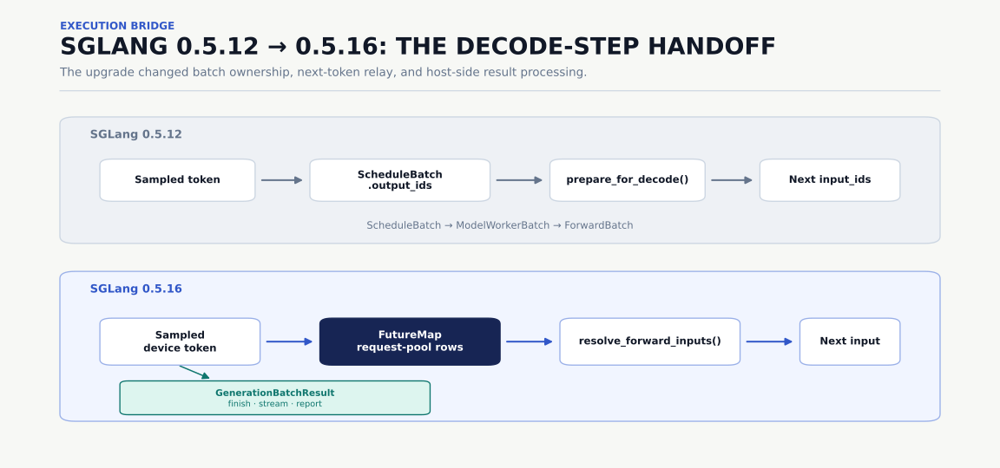
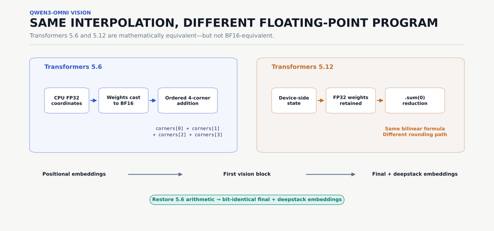
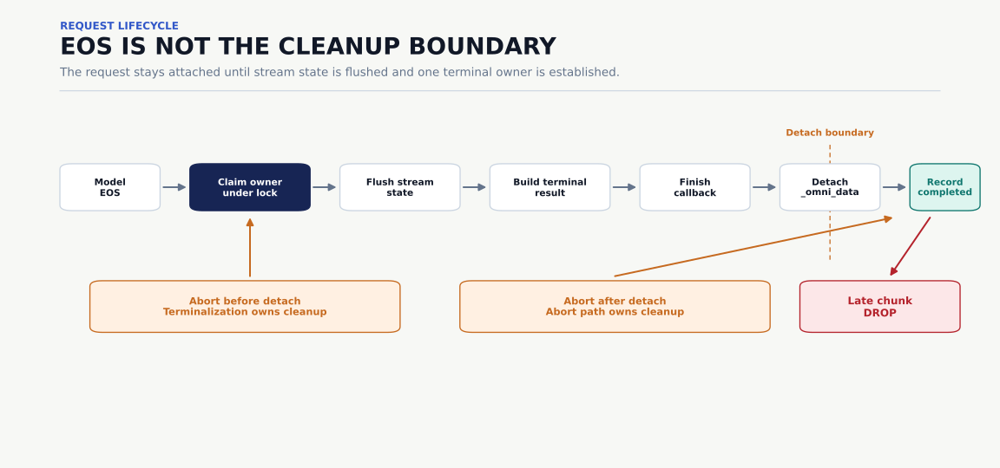

# API 对齐到浮点结合律：SGLang Omni 的 backbone 升级

前段时间我们 SGLang Omni 依赖的 SGLang Backbone 从 `0.5.12.post1` 升级到了 `0.5.16`。通常认为，我们只需要改掉重命名的 API，更新一下集成代码，然后就完事了。不过最后其实改动的大小堪称灾难性，跨越了六个 SGLang 版本，Transformers 从 `5.6.0` 升级到了 `5.12.1`，最后在 [PR #1183](https://github.com/sgl-project/sglang-omni/pull/1183) 里改动了 162 个文件。


> PS：其实从我个人对工程审美的理解来看，SGLang Omni 最好作为 SGLang 的一层上游抽象，尽量对 SGLang 黑盒使用，甚至都不需要固定在任意一个具体版本上。类似于我们在 slime 和 miles 中，希望通过约定 SGLang 的下游接口，再通过 SGLang 的 CI 进行保护，这样随时能够使用最新的 SGLang。但是很遗憾，大多数上游框架都会侵入性修改下游作为依赖，导致不得不 pin 在某个具体的 SGLang 版本上，并且对这个版本的接口进行修改。而每次修改实际上就是要把这些在特定版本上的侵入性代码重置到更新的版本上。

升级的 PR diff 巨大无比。如我上文所说的那样，SGLang Omni 很难做到对 SGLang 仅仅进行一层简单轻薄的封装：它自己拥有一条多阶段流水线、一部分 scheduler 循环、model runner 的集成、流式状态，以及进程放置逻辑。上下游两个系统之间的运行契约远不是一两个核心接口能够保护的。Scheduler 的兼容性要求一套稳定的执行协议；Qwen3-Omni 要求维护浮点运算的顺序；而 MOSS 各阶段合并进同一个进程之后，显存必须按构造顺序计算，不能再把进程预算当成一个与时间无关的数字...

这些事情构成了本次升级的噩梦，也是我们在此反思，希望以后的升级能够更为轻量。

## 为什么这次升级不只是 API 变更

上一次固定版本的升级是 [PR #698](https://github.com/sgl-project/sglang-omni/pull/698)，把 SGLang 从 `0.5.8` 升到了 `0.5.12.post1`。那次改动也不小：更新了 Transformers 和 PyTorch，修了模型专属的假设，适配了 request pool、sampling、output type、device 和 CUDA 依赖。但它的重心仍在集成的边界上，没有实质性地重写 Omni 的 scheduler 或基础的 model runner 执行路径。

[PR #1183](https://github.com/sgl-project/sglang-omni/pull/1183) 跨过了另一条边界。SGLang `0.5.16` 改变了三件事：batch 怎么选出来、活的 scheduler batch 怎么变成模型输入、采样出的 token 怎么进入下一轮。因为 Omni 有自己的外围的事件循环而不是原样调用 SGLang 的 scheduler，所以不能把这些变化当作封装在 API 后面的实现细节。PR #698 主要是在上游接口移动之后修调用方。PR #1183 则必须重新建立一套 Omni 自身参与实现的执行协议。后文中出现的数值问题、生命周期问题和显存计账问题，是同一个底层困难的不同表现形式：Omni 依赖的是 SGLang 的具体行为，而接口并没有把这些行为定义下来。

## SGLang 0.5.16 如何改变了 decode step 的交接

理解 scheduler 变化最清楚的方式，是跟着一个 `ScheduleBatch` 走过两轮 decode 迭代。

在 SGLang `0.5.12` 中，`Scheduler.get_next_batch_to_run()` 读取并修改 scheduler 自身持有的字段，比如 `self.running_batch` 和 `self.last_batch`，然后返回要执行的 `ScheduleBatch`。在模型 forward 之前，这个 scheduler batch 被转换成一个拷贝出来的 `ModelWorkerBatch` 引用，由 `ForwardBatch.init_new()` 消费。

采样之后，scheduler 把 device 侧的 token 张量写回同一个 scheduler batch 的 `output_ids` 字段。当这个 batch 进入下一轮 decode 迭代时，`ScheduleBatch.prepare_for_decode()` 把这个张量移到 `batch.input_ids` 并清空 `output_ids`。

SGLang `0.5.16` 对于执行状态的保持和修改归属权有一套新的规则：现在由调用方保存可变的 batch 状态，模型执行路径拿到的是这个 batch 本身而不是和 `0.5.12` 那样拿到一个拷贝。具体来说，`get_next_batch_to_run(running_batch, last_batch)` 返回一个 `NextBatchPlan`，调用方显式地用 plan 的结果替换自己的 running batch。`ForwardBatch.init_new()` 直接消费实时的 `ScheduleBatch`，不再有独立的 `ModelWorkerBatch`。采样后的 token 也不再经过 `ScheduleBatch.output_ids` 传递，而是改走一张叫 `FutureMap` 的表。



在每次 forward 之前，`resolve_forward_inputs()` 从 scheduler 的暂存区或从 `FutureMap` 中 materialize 当前输入，也就是把还不在位的值落实成 device 上真实存在的张量。采样之后，下一个 device token 被存进这个 map，以 request pool 的行号为 key。实时 batch 清空 `input_ids`，下一轮迭代再把那些行号解析回输入。

Omni 不做投机解码，配置了投机算法会直接报错。所以这里的 `FutureMap` 只做一件事：在 device 上把上一轮采样出的 token 传给下一轮。它为投机解码准备的字段一直是空的。

新的 token 处理路径也把以前看起来可以互换的两种结果分开了。在 `0.5.12` 里，这两者都挂在同一个 `batch.output_ids` 上：要 device 上的张量就直接读它，要 CPU 侧的值就对它 `.tolist()`，所以它们看起来只是同一份数据的两种读法。现在两者分开存放：下一次 forward 需要的 device token 留在 GPU 中继上，而用于结束判定、logprobs、流式输出和构造响应的 CPU 可见值则留在 `GenerationBatchResult` 中。过滤或 retract 一个实时 batch 可能会在下一次迭代之前改变它的请求行，所以保留旧的 `output_ids → input_ids` 快捷方式会把 token 状态挂在 batch 的一个过时视图上。

SGLang 自己的 `Scheduler.run_batch()` 执行这个协议，但 Omni 并不是原样调用那个循环。它在 forward 周围有自己的多阶段事件循环和模型专属 runner。因此，这次升级引入了一个 `SGLangExecutionBridge`，负责解析当前输入、进入所需的 forward 上下文、发布下一轮 token 并记录完成状态。模型专属 runner 使用这个 bridge，而不是各自维护一份旧 scheduler 契约的副本。

总的来说，这次升级中遇到的兼容性问题不只是 class 或者接口改名导致的。SGLang 改变了谁拥有实时 batch、下一个 token 在迭代之间存放在哪里、以及 forward 输入何时可以被重建。Omni 为了适配新的数据流进行了较大的架构改动。

## 几个浮点运算改变了 Qwen3-Omni

Scheduler 这条路跑通之后，Qwen3-Omni 给出了一个令人迷惑的故障。模型能正常启动也能接受请求，但 MMMU 评测结果掉点。从经验上，这种故障容易被归到预处理、图像缩放、tokenizer 变化、模型权重、rotary position，或者干脆归到 GPU 的非确定性上，所以我们把两套栈逐层对比了一遍。

输入完全一致。`input_ids`、attention mask、pixel values、image grid 元信息、patch embedding 的输出、rotary position IDs 全都对得上。第一个差异出现在位置编码进入 vision encoder 之后，然后穿过第一个 vision block，一直传到最终的 image embedding 和 deepstack embedding。在七个真实样本上，最终 image embedding 的最大绝对差异大约在 `0.156` 到 `0.359` 之间。

这个差异来自浮点运算：Transformers `5.6` 版本用 CPU FP32 的行为构造双线性插值坐标，把插值权重转成位置编码表的 dtype（通常是 BF16），再按一个明确的顺序把四个 corner 的 embedding 加起来：

```python
corners = pos_embed(indices) * weights[:, :, None]
result = corners[0] + corners[1] + corners[2] + corners[3]
```

而在 Transformers `5.12` 版本中，把这段计算挪进了一条公共路径。它用不同的方式生成插值状态，在乘法过程中保留 FP32 权重，然后用一次 sum 归约四个 corner。

两种实现在数学上是等价的，但 BF16 浮点数的乘法和加法不满足结合律。改变中间 dtype 和累加顺序，就改变了预训练 vision tower 看到的位置编码。



我们有意把这个修复的范围做的很小。[`Qwen3OmniMoeVisionEncoderCompat`](https://github.com/sgl-project/sglang-omni/blob/a8d3dd14a2784cea51937936301043f1735bfda7/sglang_omni/models/qwen3_omni/components/vision_compat.py#L13-L146) 保留了 Transformers `5.12.1` 的 encoder 结构、装饰器、输出类型、vision block 和 deepstack 行为，只把插值那段算术换回 checkpoint 训练时使用的 `5.6` 版本对应的计算方法。改完之后，预处理张量、抓下来的 vision 中间张量、最终 embedding 和 deepstack embedding 都和参考实现逐比特一致；50-sample MMMU 的通过率回到 31/50，也就是 62%。

这是整次升级里最清晰的一个结论。**对一个预训练模型来说，兼容性包含解释它权重的那个程序。** 比如 Qwen3-Omni 的权重是在 Transformers 5.6 那套浮点执行顺序下训练出来的。推理时如果换了另一套在数学上等价、但浮点运算顺序不同的实现，模型的数值输出可能变化。

## EOS 不等于请求已经结束

Scheduler 的这轮 review 还顺带暴露了一个早就存在的生命周期问题：Omni 把模型专属的请求数据挂在 SGLang 的 request 上，而这份请求数据又持有指回 request 的引用：

```text
Req → Omni request data → Req
```

这个问题不是 SGLang `0.5.16` 引入的，但它成为了这次重构 scheduler 时绕不开的问题。对 TTS 和 omni 模型来说，这份请求数据可能持有参考音频、输入 embedding、hidden state、流式缓冲区，以及模型专属的解码状态。这两条引用只要都还在，引用计数就永远降不到 0。请求结束时这份数据释放不掉，只能等 Python 的循环回收器之后扫到。清理这个循环引用听起来很简单，但只要深入思考一下多阶段流水线中“请求终止”的真正含义，就会发现这其实比预想中麻烦。

一个自回归请求可能已经结束了，而上游阶段还有一个 stream chunk 在路上。同一个请求可能同时出现在 running batch、刚完成的 batch、一个异步 pending step，以及 stream ingress 缓冲区里。如果在 model runner 冲刷完最后一段缓冲音频之前就把请求数据摘掉，最后一个 chunk 就丢了。如果在 in-flight 的 stream ingress 还没落定之前就摘掉，一个迟到的 chunk 会被误认为是准入之前的数据，然后留在某个 pending 结构里。如果 abort 在正常终止流程正在清理这个请求的时候到达，两边可能都去跑一遍模型清理，也可能都以为对方会做。这种状态的弥散性使得任何单一的标志位检查都很难在复杂的并发路径中划出一条清晰的边界。

最终的 scheduler 代码把终止处理抽象为一次所有权交接。第一步：确定所有者，在请求准入锁的保护下，正常完成路径先"认领"这个请求，保证只有一条路径产出终止输出；第二步：让 model runner 刷掉剩余的流式状态，构造终止结果；第三步：跑模型专属的 finish 回调。这三步都需要读请求数据本体，完成这些步骤后，最后 detach Omni 的请求数据，并把请求记为已完成。在这个边界之后到达的 stream chunk 会被直接丢弃，不会再建出一个没人回收的 pending 状态。Abort 和正常的请求终止流程使用同一把锁：如果它在 detach 之前到达，终止流程会看到它并完成 abort 清理；如果它在 detach 之后到达，abort 路径就知道已经没有终止所有者了，于是自己做清理。



关键性质不是"每条终止路径都调用了同一个 helper"，而是锁和数据挂载这两件事合在一起，在两种可能的交错顺序下都能唯一确定一个清理所有者。这一点在最终的 [`stream_output`](https://github.com/sgl-project/sglang-omni/blob/a8d3dd14a2784cea51937936301043f1735bfda7/sglang_omni/scheduling/omni_scheduler.py#L1326-L1424) 路径里能直接看到：最后一段流式数据在 detach 之前被排空，而完成记录则把这个请求对后续 ingress 关闭掉。

这类问题在多阶段服务中经常遇到。"模型生成了 EOS"和"流水线已经处理完这个请求"是两个不同的事件。清理属于第二个边界，这个边界的位置，取决于最后一个还握着这个请求的地方什么时候放手，所以要把这些地方逐个列出来确认，不能看模型的 finish 标志。

## 合并后的 MOSS 流水线为什么会 OOM

MOSS-TTS Local 暴露的是另一种所有权错误。它的默认拓扑给预处理、自回归引擎和 vocoder 分配 GPU 显存比例：

```text
preprocessing    0.15
AR engine        0.67
vocoder          0.18
```

熟悉 SGLang 的读者可能知道 `mem_fraction_static`：它规定了自回归引擎能占用的 GPU 显存上限，并直接影响 KV cache 的大小。在 Omni 中，显存配额的定义有所不同。Omni 先为 preprocessing、自回归引擎和 vocoder 等各 stage 分别声明 `total_gpu_memory_fraction`，再根据实际的进程拓扑汇总成进程级的预算。如果这些 stage 运行在独立进程中，它的配额就是所在进程的显存预算；如果多个 stage 合并到同一个进程，该进程声明的累计预算就是这些阶段配额的总和。

在之前在 MOSS 流水线实现中我们忽略了模型是按顺序逐个加载的，自回归引擎探测可用显存时，vocoder 尚未加载，此时进程中只有 preprocessing 和自回归引擎，累计预算应为 `0.15 + 0.67 = 0.82`，我们却错误地传入了 `1.0`，导致原本应该留给 vocoder 的显存也被计入 KV cache 的可用空间。在 H100 上，自回归引擎据此算出了约 66.22 GiB 的 KV 空间，等到 vocoder 稍后尝试分配 942 MiB 显存时，实际剩余空间仅剩 442 MiB 左右，导致启动失败。

正确的计算方法是：只把已经加载完的那些阶段的 fraction 加起来。预处理在最前，额度是 `0.15`；轮到自回归引擎时，进程里只有预处理和它自己，额度是 `0.82`；只有等 vocoder 也加载完，这个数才到 `1.0`。最终实现按阶段构造顺序算出这些前缀和，并注入到每一个会做进程级显存 profiling 的 factory 里。实现本身足够短，可以直接读源码 [`_attach_process_memory_fraction_defaults`](https://github.com/sgl-project/sglang-omni/blob/a8d3dd14a2784cea51937936301043f1735bfda7/sglang_omni/pipeline/mp_runner.py#L186-L214)。

把自回归引擎的 fraction 额度改成 `0.82` 之后，它的 KV 分配定在大约 `51.89 GiB`。vocoder 加载完成后，整个进程占用 `73.44 GiB`，对应它最终 `79.65 GiB` 的预算，之前起不来的合并拓扑成功服务了一个正常请求。

这个问题很容易被总结成"调低其他 stage 的显存配额来给 vocoder 留点显存"，但这个说法丢掉了真正有用的设计原则。**一个进程里的模型是一个一个加载进去的，它的显存预算就得一段一段地给** 放置 fraction 描述的是最终拓扑；而显存 profiling 需要的是截至当前构造点、已经加载的那些对象所对应的 fraction。测量的范围和预算的范围必须对齐。

## 版本升级真的导致了 Higgs 回归吗？

MOSS 的 OOM 是因为分支改了拓扑而显存计账没跟上。Higgs 的问题排查则更加曲折，因为没有严格控制变量，我们浪费了一天时间在错误的方向上。

之所以花这么长时间，是因为没有什么可查的线索。Server 正常启动，两个 worker 各自承接了应有的请求，每个请求都在接收它的 worker 上完成了。唯一不对的是时间：Higgs TTS stage-1 跑出来 `5.046 req/s`，平均延迟 `3.114 s`，而通过 CI 的门槛是 `13.64 req/s` 和 `1.10 s`。这个数值离 CI 门槛差的太多而不能简单被解释为随机误差。

我们的第一反应是本文第一节中描述的 SGLang 0.5.16 的执行流程变化导致了这个回退，profile 看上去似乎支持我们的猜想。一份 Nsight Systems trace 数出了 `34,721` 次 CUDA stream 同步。`py-spy` 反复命中的是逐 token 的 CUDA Graph buffer 重置和 sampling 参数被拷回 host。虽然这些确实是需要修复的问题，但是在我们完成清理了 token 交接、`FutureMap` 所有权、WAR 事件和 CUDA Graph 执行等等之后吞吐基本没有挽回多少。Benchmark 始终停留在 `5 req/s` 附近。

为了实锤是 version bump 引入的问题，我们尝试固定住 Omni 代码，只替换底层的 SGLang 版本。Omni 那一侧用的是 bump 分支切出来时的那个 `main` 分支 commit。两次运行分别跑出 `4.663` 和 `4.636 req/s`，基本属于误差范围 —— 结果反而实锤了并不是 version bump 引入的问题。总不能是 Higgs 一直就这么慢吧？但是 CI 历史记录里的性能又是哪来的呢？复盘后我们意识到：在 CI 历史记录里看到的 `18 req/s` 并不是当前 `main` 的结果，控制变量不够严谨，性能回退可能早就已经合入了。

这改变了调查方向，我们开始研究 Higgs 上一次快是什么时候，然后在那个时间点和分支之间对 Omni 的 commit 做二分。答案是 [PR #1071](https://github.com/sgl-project/sglang-omni/pull/1071)，7 月 21 日合入，比 version bump 工作开始早了三天。在同一张 GPU、同一个 SGLang pin 上，benchmark 在它的父 commit 上给出 `9.318 req/s`，在 #1071 上给出 `4.664`。

那个 PR 把 Higgs 的 vocoder 移到了自己的进程里。在 CI 机器上，自回归引擎和 vocoder 仍然共享一张 H100，但现在它们持有两个 CUDA context，没有 MPS 的情况下 GPU 在两者之间做时间片轮转，而不是让它们的工作重叠。一个只改变 vocoder 进程放置的对照实验复现了回归：把 vocoder 移出进程使吞吐降低了 55%。16 个并发请求除以 `3.11 s` 的平均延迟恰好解释了整个 `5.046 req/s`，所以没有请求被丢弃；两个 context 互相等待的时间以延迟的形式回到了我们面前。

它之所以能直接合入，是因为没有人跑过这个特定的测试。#1071 是在并发 `96` 和非默认 batching 参数下调优和 benchmark 的，在那个配置下把 vocoder 拆出去确实有收益。CI 门槛在默认参数下跑并发 `16`，在这个配置下拆分是亏的，而且 GPU CI 只在打了标签的 PR 上运行，所以没有任何合入后的运行把这两个配置放在一起对比，这次 version bump 恰好是我们第一次跑这个对比测试。

这让我们无法简单地通过 revert 来修复这个回退，因为 #1071 针对的那个并发 `96` 部署是真实的，而当前的默认配置不能维持下去。最终 bump 里上线的方案是把 vocoder 移回引擎的进程，让两者再次共享一个 CUDA context，然后去追赶此前拆分进程带来的 vocoder 速度。编译的 codec decode 被关掉了，因为在单 context 并发 `16` 下它反而消耗吞吐；decode 运行在 CUDA Graphs 上，这些 graph 覆盖了一个 decode window 能碰到的所有 frame count。CI 门槛维持原样，一个 unit test 现在固定了 vocoder 的进程分配，以防拆分意外回来。Higgs 在 bump 分支存在之前的三天里，在 `main` 上就已经这么慢了，而 bump 才是发现这一事实的契机。

## 下次我们会先检查什么

这次升级遇到了若干回退和故障，但没有一个是接口适配引起的，根本原因都是更上游的位置的行为分叉。Scheduler 兼容性在 request pool 索引表的行号处分叉，Qwen3-Omni 在 vision embedding 的浮点计算处分叉，请求终止时的清理在所有权交接处分叉，MOSS 显存计账在构造阶段处分叉，Higgs 性能在进程拓扑处分叉。下一次升级应该从列出 Omni 从 SGLang 引入、镜像或复现的每一种行为开始。对每一种行为，记录旧的表现、新的表现，以及语义差异首先变得可见的那个边界。

这次升级还展示了并行工作变得语义过时的速度。在 rebase 过程中，[PR #1161](https://github.com/sgl-project/sglang-omni/pull/1161) 不得不把围绕 `req.is_chunked` 构建的 fixture 替换为升级后的 `req.inflight_middle_chunks` 状态。[PR #1204](https://github.com/sgl-project/sglang-omni/pull/1204) 和 `main` 上变更后的 scheduler 生命周期共享 request pool 行、retract、finish 和 abort 的所有权。[PR #1206](https://github.com/sgl-project/sglang-omni/pull/1206) 改变了 coordinator 拥有的 abort 和终止完成行为。这些重叠都不意味着 bump 在那些 PR 里引入了缺陷。它意味着当两个分支依赖同一份运行时契约时，一次干净的 Git merge 是不够的。

这些边界应该作为代码合入的准则。如果某个 PR 触及了这些边界，就应该先把它和升级后的代码合并，在对应的位置跑一遍测试。测试的归属也需要明确：模型相关的检查由 Omni 负责；至于 decode 阶段的 token 交接，由于 Omni 只是在复现 SGLang `Scheduler.run_batch()` 的内部逻辑，这部分最适合作为上游 SGLang 的契约测试——上游改了，上游的测试应该先报错。

PR #1183 以一次版本 pin 变更开始，以解释这个 pin 为什么存在而告终。SGLang Omni 不仅是 SGLang Python API 的调用方。它参与 scheduler 的 token 交接，继承模型依赖的浮点程序，并拥有跨越多个阶段的请求和显存生命周期。只有当每一条边界都被显式化，并在其行为首先分叉的位置进行检查时，这次升级才变得正确。

这并不意味着在这个分支上观察到的每一个故障都属于 bump。Higgs 在这个分支存在之前就已经回归了。升级只是把它暴露出来的那次工作。迁移到 SGLang `0.5.16` 只改变了一次 pin。知道哪些行为属于 SGLang、哪些属于 Omni、以及在哪里区分两者，才是让下一次变更不再那么困难的关键。

## 致谢

感谢所有参与本次升级的实现、调试、benchmark 和 review 工作的人：

Yuhao Chen, Jiaxin Deng, Jingwen Gu, Chenchen Hong, Xuehao Yang, Kaige Li, Jun Liu, Ratish P, Xuesong Ye, and Chenyang Zhao.