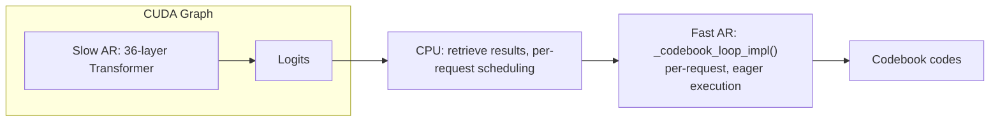
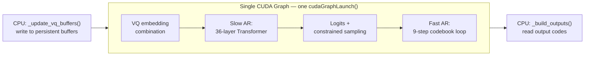

# Revisiting CUDA Graph: Core Mechanisms, Multi-Graph Memory Sharing, and Unified Coverage for Dual AR Models

Last August, I wrote a brief article on understanding CUDA Graph from a virtual address protection perspective, [A Brief Analysis of CUDA Graph Based on torch-memory-saver](./readme.md) (Part 1 of this series): it covered CUDA Graph fundamentals, why it's commonly used in inference but rarely in training, and how torch-memory-saver uses `cuMemMap` to protect virtual address stability. Unfortunately, my understanding of CUDA Graph was still shallow at the time. Recently, while adding CUDA Graph support for Fish Audio's S2-Pro TTS model in the SGLang-Omni framework ([PR #153](https://github.com/sgl-project/sglang-omni/pull/153)), I discovered the true depth of CUDA Graph. S2-Pro has two asymmetric autoregressive processes (Slow AR + Fast AR), and we unified their forward into a single CUDA Graph for capture and replay, boosting TPS from 55.6 to 88. In discussions around [PR #153](https://github.com/sgl-project/sglang-omni/pull/153), we further tested the performance of combining `torch.compile` with CUDA Graph:


| Configuration | Steady-state throughput |
|---|---|
| Eager (no CUDA graph, no compile) | 55.6 tok/s |
| CUDA graph only | 88 tok/s |
| Partial compile (fast head only) | 121 tok/s |
| Full-model compile | 126 tok/s |

> Note: TPS here measures the speed at which the TTS model's LLM backbone produces speech codec tokens, excluding the vocoder stage. The specific architecture of this model will be elaborated later in the article.

The results were extremely satisfying. Motivated by this, this article will dive deep into PR #153 to discuss:

1. Progressive derivation of CUDA Graph core mechanisms and constraints
2. Unified CUDA Graph coverage for the S2-Pro Dual AR model
3. Engineering implementation of deferred graph capture, persistent buffers, etc.

The discussion of torch.compile's four modes and their coexistence strategy with CUDA Graph, as well as the conflict between inductor CUDAGraph Trees and SGLang CudaGraphRunner, will be deferred to a follow-up article.

acknowledgement:

Jingwen Gu, Yitong Guan, Ratish P, Shidong Li, Yue Leng, Shuai Shi, Junrong Lin, Shenggui Li, and yours truly


## CUDA Graph Core Mechanisms

In [A Brief Analysis of CUDA Graph](./readme.md), we already discussed the basic concepts. In short, CUDA Graph records a sequence of GPU kernels as a static DAG, then replays the entire computation flow with a single CPU launch, eliminating the CPU overhead of launching kernels one by one. Building on that foundation, let's develop a deeper understanding of CUDA Graph's core mechanisms.

### Construction Process

1. **Capture**: Capturing or recording a CUDA Graph. After calling `cudaStreamBeginCapture()`, the CUDA runtime enters recording mode — all subsequent operations submitted to that stream (kernel launches, memcpy, memset, etc.) are not actually executed, but instead recorded as nodes in the DAG. Each node stores: which kernel to call, grid/block dimensions, and all parameter values (for tensors, this means their GPU virtual addresses). Edges between nodes are automatically inferred from the submission order on the stream and cross-stream event synchronization. When recording ends, calling `cudaStreamEndCapture()` returns a `cudaGraph_t` as a pure topological description that cannot be directly executed.

2. **Instantiate**: Instantiating a CUDA Graph. After obtaining `cudaGraph_t`, a further call to `cudaGraphInstantiate()` compiles it into `cudaGraphExec_t`. Capture is analogous to recording a script, while instantiate is compiling that script into an executable binary — the former is a declarative description, the latter an imperative execution plan:
   - Dependency analysis and scheduling: traverse the DAG topology, determine which kernels have true data dependencies and which can execute concurrently, and generate an optimal execution plan.
   - Parameter binding and solidification: all kernel parameters recorded during capture, such as GPU pointers for tensors, are baked into the executable object. From this we can see that tensor addresses must remain unchanged for every subsequent CUDA Graph replay, because virtual addresses have been welded into the `cudaGraphExec_t`.
   - Legality validation: checks whether the graph contains unsupported operations (e.g., host-device sync); if invalid, instantiate returns failure.


3. **Replay**: CUDA Graph replay. Calling `cudaGraphLaunch(exec, stream)` submits the entire `cudaGraphExec_t` to the specified stream in one shot. The CPU issues a single launch instruction, and the GPU scheduler executes all kernels sequentially (or concurrently) according to the execution plan generated during instantiate, eliminating the CPU overhead of per-kernel launches. Since replay bypasses the Python/PyTorch dispatcher and has no per-operation CPU-side scheduling, CPU overhead drops to nearly zero.

For inference — a highly repetitive, fixed computation flow where each decode step executes the same kernel sequence — capture once, instantiate once, replay endlessly, saving massive CPU launch overhead. This is the core value of CUDA Graph.

### Constraints

The operations performed during the construction stages allow us to derive CUDA Graph's constraints — i.e., under what conditions CUDA Graph will break:

| Constraint | Meaning | Why |
|---|---|---|
| **Pointer stability** | GPU virtual addresses must remain unchanged during replay | Capture records addresses; changed addresses mean kernels read/write wrong memory |
| **No dynamic memory allocation** | All tensors must be pre-allocated during capture | Dynamic `torch.zeros(...)` triggers the allocator with unpredictable addresses |
| **No host-device sync** | Cannot call `.item()`, `torch.multinomial`, etc. | Sync interrupts stream capture, causing capture failure |
| **Static control flow** | Loop counts and branch conditions are fixed at capture time | Graph is a static DAG and doesn't support runtime conditional branches |
| **Graph doesn't auto-update after recording** | Code path changes require re-capture | The recorded kernel sequence is fixed and won't change due to Python code modifications |

Overall, CUDA Graph is a rather fragile static graph operation that requires careful protection.

The above constraints lead to a direct corollary: a single graph can only serve one batch size. Specifically, since kernel parameters recorded during capture (grid dimensions, tensor shapes/addresses) are baked into the `cudaGraphExec_t`, changing the batch size invalidates all of them. In SGLang's decode stage, each request produces one token per step, so `bs=4` means the input tensor's first dimension is 4 — the corresponding kernel grid sizes, intermediate tensor shapes, and memory layouts are all based on 4, completely different from those for `bs=8`. In other words, a single graph can only serve one batch size. SGLang captures a separate graph for a discrete set of decode batch sizes (e.g., `bs ∈ {1, 2, 4, 8, ...}`). When the actual number of requests matches a pre-recorded bs, graph replay is used; otherwise it falls back to eager mode — PyTorch's default per-op execution where each kernel is launched individually by the CPU, without graph's one-shot submission optimization, but with the advantage of correctly handling any dynamic shape.

### PyTorch Wrapper and Memory Pool

PyTorch further wraps the CUDA runtime's graph API into Python-friendly interfaces:

| PyTorch API | CUDA Runtime API |
|---|---|
| `torch.cuda.CUDAGraph()` | `cudaGraph_t` + `cudaGraphExec_t` |
| `graph.capture_begin()` | `cudaStreamBeginCapture()` |
| `graph.capture_end()` | `cudaStreamEndCapture()` |
| `graph.replay()` | `cudaGraphLaunch()` |

### CUDA Graph Memory Overhead and Sharing Mechanism

At this point, I must mention a definition that [Lanqing](https://www.linkedin.com/in/lanking/) once shared with me — CUDA Graph is essentially a cache. And since it's a cache, it's a space-for-time trade-off. All intermediate computations during a graph's capture stage produce intermediate tensors (attention scores, FFN intermediate activations, residual addition outputs, etc.). These intermediate tensors' addresses are written into the `cudaGraphExec_t`, and during replay, kernels directly read from and write to these fixed addresses. Therefore, the memory region allocated from the memory pool during capture gets locked down by the CUDA Graph as a whole, and is never returned to PyTorch's general allocator.

Furthermore, note that the memory held by a CUDA Graph is not the sum of all intermediate tensor sizes. We can think of the CUDA Graph's memory pool as an enclosed, independent memory region: tensors inside the graph can only use memory within the pool, external tensors cannot occupy pool space — inside and outside are isolated. But within this fenced-off region, PyTorch's caching allocator still functions normally: intermediate tensors produced earlier can have their addresses reused by later tensors once they're no longer referenced. Therefore, the memory held by a single graph roughly equals the peak memory usage during capture (high-water mark), not the simple sum of all tensors that ever existed. For example, the forward pass of a 32-layer Transformer — each layer's intermediate activations can be reused after the next layer starts, so the high-water mark might only equal a few layers' worth of intermediate tensors, far less than the sum of all 32 layers.

Even so, if 12 graphs for different batch sizes each independently hold their own high-water mark of memory, the total usage is still 12x — which remains unacceptable for large model inference. This naturally leads to the memory sharing mechanism between different graphs. The inside-outside isolation mentioned earlier refers to isolation between the graph pool and ordinary non-graph PyTorch code, but multiple graphs don't need to be isolated from each other. PyTorch allows multiple graphs to share the same pool via `torch.cuda.graph(pool=...)`, with their intermediate tensors all allocated from the same memory region. This is safe because during the decode stage, only one graph corresponding to one batch size is replayed per step — intermediate tensors from different graphs are never alive simultaneously and can take turns reusing memory. This way, regardless of how many graphs exist, the memory overhead equals just one copy of the largest graph's high-water mark. These concepts will be further elaborated in the subsequent SGLang CudaGraphRunner source code walkthrough.

## S2-Pro Model and Unified CUDA Graph Optimization

We've established the core conceptual framework of CUDA Graph — the five constraints and memory sharing mechanism form our analytical toolkit. The question now is: when a model has two asymmetric autoregressive processes, how do these constraints concretely shape the CUDA Graph design? S2-Pro is exactly such a model.

### S2-Pro Model Architecture

[S2 Pro](https://huggingface.co/fishaudio/s2-pro) is a 5B-parameter speech generation model (TTS) from Fish Audio that generates speech matching a reference voice's timbre given reference audio + target text. The model has two Autoregressive decoders, known as Dual-Autoregressive/Dual-AR.

Setting aside the architectural design, each Dual-AR inference step needs to produce 10 codebook tokens, accomplished through two asymmetric autoregressive processes:

1. Slow AR (text model, 4B parameters): based on a pretrained Qwen3-4B, autoregresses along the time axis. The input sequence interleaves text tokens and audio tokens, predicting the semantic token for the 1st RVQ codebook at each time step t. Although only one codebook token is produced, Qwen3-4B is much larger than the audio decoder, hence the name Slow AR. Each step is computationally heavy, with single forward latency at ms-scale.
2. Fast AR (audio decoder, approximately 400M parameters): a 4-layer Transformer that receives Slow AR's hidden state as a conditioning prefix, autoregressing 9 steps along the codebook depth dimension to generate the remaining 9 codebook tokens. All codebooks share a single embedding table, with RoPE positional encoding distinguishing codebook layers. Although computation per step is tiny — few layers, small dimensions, single forward latency at μs-scale — the accumulated kernel launch overhead from 9 autoregressive steps is non-negligible.

After Fast AR completes 9 codebook tokens, Multi-Codebook Fusion (MCF) aggregates all 10 codebook tokens (Slow AR's semantic token + Fast AR's 9 acoustic tokens) into a single continuous vector, serving as Slow AR's input embedding for the next time step. This highly asymmetric design — a 4B large model on the time axis + a 4-layer small network on the depth axis — makes the Dual-AR architecture structurally isomorphic to standard autoregressive LLMs, and thus it can inherit most of SGLang's LLM-native serving optimizations, including continuous batching, paged KV cache, CUDA Graph replay, and RadixAttention-based prefix caching.

### Computation Characteristics of Slow Head and Fast Head

S2-Pro's slow head is implemented as `S2ProSGLangTextModel` in [`sglang_model.py`](https://github.com/sgl-project/sglang-omni/blob/cd9aaf3/sglang_omni/models/fishaudio_s2_pro/sglang_model.py), with a total of 36 layers (`num_layers: int = 36`), each containing 4 large GEMMs — `qkv_proj, o_proj, gate_up_proj, down_proj`. These large matrix multiplications are highly optimized in cuBLAS, with individual kernel latency at ms-scale and relatively small kernel launch overhead proportion.

Fast head is an independent small transformer — [`FishQwen3AudioDecoder`](https://github.com/sgl-project/sglang-omni/blob/cd9aaf3/sglang_omni/models/fishaudio_s2_pro/fish_speech/models/text2semantic/modeling.py#L919), with far fewer `TransformerBlock` layers than the slow head. Each step involves only one small GEMM (`[bs, 1, fast_dim]` scale), with extremely small computation (μs-scale), but requires the complete sequence of embedding lookup → linear projection → forward kvcached → argmax → embedding lookup, with 9 iterations generating a large number of small kernel launches.

Given the Fast Head's computation characteristics, we pre-allocate independent KV Cache for each fast head layer, completely isolated from SGLang's paged KV cache. Specifically, the core value of paged KV cache lies in: when multiple requests have varying sequence lengths that grow dynamically, it efficiently shares memory and reduces fragmentation through page-granularity allocation/deallocation. But fast head's usage pattern neatly sidesteps all these scenarios: the codebook loop's sequence length is fixed (`num_codebooks + 1`, i.e., 10 steps), all requests within the batch advance synchronously, and the KV cache is cleared with `zero_()` for reuse after each time step — there's no cross-timestep dynamic growth or inter-request misalignment. In this pattern of fixed length, synchronous advancement, and use-then-discard, statically pre-allocated KV Cache is both simple and efficient, and naturally satisfies CUDA Graph's pointer stability constraint since addresses don't change after allocation.

| Dimension | SGLang Paged KV Cache (slow head) | Static KV Cache (fast head) |
|---|---|---|
| Management | `token_to_kv_pool_allocator` dynamic allocation | `setup_caches()` one-time pre-allocation |
| Sequence length | Dynamic growth | Fixed (`num_codebooks + 1`) |
| Memory reclamation | Return to pool via `release_kv_cache()` | `reset_caches()` clears with `zero_()` |
| CUDA Graph compatibility | Pointer stability via SGLang's `req_to_token_pool` indirect addressing | **Inherently safe** — addresses don't change after allocation |

Both satisfy CUDA Graph's pointer stability constraint, but through different mechanisms: paged cache achieves it through framework-level pre-allocated buffers + indirect addressing, while static cache achieves it directly through one-time allocation. From this we can also see that the two KV cache types can in fact safely coexist within the same CUDA Graph — each independently manages its state, but all kernels are recorded into the same DAG. This will be the factual basis for covering both Auto Regressive forwards with a single CUDA Graph later.

### How to Design CUDA Graph for a Dual AR Model?

S2-Pro's decode stage is naturally suited for CUDA Graph:

1. Highly repetitive fixed kernel sequence: each step executes the same 36-layer transformer + 9-step codebook loop, with completely static control flow; this is the ideal scenario for the static control flow requirement among the five constraints.
2. TTS inference is latency-sensitive (requiring real-time speech generation), and eliminating CPU-side launch overhead directly helps end-to-end latency.

Given this, how should such a CUDA Graph be designed? This is, in fact, the driving question of the entire article.

Before [PR #153](https://github.com/sgl-project/sglang-omni/pull/153), SGLang's CUDA Graph only covered the slow head (standard LLM transformer forward). The fast head (codebook loop) ran outside the graph as per-request post-processing. But predictably, CUDA Graph optimization would be even more meaningful for the fast head with its heavier launch overhead on small operations. Specifically:

1. Slow head gains limited benefit from CUDA Graph: the core of slow head is large GEMMs like `mm(8×2560, 2560×6144)`, with individual kernel computation at ms-scale. The relative benefit of eliminating launch overhead is small — large kernel execution time far exceeds launch overhead.
2. Fast head without CUDA Graph is the real bottleneck: each step in the codebook loop is a μs-scale small operator, with 9 iterations generating massive kernel launches. Launch overhead dominates execution time — this is exactly the problem CUDA Graph excels at solving.

A natural idea is to capture an independent CUDA Graph for each AR process, and indeed this was Fish Audio's team internal early approach. However, this would still leave CPU scheduling overhead between the two AR processes. If two AR processes each independently build CUDA Graphs, after the slow head's graph replay ends, the CPU needs to retrieve results, launch the fast head's graph replay, and then write back to CPU for the next decode step — the scheduling between two CUDA Graphs itself introduces CPU overhead. PR #153 proposed a further approach: unifying slow head and fast head into a single `forward()`, with one CUDA Graph simultaneously capturing all kernels from both AR processes. In fact, as long as it's a complete DAG, it can be captured by a single unified CUDA Graph, containing any number and any size of kernel nodes; large GEMMs and small GEMMs in the same graph is perfectly legal. Through this approach, decode-stage TPS jumped from 55.6 to 88, fast head's launch overhead was eliminated, and the CPU scheduling overhead between the two ARs was also mitigated.

| Dimension | Unified Single CUDA Graph | Dual CUDA Graph |
|---|---|---|
| **Graph count** | One graph per bs, covering all slow + fast kernels | Two graphs per bs: LLM graph + Fastlayer graph |
| **CPU scheduling** | One `cudaGraphLaunch()` completes entire decode step | Two `cudaGraphLaunch()` calls with CPU scheduling in between |
| **Engineering complexity** | High — two KV cache types, persistent buffers, deferred capture | Lower — two independent graphs with clear boundaries |
| **Memory Pool** | Both ARs' intermediate tensors sequentially reused within same graph | Two graphs can share same `global_graph_memory_pool` (since they never replay simultaneously) |
| **Flexibility** | Two ARs coupled in one graph; modifying either requires re-capture | Two independent graphs that can be replaced or optimized individually |


It's important to emphasize that although the two AR processes share a single CUDA Graph, their respective KV Caches remain completely independently managed — slow head uses SGLang's paged KV cache, fast head uses statically pre-allocated KV cache. Unified graph only means their kernels are recorded into the same DAG; it does not imply any coupling in their state management. What changes is only the kernel organization, not the state management.

Of course, the unified large CUDA Graph introduces greater engineering complexity:

1. All inputs (previous step's codebook values) must be passed through persistent buffers
2. Initialization order must ensure the graph captures the complete path (deferred capture)
3. Codebook loop iterations and sampling must satisfy CUDA Graph's static constraints

Before PR #153, CUDA Graph only covered Slow AR, with Fast AR executing per-request outside the graph:



After PR #153, a single CUDA Graph covers the complete Slow AR + Fast AR forward:



`_decode_codebooks()` transformed from an external per-request post-processing step into an internal step of `forward()`. A single CUDA Graph records Slow AR + sampling + Fast AR in one shot, eliminating all kernel launch overhead for the entire decode step.

## Implementation Details of the S2-Pro Unified CUDA Graph Coverage

The previous chapter established the core decision of "unifying slow head and fast head into a single graph" and listed the engineering complexities it introduced. From this chapter onward, we address these engineering challenges one by one.

### Deferred Graph Capture: Why Initialization Order Matters So Much

The first engineering challenge is deferred graph capture, which directly corresponds to the last of the five constraints: graph doesn't auto-update after recording. Specifically, let's examine the initialization sequence in [`create_s2pro_sglang_engine()`](https://github.com/sgl-project/sglang-omni/blob/cd9aaf3/sglang_omni/models/fishaudio_s2_pro/factory.py) in `factory.py`:

```python
# Step 1: 暂时禁用 CUDA Graph
want_cuda_graph = not server_args.disable_cuda_graph
server_args.disable_cuda_graph = True

# Step 2: 初始化 ModelWorker（此时不 capture graph）
model_worker = ModelWorker(config=ModelWorkerConfig(), server_args=server_args, gpu_id=gpu_id)

# Step 3: BF16 精度修正
_truncate_rope_to_bf16(model_worker.model_runner.model)

# Step 4: 预分配 fast head 的 static KV cache
audio_decoder.setup_caches(max_batch_size=max_bs, dtype=torch.bfloat16)

# Step 5: 分配 persistent buffers + 挂载 audio decoder
text_model.setup_vq_decode(audio_decoder, ...)

# Step 6: 此时 capture graph——包含完整的 forward + _decode_codebooks
if want_cuda_graph:
    model_worker.model_runner.init_device_graphs()
```

Notice that step 1 explicitly disables CUDA Graph to prevent graph capture during step 2. If CUDA Graph weren't disabled in step 1, `ModelWorker.__init__()` would internally call `init_cuda_graphs()`. At that point, `text_model._vq_ready = False`, because `setup_vq_decode()` isn't called until step 5. In step 2, the `if self._vq_ready:` branch in `forward()` wouldn't execute, so the graph wouldn't include VQ embedding combination or `_decode_codebooks()`. Only after step 5 executes and `text_model._vq_ready = True` can the complete graph be captured. Otherwise, since CUDA Graph is a static graph captured once, even if `text_model._vq_ready = True` is set later, the already-recorded graph won't auto-update — replay would still execute the kernel sequence from recording time: an incomplete forward without codebook decode.

### `setup_vq_decode()` Buffer Allocation: Avoiding Dynamic Memory Allocation

[`setup_vq_decode()`](https://github.com/sgl-project/sglang-omni/blob/cd9aaf3/sglang_omni/models/fishaudio_s2_pro/sglang_model.py#L196) pre-allocates all persistent buffers. These buffers directly correspond to the second constraint from the first chapter: no dynamic memory allocation.

1. Input buffers (written by ModelRunner before forward):

- `_vq_codes`: `torch.zeros(max_bs, num_codebooks, dtype=torch.long)` — codebook codes generated in the previous step
- `_vq_mask`: `torch.zeros(max_bs, dtype=torch.bool)` — marks which batch positions need VQ embedding combination

2. Output buffers (written by `_decode_codebooks()`, read by ModelRunner after forward):

- `_output_codes`: `torch.zeros(max_bs, num_codebooks+1, dtype=torch.long)` — all codes generated in the current step
- `_output_semantic_ids`: `torch.zeros(max_bs, dtype=torch.long)` — semantic token id for the current step

3. Auxiliary tensors:

- `_semantic_bias`: `torch.full((vocab_size,), -inf, dtype=torch.bfloat16)` — implements constrained decoding
- `_vq_codebook_embeddings`: directly references `audio_decoder.codebook_embeddings` (shared weights, no extra allocation)

All buffers are allocated once via `torch.zeros(...)` during `setup_vq_decode()`, and subsequently only modified through in-place operations — this is precisely a manifestation of the "pointer stability" constraint from the first chapter.

### Persistent Buffer: In-Place Writes for CUDA Graph Data Dependencies

The previous section addressed "when to allocate buffers" and "which buffers to allocate." But buffer allocation is only half the story — at runtime, each decode step needs to write new dynamic data into these buffers (previous step's codebook values, semantic mask, etc.), then let graph replay read from them. This raises the next question: why do in-place operations (`copy_()`, `fill_()`, `zero_()`) guarantee CUDA Graph safety? The answer again traces back to the "pointer stability" constraint from the first chapter.

| Operation | Usage scenario | Why it satisfies pointer stability |
|---|---|---|
| `tensor.copy_(source)` | `_update_vq_buffers()` writes VQ codes | Modifies values, not addresses |
| `tensor[:bs] = value` | `_decode_codebooks()` writes output codes | Index assignment is an in-place operation |
| `tensor.fill_(scalar)` | audio decoder's `input_pos.fill_(codebook_idx)` | In-place fill |
| `tensor.zero_()` | `reset_caches()` clears KV cache | In-place zeroing |


With these in-place operation protocols, [`S2ProSGLangModelRunner`](https://github.com/sgl-project/sglang-omni/blob/cd9aaf3/sglang_omni/models/fishaudio_s2_pro/runtime/s2pro_sglang_ar.py) can implement a carefully designed buffer read/write scheme:

| Step | Function | Location |
|---|---|---|
| 1 | `_update_vq_buffers()` — writes `_vq_codes` / `_vq_mask` | **Outside graph** (before forward) |
| 2 | `model_worker.forward()` — CUDA Graph replay | **Inside graph** |
| 3 | `_build_outputs()` — reads `_output_codes` | **Outside graph** (after forward) |

Buffer reads and writes occur outside the CUDA Graph boundary (`_update_vq_buffers` before forward, `_build_outputs` after forward), but the buffers themselves are referenced by kernels inside the graph. This "write values externally, read addresses inside graph" pattern is the standard approach for CUDA Graph compatibility with dynamic inputs.

Let's look at the concrete implementation of `_update_vq_buffers()`:

```python
def _update_vq_buffers(self, model_worker_batch, scheduler_output):
    text_model = self.model_worker.model_runner.model
    input_ids = model_worker_batch.input_ids
    bs = input_ids.shape[0]

    # 计算 semantic mask
    is_semantic = (input_ids >= self._semantic_begin_id) & (input_ids <= self._semantic_end_id)
    text_model._vq_mask[:bs].copy_(is_semantic)

    # 写入每个 request 的 codebook values
    for i, sched_req in enumerate(scheduler_output.requests):
        data = sched_req.data
        if data._last_codebook_values is not None and is_semantic[i]:
            text_model._vq_codes[i].copy_(data._last_codebook_values)
```

`.copy_()` modifies the values of `_vq_mask` and `_vq_codes`, but these tensors' GPU virtual addresses remain unchanged. During graph replay, the kernels in `forward()` still read from the same addresses — only the values have been updated to the current step's data.

Similarly, `forward_kvcached()` uses a carefully designed CUDA Graph-compatible `fill_()` pattern:

```python
def forward_kvcached(self, x, codebook_idx):
    self.input_pos.fill_(codebook_idx)
    freqs_cis = self.freqs_cis[self.input_pos]
    cache_seqlens = self.input_pos.expand(bsz).to(torch.int32)
    ...
```

`input_pos` is a persistent tensor registered via `register_buffer`. `fill_()` is an in-place operation. `codebook_idx`, after the codebook loop is unrolled, becomes a Python constant that's fixed as part of the graph at capture time — corresponding to the "static control flow" among the five constraints. Compared to `torch.tensor([codebook_idx])`, the fill approach avoids creating a new tensor, which would break address stability.

### Greedy Decoding: Avoiding Host-Device Sync

PR #153 switched the codebook sampling strategy from `_sample_with_topk` (temperature + top_k + top_p + repetition_penalty) to `torch.argmax(biased_logits, dim=-1)`. This isn't merely simplification — it directly corresponds to the "no host-device sync" constraint among the five:

- `torch.argmax` is deterministic, stateless, and requires no random number generator → can be fully captured by CUDA Graph
- top_k/top_p sampling involves `torch.multinomial`, which may require random state management and dynamic shape operations → graph-incompatible
- In TTS scenarios, the quality loss from greedy decoding is acceptable — this is an intentional trade-off
