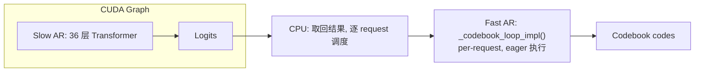
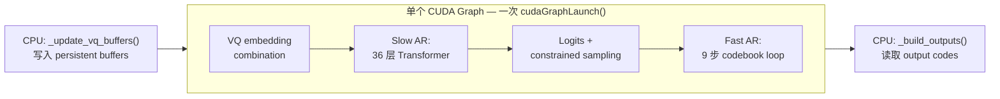

# 再探 CUDA Graph：核心机制、多图复用以及 Dual AR 模型的统一覆盖优化

去年 8 月，我浅浅写过一篇从虚拟地址保护角度来理解 CUDA Graph 的文章，[基于 torch-memory-savor 浅析 CUDA Graph](./readme.md)（本系列第一篇）：覆盖了 CUDA Graph 基本概念、推理常用/训练少用的原因、torch-memory-saver 如何通过 `cuMemMap` 保护虚拟地址稳定性。无奈当时我对 CUDA Graph 的理解尚且浅薄，最近在 SGLang-Omni 框架中为 Fish Audio 的 S2-Pro TTS 模型添加 CUDA Graph 支持（[PR #153](https://github.com/sgl-project/sglang-omni/pull/153)），才发现 CUDA Graph 的博大精深。S2-Pro 拥有两个不对称的自回归过程（Slow AR + Fast AR），我们将它们的 forward 统一到一个 CUDA Graph 中捕获和重放，TPS 从 55.6 提高到了 88。在 [153](https://github.com/sgl-project/sglang-omni/pull/153) 相关的讨论中，我们更进一步结合 `torch.compile` 测试了同时开启 `torch.compile` 和 CUDA Graph 的性能：


| Configuration | Steady-state throughput |
|---|---|
| Eager (no CUDA graph, no compile) | 55.6 tok/s |
| CUDA graph only | 88 tok/s |
| Partial compile (fast head only) | 121 tok/s |
| Full-model compile | 126 tok/s |

> 注：此处的 TPS 衡量的是 TTS 模型 LLM backbone（语言模型骨干网络）产生 speech codec tokens 的速度，不包含 vocoder 阶段。这个模型的具体架构会在后文详细阐述。

效果令人感到极度舒适。有感于此，本文将结合 PR #153 深入讨论：

1. CUDA Graph 核心机制与约束条件的递进推导
2. S2-Pro Dual AR 模型的统一 CUDA Graph 覆盖方案
3. deferred graph capture、persistent buffer 等工程实现

关于 torch.compile 四种 mode 与 CUDA Graph 的共存策略、inductor CUDAGraph Trees 与 SGLang CudaGraphRunner 的冲突机制，我们会留作后文分析。

acknowledgement：

Jingwen Gu, Yitong Guan, Ratish P, Shidong Li, Yue Leng, Shuai Shi, Junrong Lin, Shenggui Li, 还有我本人


## CUDA Graph 核心机制

在[浅析 CUDA Graph](./readme.md) 一文中，已经讨论了 CUDA Graph 的基本概念。简单来说，CUDA Graph 将一段 GPU kernel 序列录制为静态 DAG，之后只需一次 CPU launch 即可重放整个计算流，以此消除逐个 kernel launch 的 CPU 开销。在此基础上，我们更进一步理解 CUDA Graph 的一些核心机制。

### 构造过程

1. **Capture**：捕获或者是录制 CUDA Graph。调用 `cudaStreamBeginCapture()` 后，CUDA runtime 进入录制模式——后续所有提交到该 stream 的操作（kernel launch、memcpy、memset 等）都不会真正执行，而是被记录为 DAG 中的节点。每个节点保存的信息包括：要调用哪个 kernel、grid/block 维度、以及所有参数的值（对 tensor 而言就是其 GPU 虚拟地址）。节点之间的边由 stream 上的提交顺序和跨 stream 的 event 同步自动推断。录制结束时，调用 `cudaStreamEndCapture()` 返回一个 `cudaGraph_t` 作为纯粹的拓扑关系的描述，不能直接执行。

2. **Instantiate**：实例化 CUDA Graph。得到 `cudaGraph_t` 后，进一步调用 `cudaGraphInstantiate()` 将其编译为 `cudaGraphExec_t`。capture 类似于录制脚本，instantiate 则是编译脚本为可执行二进制——前者是声明式的描述，后者是命令式的执行计划：
   - 依赖分析与调度：遍历 DAG 拓扑，确定哪些 kernel 之间有真正的数据依赖、哪些可以并发执行，生成一份最优的执行计划。
   - 参数绑定与固化：将 capture 阶段录制的所有 kernel 参数，比如 tensor 的 GPU 指针等等，烘焙（bake）进可执行对象中。从中我们也能看出，之后每次利用 CUDA Graph replay 时 tensor 的地址必须保持不变，因为虚拟地址已经被焊死在 `cudaGraphExec_t` 里了。
   - 合法性校验：检查图中是否存在不支持的操作（如 host-device sync），不合法则 instantiate 返回失败。


3. **Replay**：CUDA Graph 重放。调用 `cudaGraphLaunch(exec, stream)` 将整个 `cudaGraphExec_t` 一次性提交到指定 stream 上。CPU 只发出一次 launch 指令，GPU 端的调度器按 instantiate 阶段生成的执行计划依次（或并发地）执行所有 kernel，消除了逐个 kernel launch 的 CPU 开销。由于 replay 不经过 Python/PyTorch 的 dispatcher，也没有 CPU 端的逐 operation 调度，CPU overhead 几乎降为零。

对于推理这种高度重复的固定计算流（每个 decode step 执行相同的 kernel 序列），capture 一次、instantiate 一次、replay 无数次，节省下大量 CPU launch 开销，这就是 CUDA Graph 的核心价值。

### 约束条件

启动阶段执行的操作能够进一步推导出 CUDA Graph 的约束条件，也即在什么情况下 CUDA Graph 会被破坏：

| 约束 | 含义 | 为什么 |
|---|---|---|
| **指针稳定性** | replay 时必须保证 GPU 虚拟地址不变 | capture 时录制的是地址，地址变了 kernel 就读写错误内存 |
| **不能有动态内存分配** | capture 期间所有 tensor 必须预分配 | 动态 `torch.zeros(...)` 会触发 allocator，地址不可预测 |
| **不能有 host-device sync** | 不能调用 `.item()`、`torch.multinomial` 等 | sync 会中断 stream capture，导致 capture 失败 |
| **静态控制流** | 循环次数、分支条件在 capture 时固化 | graph 是静态 DAG，不支持运行时条件分支 |
| **graph 录制后不会自动更新** | 改了代码路径必须重新 capture | 录制完的 kernel 序列被固化，不会因为 Python 代码变化而改变 |

总的来说，CUDA Graph 是一个较为脆弱的静态图操作，需要仔细保护。

上述约束进一步得到一个直接推论：一份 graph 只能服务一种 batch size。具体来说，考虑到 capture 阶段录制 kernel 参数（grid 维度、tensor shape/地址）会被固化进 `cudaGraphExec_t`，而 batch size 改变，则这些参数会全部失效。SGLang 的 decode 阶段每个请求每步只产出一个 token，`bs=4` 意味着 input tensor 第一维为 4——对应的 kernel grid size、中间 tensor shape、内存布局都是按 4 来的，和 `bs=8` 时的布局完全不同。换言之，一份 graph 只能服务一种 batch size，SGLang 会为一组离散的 decode batch size（如 `bs ∈ {1, 2, 4, 8, ...}`）各 capture 一份 graph。当实际请求数恰好命中某个预录的 bs 时，走 graph replay；否则 fallback 到 eager mode——即 PyTorch 默认的逐 op 执行方式，每个 kernel 由 CPU 逐个 launch，没有 graph 的一次性提交优化，但胜在对任意动态 shape 都能正确执行。

### PyTorch 封装与 Memory Pool

PyTorch 将 CUDA runtime 的 graph API 进一步封装为 Python 友好的接口：

| PyTorch API | CUDA Runtime API |
|---|---|
| `torch.cuda.CUDAGraph()` | `cudaGraph_t` + `cudaGraphExec_t` |
| `graph.capture_begin()` | `cudaStreamBeginCapture()` |
| `graph.capture_end()` | `cudaStreamEndCapture()` |
| `graph.replay()` | `cudaGraphLaunch()` |

### CUDA Graph 显存开销与共享机制

讲到这里，不得不提到[兰青老师](https://www.linkedin.com/in/lanking/)曾给我分享过的一种定义——CUDA Graph 就是一种 cache。既然是 cache，一定是空间换时间的。每个 graph 在 capture 阶段执行的所有中间计算都会产生中间 tensor（attention score、FFN 中间激活、残差加法的输出等）。这些中间 tensor 的地址会被写入 `cudaGraphExec_t`，replay 时 kernel 直接读写这些固定地址。因此，capture 期间 memory pool 分配出的这块显存区域会被 CUDA Graph 整体锁定，不会还给 PyTorch 的通用 allocator。

此外，注意到 CUDA Graph 所持有的显存并非所有中间 tensor 大小的总和。我们可以将 CUDA Graph 的 memory pool 视作一块封闭的独立显存区域：graph 内部的 tensor 只能使用 pool 内的显存，外部 tensor 不能占用 pool 里的空间，内外隔离。但在这个围起来的区域内部，PyTorch 的 caching allocator 仍然正常工作：先产生的中间 tensor 如果后续不再被引用，其地址可以被后面的 tensor 复用。因此，单个 graph 持有的显存约等于 capture 期间的显存峰值（high-water mark），而非所有曾经出现过的 tensor 的简单加总。举个例子，一个 32 层 Transformer 的 forward，每层的中间激活在下一层开始后就可以被复用，high-water mark 可能只相当于几层的中间 tensor，而远非 32 层的总和。

尽管如此，如果有 12 个不同 batch size 的 graph 且各自独立持有一份 high-water mark 的显存，总占用仍然是 12 倍——这在大模型推理中依然不可接受。这里进一步引出不同 Graph 之间的显存共享机制。前文提及的内外隔离，是指 graph pool 与非 graph 的普通 PyTorch 代码之间的隔离，但多个 graph 之间并不需要隔离。PyTorch 通过 `torch.cuda.graph(pool=...)` 允许多个 graph 共享同一个 pool，它们的中间 tensor 都从同一块显存区域中分配。这之所以安全，是因为 decode 阶段每个 step 只会选择一个 batch size 对应的 graph 来 replay，不同 graph 的中间 tensor 不会同时存活，可以轮流复用。这样，不管有多少个 graph，显存开销只相当于最大那个 graph 的一份 high-water mark。这些概念会在后续 SGLang CudaGraphRunner 源码中具体展开。

## S2-Pro 模型与统一 CUDA Graph 优化

我们已经建立了 CUDA Graph 的核心概念框架——五条约束和显存共享机制构成了分析工具箱。现在的问题是：当一个模型拥有两个不对称的自回归过程，这些约束会如何具体地约束 CUDA Graph 的设计？S2-Pro 正是这样一个模型。

### S2-Pro 模型架构

[S2 Pro](https://huggingface.co/fishaudio/s2-pro) 是 Fish Audio 推出的 5B 参数语音生成模型（TTS），在给定参考语音 + 目标文本的情况下，生成符合参考语音音色的语音。整个模型拥有两个 Autoregressive decoder，也即 Dual-Autoregressive/Dual-AR。

抛开模型架构上的设计，Dual-AR 单次推理需要得到 10 个 codebook token，通过两个不对称的自回归过程完成：

1. Slow AR（text model，4B 参数）：基于预训练的 Qwen3-4B，沿时间轴自回归。输入序列交织 text tokens 和 audio tokens，每个时间步 t 预测第 1 个 RVQ codebook 的 semantic token。虽然只得到一个 codebook token，但是由于 Qwen3-4B 比起 audio decoder 还是要大很多，所以称为 Slow AR。每步的计算相对沉重，单次 forward 耗时 ms 级。
2. Fast AR（audio decoder，大约 400M 参数）：一个 4 层 Transformer，接收 Slow AR 的 hidden state 作为 conditioning prefix，沿 codebook 深度维度自回归 9 步，逐个生成剩余 9 个 codebook token。所有 codebook 共享同一个 embedding table，通过 RoPE 位置编码区分 codebook 层级。虽然每步计算量极小，层数少、维度小，单次 forward 耗时 μs 级，但 9 步自回归累积的 kernel launch 开销不可忽视。

Fast AR 完成 9 个 codebook token 后，通过 Multi-Codebook Fusion (MCF) 将全部 10 个 codebook token（Slow AR 的 semantic token + Fast AR 的 9 个 acoustic token）聚合为单个连续向量，作为 Slow AR 下一个时间步的输入 embedding。这种高度不对称的设计——时间轴上的 4B 大模型 + 深度轴上的 4 层小网络——使得 Dual-AR 架构在结构上与标准自回归 LLM 同构（structurally isomorphic），因此可以继承 SGLang 大部分 LLM-native serving 优化，包括 continuous batching、paged KV cache、CUDA Graph replay、以及基于 RadixAttention 的 prefix caching。

### Slow Head 与 Fast Head 的计算特征

S2-Pro 的 slow head 在 [`sglang_model.py`](https://github.com/sgl-project/sglang-omni/blob/cd9aaf3/sglang_omni/models/fishaudio_s2_pro/sglang_model.py) 中实现为 `S2ProSGLangTextModel`，统共 36 层（`num_layers: int = 36`），每层包含 4 个大 GEMM——`qkv_proj, o_proj, gate_up_proj, down_proj`，这些大矩阵乘法在 cuBLAS 中已经高度优化，单个 kernel 耗时在 ms 级，kernel launch overhead 相对占比较小。

Fast head 是一个独立的小型 transformer——[`FishQwen3AudioDecoder`](https://github.com/sgl-project/sglang-omni/blob/cd9aaf3/sglang_omni/models/fishaudio_s2_pro/fish_speech/models/text2semantic/modeling.py#L919)，其 `TransformerBlock` 层数远小于 slow head。每步只有一次小 GEMM（`[bs, 1, fast_dim]` 级别），计算量极小（μs 级），但需要完成 embedding lookup → linear projection → forward kvcached → argmax → embedding lookup 的完整序列，9 步循环产生了大量的小 kernel launch。

考虑到 Fast Head 的计算特性，我们为每层 fast head 预分配独立的 KV Cache，与 SGLang 的 paged KV cache 完全隔离。具体来说，Paged KV cache 的核心价值在于：当多个请求的序列长度各不相同且动态增长时，通过 page 粒度的分配/回收来高效共享显存、减少碎片。但 fast head 的使用模式恰好绕开了这些情况：codebook loop 的序列长度是固定的（`num_codebooks + 1`，即 10 步），所有 batch 内的请求同步推进，且 KV cache 在每个时间步结束后即被 `zero_()` 清空重用，不存在跨时间步的动态增长或请求间的不对齐。在这种长度固定、同步推进、用完即弃的模式下，静态预分配 KV Cache 是简单且高效的实现，也天然满足 CUDA Graph 的指针稳定性约束，地址分配后不再变化。

| 维度 | SGLang Paged KV Cache（slow head） | Static KV Cache（fast head） |
|---|---|---|
| 管理方式 | `token_to_kv_pool_allocator` 动态分配 | `setup_caches()` 一次性预分配 |
| 序列长度 | 动态增长 | 固定（`num_codebooks + 1`） |
| 内存回收 | 通过 `release_kv_cache()` 归还 pool | `reset_caches()` 用 `zero_()` 清空 |
| CUDA Graph 兼容性 | 通过 SGLang 的 `req_to_token_pool` 间接寻址保证指针稳定 | **天然安全**——地址分配后不变 |

两者各自满足 CUDA Graph 的指针稳定性约束，但机制不同：paged cache 通过框架级的预分配 buffer + 间接寻址实现，static cache 则直接通过一次性分配实现。由此也可发现，两种 KV cache 事实上可以在同一个 CUDA Graph 中安全共存——各自独立管理状态，但所有 kernel 被录进同一个 DAG，这将是后文通过一个 CUDA Graph 覆盖两个 Auto Regressive forward 的事实依据。

### 如何为 Dual AR 模型设计 CUDA Graph？

S2-Pro 的 decode 阶段天然适合 CUDA Graph：

1. 高度重复的固定 kernel 序列：每个 step 都执行相同的 36 层 transformer + 9 步 codebook loop，控制流完全静态；这是五条约束中静态控制流要求的理想场景。
2. TTS 推理是 latency-sensitive 的（需要实时生成语音），消除 CPU 侧的 launch overhead 对端到端延迟有直接帮助。

考虑到此处，这样的 CUDA Graph 应该如何去设计？实际上，这也是整篇文章的驱动问题。

[PR #153](https://github.com/sgl-project/sglang-omni/pull/153) 之前，SGLang 的 CUDA Graph 只覆盖 slow head（标准 LLM transformer forward）。Fast head（codebook loop）作为 per-request 后处理运行在 graph 之外。但是，可以想见，对于有更多启动细碎开销的 fast head，CUDA Graph 优化会更有意义。具体而言：

1. Slow head 的 CUDA Graph 收益有限：slow head 的核心是 `mm(8×2560, 2560×6144)` 这样的大 GEMM，单 kernel 计算耗时 ms 级。消除 launch overhead 的相对收益小——大 kernel 的执行时间远大于 launch 开销。
2. Fast head 没有 CUDA Graph 才是真正的瓶颈：codebook loop 每步是 μs 级的小算子，9 步循环产生大量 kernel launch。Launch overhead 占执行时间的主要比例——这正是 CUDA Graph 最擅长解决的问题。

一个自然的想法是为两个 AR 过程各 capture 一个独立的 CUDA Graph，事实上这也是 Fish Audio 团队内部的早期方案正是这么做的。但是，如此以来，两个 AR 过程之间还会存在 CPU 调度开销。假设两个 AR 过程各自独立建立 CUDA Graph，slow head 的 graph replay 结束后，CPU 需要取回结果、启动 fast head 的 graph replay、再写回给 CPU，以供下一个 decode step，两个 CUDA Graph 之间本身的调度也存在 CPU 开销。PR #153 提出了更进一步的方案，将 slow head 和 fast head 统一到唯一的 `forward()` 中，一个 CUDA Graph 同时捕获两个 AR 过程的全部 kernel。实际上，只要是一个完整的 DAG，就可以被一个统一的 CUDA Graph 捕获，包含任意数量、任意大小的 kernel 节点；大 GEMM 和小 GEMM 出现在同一个 graph 中完全合法。通过这一方案，decode 阶段的 TPS 从 55.6 跃升到 88，fast head 的 launch overhead 得以消除，两个 AR 之间的 CPU 调度开销也被缓解。

| 维度 | 统一单 CUDA Graph 方案 | 双 CUDA Graph 方案 |
|---|---|---|
| **Graph 数量** | 每个 bs 一个 graph，覆盖 slow + fast 全部 kernel | 每个 bs 两个 graph：LLM graph + Fastlayer graph |
| **CPU 调度** | 一次 `cudaGraphLaunch()` 完成整个 decode step | 两次 `cudaGraphLaunch()`，中间有 CPU 调度 |
| **工程复杂度** | 高——两种 KV cache、persistent buffer、deferred capture | 较低——两个 graph 各自独立，边界清晰 |
| **Memory Pool** | 两个 AR 的中间 tensor 在同一个 graph 内顺序复用 | 两个 graph 可共享同一个 `global_graph_memory_pool`（因为不会同时 replay） |
| **灵活性** | 两个 AR 耦合在一个 graph 中，修改任何一个都需要重新 capture | 两个 graph 独立，可以单独替换或优化 |


需要强调的是，虽然两个 AR 过程共享同一个 CUDA Graph，它们各自的 KV Cache 仍然是完全独立管理的——slow head 使用 SGLang 的 paged KV cache，fast head 使用 static 预分配的 KV cache。统一 graph 只意味着两者的 kernel 被录进同一个 DAG，并不意味着它们的状态管理有任何耦合。改变的只有 kernel 的组织方式，不改变状态管理。

当然，统一的大 CUDA Graph 引入了更大的工程复杂度：

1. 所有输入（上一步的 codebook values）必须通过 persistent buffer 传入
2. 初始化顺序必须保证 graph 捕获到完整路径（deferred capture）
3. Codebook loop 的循环和采样必须满足 CUDA Graph 的静态约束

PR #153 之前，CUDA Graph 只覆盖 Slow AR，Fast AR 在 graph 之外逐 request 执行：



PR #153 之后，一个 CUDA Graph 覆盖 Slow AR + Fast AR 的完整 forward：



`_decode_codebooks()` 从外部的 per-request 后处理，变成了 `forward()` 内部的一个步骤。一个 CUDA Graph 将 Slow AR + sampling + Fast AR 一次性录制，消除整个 decode step 的所有 kernel launch overhead。

## S2-Pro CUDA Graph 双覆盖方案的具体实现

上一章确立了"把 slow head 和 fast head 统一到一个 graph"的核心决策，并列出了它引入的工程复杂性。从这一章开始，我们逐项展开这些工程挑战。

### Deferred Graph Capture：为什么初始化顺序如此重要

第一个工程挑战是 deferred graph capture，它直接对应五条约束中的最后一条：graph 录制后不会自动更新，具体来说，我们来观察 `factory.py` 中 [`create_s2pro_sglang_engine()`](https://github.com/sgl-project/sglang-omni/blob/cd9aaf3/sglang_omni/models/fishaudio_s2_pro/factory.py) 的初始化时序：

```python
# Step 1: 暂时禁用 CUDA Graph
want_cuda_graph = not server_args.disable_cuda_graph
server_args.disable_cuda_graph = True

# Step 2: 初始化 ModelWorker（此时不 capture graph）
model_worker = ModelWorker(config=ModelWorkerConfig(), server_args=server_args, gpu_id=gpu_id)

# Step 3: BF16 精度修正
_truncate_rope_to_bf16(model_worker.model_runner.model)

# Step 4: 预分配 fast head 的 static KV cache
audio_decoder.setup_caches(max_batch_size=max_bs, dtype=torch.bfloat16)

# Step 5: 分配 persistent buffers + 挂载 audio decoder
text_model.setup_vq_decode(audio_decoder, ...)

# Step 6: 此时 capture graph——包含完整的 forward + _decode_codebooks
if want_cuda_graph:
    model_worker.model_runner.init_device_graphs()
```

注意到，step 1 为了防止在 step 2 直接 capture CUDA Graph，所以显式先 disable 了 CUDA Graph。倘若不在 step 1 进行 disable，进入到 `ModelWorker.__init__()` 内部就会调用 `init_cuda_graphs()`。此时 `text_model._vq_ready = False`，因为 `setup_vq_decode()` 还在 step 5 才调用。在 step 2 中，`forward()` 的 `if self._vq_ready:` 分支不会执行，graph 中不包含 VQ embedding combination 和 `_decode_codebooks()`。所以只有等到 step 5 执行后，`text_model._vq_ready = True`，才能 capture 完整的 graph。否则，由于 CUDA Graph 是一次捕获的静态图，后续即便有了 `text_model._vq_ready = True`，已经录好的 graph 也不会自动更新，Replay 时执行的仍然是录制时的 kernel 序列，一个不包含 codebook decode 的残缺 forward。

### `setup_vq_decode()` 的 Buffer 分配：避免动态内存分配

[`setup_vq_decode()`](https://github.com/sgl-project/sglang-omni/blob/cd9aaf3/sglang_omni/models/fishaudio_s2_pro/sglang_model.py#L196) 预先分配了所有 persistent buffer。这些 buffer 直接对应第一章的第二条约束，不能有动态内存分配。

1. Input buffers（由 ModelRunner 在 forward 前写入）：

- `_vq_codes`：`torch.zeros(max_bs, num_codebooks, dtype=torch.long)`——上一步生成的 codebook codes
- `_vq_mask`：`torch.zeros(max_bs, dtype=torch.bool)`——标记哪些 batch 位置需要 VQ embedding combination

2. Output buffers（由 `_decode_codebooks()` 写入，ModelRunner 在 forward 后读取）：

- `_output_codes`：`torch.zeros(max_bs, num_codebooks+1, dtype=torch.long)`——当前步生成的所有 codes
- `_output_semantic_ids`：`torch.zeros(max_bs, dtype=torch.long)`——当前步的 semantic token id

3. Auxiliary tensors：

- `_semantic_bias`：`torch.full((vocab_size,), -inf, dtype=torch.bfloat16)`——实现 constrained decoding
- `_vq_codebook_embeddings`：直接引用 `audio_decoder.codebook_embeddings`（共享权重，不额外分配）

所有 buffer 在 `setup_vq_decode()` 时一次性 `torch.zeros(...)` 分配，之后只通过就地操作修改值——这正是第一章"指针稳定性"约束的体现。

### Persistent Buffer：CUDA Graph 数据依赖的就地写入

上一章解决了"什么时候分配 buffer"和"分配哪些 buffer"的问题。但 buffer 分配只是故事的一半——运行时每个 decode step 都需要往这些 buffer 里写入新的动态数据（上一步的 codebook values、semantic mask 等），然后让 graph replay 读取。这就引出下一个问题：为什么就地操作（`copy_()`、`fill_()`、`zero_()`）就能保证 CUDA Graph 安全？答案仍然要回到第一章的"指针稳定性"约束。

| 操作 | 使用场景 | 为什么满足指针稳定性约束 |
|---|---|---|
| `tensor.copy_(source)` | `_update_vq_buffers()` 写入 VQ codes | 修改值，不改地址 |
| `tensor[:bs] = value` | `_decode_codebooks()` 写入 output codes | index assignment 是就地操作 |
| `tensor.fill_(scalar)` | audio decoder 的 `input_pos.fill_(codebook_idx)` | 就地填充 |
| `tensor.zero_()` | `reset_caches()` 清空 KV cache | 就地清零 |


有了这些就地操作协议，[`S2ProSGLangModelRunner`](https://github.com/sgl-project/sglang-omni/blob/cd9aaf3/sglang_omni/models/fishaudio_s2_pro/runtime/s2pro_sglang_ar.py) 就可以实现一个精心设计的 buffer 读写方案：

| 步骤 | 函数 | 位置 |
|---|---|---|
| 1 | `_update_vq_buffers()` — 写入 `_vq_codes` / `_vq_mask` | **graph 外部**（forward 前） |
| 2 | `model_worker.forward()` — CUDA Graph replay | **graph 内部** |
| 3 | `_build_outputs()` — 读取 `_output_codes` | **graph 外部**（forward 后） |

buffer 的读写发生在 CUDA Graph boundary 之外（`_update_vq_buffers` 在 forward 前，`_build_outputs` 在 forward 后），但 buffer 本身被 graph 内部的 kernel 引用。这种 "外部写值、graph 内部读地址" 的模式是 CUDA Graph 与动态输入兼容的标准做法。

来看 `_update_vq_buffers()` 的具体实现：

```python
def _update_vq_buffers(self, model_worker_batch, scheduler_output):
    text_model = self.model_worker.model_runner.model
    input_ids = model_worker_batch.input_ids
    bs = input_ids.shape[0]

    # 计算 semantic mask
    is_semantic = (input_ids >= self._semantic_begin_id) & (input_ids <= self._semantic_end_id)
    text_model._vq_mask[:bs].copy_(is_semantic)

    # 写入每个 request 的 codebook values
    for i, sched_req in enumerate(scheduler_output.requests):
        data = sched_req.data
        if data._last_codebook_values is not None and is_semantic[i]:
            text_model._vq_codes[i].copy_(data._last_codebook_values)
```

`.copy_()` 修改了 `_vq_mask` 和 `_vq_codes` 的值，但这些 tensor 的 GPU 虚拟地址没有变化。Graph replay 时，`forward()` 中的 kernel 读取的仍然是同一个地址，只是值已经被更新为当前 step 的数据。

同样的，`forward_kvcached()` 中使用了一个精心设计的 CUDA Graph 兼容的 `fill_()` 模式：

```python
def forward_kvcached(self, x, codebook_idx):
    self.input_pos.fill_(codebook_idx)
    freqs_cis = self.freqs_cis[self.input_pos]
    cache_seqlens = self.input_pos.expand(bsz).to(torch.int32)
    ...
```

`input_pos` 是 `register_buffer` 注册的 persistent tensor。`fill_()` 是就地操作。`codebook_idx` 在 codebook loop 展开后是 Python 常量，在 capture 时被固化为 graph 的一部分——对应五条约束中的"静态控制流"。fill 操作相比 `torch.tensor([codebook_idx])`，后者会创建新 tensor，破坏地址稳定性。

### Greedy Decoding：避免 host-device sync

PR #153 将 codebook 的采样策略从 `_sample_with_topk`（temperature + top_k + top_p + repetition_penalty）切换为 `torch.argmax(biased_logits, dim=-1)`。这不仅仅是简化——它直接对应五条约束中的"不能有 host-device sync"：

- `torch.argmax` 是确定性的、无状态的、不需要随机数生成器 → 完全可以被 CUDA Graph 录制
- top_k/top_p sampling 涉及 `torch.multinomial`，可能需要 random state 管理和动态 shape 操作 → graph-incompatible
- TTS 场景下 greedy decoding 的质量损失可以接受——这是一个有意的 trade-off