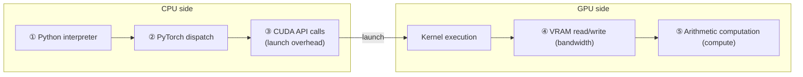
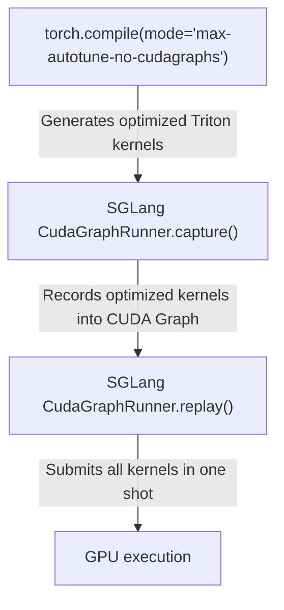
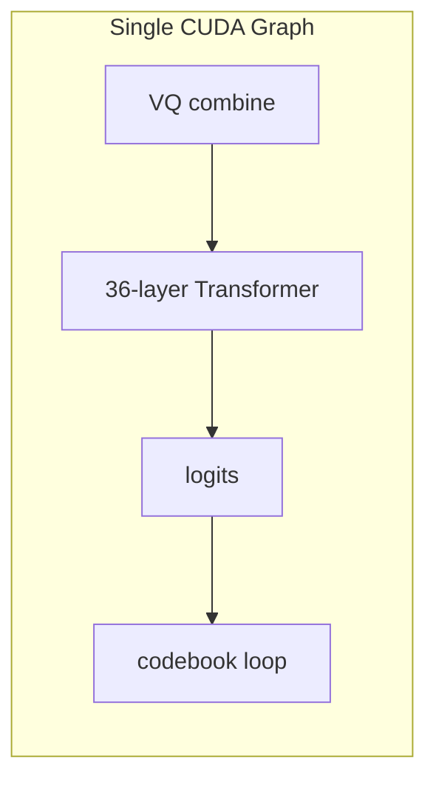
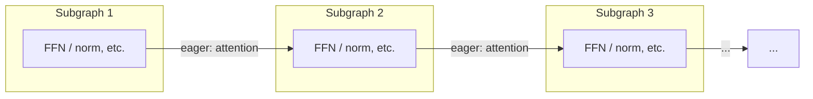

## SGLang CudaGraphRunner Source Code Walkthrough

The first two chapters showed, from the perspective of S2-Pro, how CUDA Graph constraints land as concrete code design. Now let's move one level up and look at how the SGLang framework manages these graphs.

Recall the two key conclusions derived in the first chapter: **one graph can only serve one batch size** (so a separate graph needs to be captured for each bs), and **multiple graphs can share a memory pool** (otherwise the VRAM usage is N times the high-water mark). `CudaGraphRunner` is the source-level implementation of exactly these two concepts.

### Multi-Batch-Size Graph Management

SGLang's `CudaGraphRunner` maintains an independent `cudaGraphExec_t` for each batch size - this is the direct manifestation of the "one bs, one graph" conclusion. The default `capture_bs` list contains 12 batch sizes (such as `[1, 2, 4, 8, 12, 16, 24, 32, 40, 48, 56, 64]`).

**Capture order**: from large to small - this follows from the memory pool sharing mechanism derived in the first chapter. Capture the large bs first so that the memory pool sees the maximum VRAM demand; subsequent captures for smaller bs can reuse the already allocated memory:

```python
# Key logic inside cuda_graph_runner.py capture()
capture_range = reversed(self.capture_bs)  # from large bs to small bs
for bs in capture_range:
    graph, output_buffers = self.capture_one_batch_size(bs, forward)
    self.graphs[bs] = graph
    self.output_buffers[bs] = output_buffers
```

Before capture, each bs first performs a **warmup run** (eager forward), triggering all possible memory allocations (cuBLAS workspace, attention buffer, etc.) and ensuring there will be no unexpected allocation during capture - this corresponds to the "no dynamic memory allocation" rule among the five constraints.

### Memory Pool Sharing

The first chapter already discussed CUDA Graph's VRAM sharing mechanism in depth (high-water mark, inside/outside isolation, `pool=...`). In `CudaGraphRunner`, this appears as all bs graphs sharing the same pool:

```python
with self.device_module.graph(cuda_graph=graph, pool=pool, stream=stream):
    out = run_once_fn()
```

For S2-Pro, the graphs for 12 bs values share the audio decoder's KV cache intermediate-result memory - the VRAM overhead is only one high-water mark for the largest-bs graph, not 12 copies.

### BS Padding During Replay

When the actual batch size is smaller than the captured batch size, `CudaGraphRunner` finds the smallest captured bs greater than or equal to the actual bs:

```python
index = bisect.bisect_left(self.capture_bs, raw_bs)
bs = self.capture_bs[index]
```

Graph replay executes the full `captured_bs` kernels, and the extra rows produce invalid computation. For S2-Pro, padding means `_decode_codebooks()` also executes the full 9-step codebook loop for the padding rows - but because the codebook loop consists of small matrix operations, the extra overhead is very small.

### S2-Pro's Additional Requirements for Capture

When `text_model._vq_ready = True`, the captured forward includes VQ embedding combination, 36 Transformer layers, logits computation, and `_decode_codebooks()`'s constrained sampling + 9-step codebook loop. The graph contains roughly `36 × 4 (transformer GEMM) + 9 × N (codebook loop kernels)` kernel nodes - significantly larger than a normal LLM graph, but replay overhead is still a single `cudaGraphLaunch()`.

### When to Fall Back to Eager Mode

Not every case can use CUDA Graph. For S2-Pro:

- **Prefill stage**: sequence length is not fixed -> no graph
- **Decode stage bs exceeds the maximum captured bs** -> fallback
- **Chunked prefill** -> no graph
- **Extend mode** -> eager

CUDA Graph mainly accelerates **steady-state throughput during the decode stage** - exactly where S2-Pro's performance bottleneck lies.

## The Deeper Relationship Between CUDA Graph and torch.compile

Recall the benchmark table at the beginning: CUDA Graph only reaches 88 tok/s, but partial compile further improves this by 36% to 121 tok/s. CUDA Graph has already eliminated all kernel launch overhead - so where does this extra 36% come from? This shows that **there are other overheads that CUDA Graph cannot eliminate**. To answer this question, we need to build a more complete model of GPU execution overhead.

### The Five Layers of GPU Execution Overhead



| Overhead layer | Effect of CUDA Graph | Effect of torch.compile |
|---|---|---|
| ①Python overhead | **Completely eliminated** | Greatly reduced |
| ②Framework dispatch | **Completely eliminated** | Greatly reduced |
| ③launch overhead | **Completely eliminated** | Partially reduced (fewer kernels after fusion) |
| ④VRAM bandwidth | No effect | **Significantly optimized** (operator fusion reduces intermediate tensor reads/writes) |
| ⑤Arithmetic computation | No effect | May optimize (or may be worse) |

**Key insight**: the two overlap on ③, but only torch.compile is effective on ④. This explains why CUDA Graph + torch.compile still has a 36% incremental gain - the small-operator chain in the codebook loop still has a large amount of intermediate tensor VRAM traffic.

### Why SGLang Uses `max-autotune-no-cudagraphs`

In the previous chapter, we walked through SGLang's `CudaGraphRunner` in detail - it manages graph capture/replay, the memory pool, and multi-bs scheduling by itself. If inductor also performs graph capture on its own (`reduce-overhead` or `max-autotune` mode), a **"graph inside a graph"** conflict occurs. Therefore SGLang chooses the `no-cudagraphs` suffix: let inductor only handle **kernel optimization** (operator fusion + Triton autotune), while **graph management** is left to SGLang itself:



Deeper discussion of the CUDAGraph Trees mechanism, the `fullgraph=True` constraint, graph-recording compatibility for inductor Triton kernels, and related topics is left for a follow-up article.

## The Rise and Fall of torch.compile in S2-Pro

The previous chapter established the five-layer overhead model and the division-of-labor principle behind `no-cudagraphs`. This chapter uses the actual iteration process of [PR #153](https://github.com/sgl-project/sglang-omni/pull/153) and benchmark data to **validate** that model.

### Narrative Line Across Seven Commits

| No. | Commit | Content | Meaning |
|---|---|---|---|
| 1 | `c153ae9` | unified slow/fast head | Core implementation: unified forward + persistent buffers |
| 2 | `f621355` | lint | Code style |
| 3 | `c962aa6` | torch.compile added in | **Turning point**: added `enable_torch_compile = True` |
| 4 | `78aafc7` | setup_vq_decode before CUDA graph capture | **Key fix**: deferred graph capture |
| 5 | `dccf122` | tts eval refactoring | Benchmark refactor |
| 6 | `cf9396d` | export server output | Output interface adjustment |
| 7 | `20be04a` | acknowledge torch.compile discussion | **Final decision**: remove torch.compile |

Commit 3 added `server_args.enable_torch_compile = True`, causing **the entire model forward** to be taken over by inductor - benchmarking 18 candidate kernels for every GEMM shape across 36 Transformer layers × 12 bs values. Startup time expanded from 33s to 137s.

### Interpreting the Benchmark Data

| Configuration | Health Ready | Graph Capture | Throughput (TTS) | Throughput (Voice Clone) |
|---|---|---|---|---|
| CUDA Graph only | 33.3s | 3.3s | 88.1 tok/s | 87.7 tok/s |
| Partial compile (fast head only) | 54.4s | 16.4s | 120.6 tok/s | 118.7 tok/s |
| Full-model compile | 137.0s | 107.0s | 125.7 tok/s | 122.5 tok/s |

Using the five-layer overhead model established in the previous chapter, we can interpret these data points one by one:

1. **Where does partial compile's 36% throughput improvement come from?** Recall the five-layer overhead table: CUDA Graph has already eliminated overheads ①②③, but in the 9-step codebook loop, the intermediate tensors between the small operators in each step still need to go through VRAM reads/writes - this is exactly overhead ④ (VRAM bandwidth). torch.compile's inductor fuses these small operators into fewer Triton kernels, reducing GPU-side VRAM round-trips. **Even when launch overhead is already zero, bandwidth optimization still has 36% room for improvement** - this precisely validates the five-layer model's prediction that "CUDA Graph does not affect ④, while torch.compile significantly optimizes ④."

2. **Only a 4% difference between full compile and partial compile**: recall the computational characteristics of the slow head from the second chapter - large GEMMs are already highly optimized by cuBLAS (overhead ⑤ is near optimal), and the only benefit torch.compile brings to the Transformer is fusing small-operator chains such as layernorm + residual, whose share is small.

3. **103.7s of additional startup time**: `max-autotune-no-cudagraphs` mode performs Triton autotune for each GEMM shape × each bs, for a total of approximately 12 bs × 36 layers × ~4 linear layers × 18 candidates ≈ 31,000+ benchmark runs. This is the inherent cost of autotune.

4. **Partial compile only +21s**: it only compiles the small number of small operators in the fast head, so the autotune search space is much smaller than for the full model.

### Why the Final Choice Was Not to Compile

1. **Abstraction-level mismatch**: torch.compile should be a framework-level capability, not a hack inside a single model
2. **Interaction complexity**: torch.compile's guards/recompilation and CUDA Graph interactions require extreme care
3. **Granularity issue**: the only part that truly benefits is the fast head's 36% gain; the slow head's 4% is not worth 103s of startup time

> This decision is not "do not use torch.compile", but "**do not do it here**" - defer the optimization to the framework level (Issue #172).

## Issue #172: Framework-Level torch.compile Blueprint

The previous chapter's conclusion was "do not do torch.compile here; defer it to the framework level." So how should it be done at the framework level? [Issue #172](https://github.com/sgl-project/sglang-omni/issues/172) gives a systematic three-phase plan, directly responding one by one to the three layers of decision logic above:

- **Phase 1 (Partial Compile)**: models declare compilable auxiliary modules (such as the codebook decoder) via `get_compile_targets()`, and the framework side compiles them with `torch.compile(mode="max-autotune-no-cudagraphs", fullgraph=True)`. Expected ~121 tok/s, startup ~54s.
- **Phase 2 (Global Compile)**: compile the entire `model.forward()`, assuming SGLang components such as RadixAttention are all compile-clean. Expected ~126 tok/s.
- **Phase 3 (Mega Cache)**: cache inductor compilation artifacts and eliminate startup overhead. Expected startup with a warm cache is close to the baseline ~33s.

Core design principles: no compile calls appear in model files; compile targets must be tensor-in tensor-out; `fullgraph=True` is mandatory; eager-first readability; configuration-driven. These principles correspond one-to-one with the lessons from PR #153. A detailed implementation analysis of the three phases is left for a follow-up article.

## Piecewise CUDA Graph: Another Path in the SGLang Main Repository

Looking back at the previous sections, we encountered the boundaries of monolithic CUDA Graph in several places: the first chapter derived the "one bs, one graph" limitation - the prefill stage has a large range of variation in token count, so it is impossible to enumerate every size; the CudaGraphRunner chapter pointed out that the prefill stage can only fall back to eager; and in Phase 2 of Issue #172, RadixAttention may cause graph breaks. These limitations naturally lead to a question: **is there a CUDA Graph approach that is more flexible than monolithic?** SGLang main repository's Piecewise CUDA Graph (PCG) is exactly the answer to this question.

### Three Limitations of Monolithic Graph

Recall the five constraints from the first chapter: monolithic graph requires the entire `forward()` to satisfy all of them. But in reality:

1. **Uncapturable operations**: FlashAttention, MoE dispatch (DeepEP, etc.), and similar operations either cannot or should not be captured by CUDA Graph - they require dynamic shapes or have internal host-device sync (violating constraint three). Monolithic graph cannot bypass these operations.
2. **Dynamic shape in prefill**: the token count in the prefill stage varies widely (from a few to several thousand), making it impossible to pre-capture a monolithic graph for every token count (violating the spirit of constraint four - although the control flow is static, the shape is not fixed).
3. **VRAM pressure**: monolithic graph holds a full set of intermediate tensors for each batch size, causing high VRAM usage.

The reason S2-Pro's decode can use monolithic graph is precisely that it satisfies all conditions: fixed bs, RadixAttention is capturable during decode, and the codebook loop control flow is completely static. But these conditions do not hold universally.

### Core Idea: Split at the Boundaries of Uncapturable Operations

**Piecewise CUDA Graph does not treat the entire forward as one graph; instead, it splits at the boundaries of uncapturable operations**, breaking forward into several small subgraphs, with each subgraph captured independently:

**Monolithic Graph (PR #153 approach)**: the entire forward is one graph



**Piecewise Graph (SGLang main repository approach)**: split at uncapturable operations



Each subgraph covers the portion "between two uncapturable operations" (such as FFN, layernorm, residual, etc.). Uncapturable operations (attention, MoE dispatch) still execute in eager mode.

### Split Points Mechanism

Split points are declared with the [`@register_split_op`](https://github.com/sgl-project/sglang/blob/main/python/sglang/srt/compilation/compilation_config.py) decorator:

```python
SPLIT_OPS = []

def register_split_op(op_name=None):
    def decorator(op_func):
        name = op_name or op_func.__name__
        SPLIT_OPS.append(f"sglang.{name}")
        return op_func
    return decorator
```

At compile time, [`split_graph()`](https://github.com/sgl-project/sglang/blob/main/python/sglang/srt/compilation/backend.py) traverses all nodes in the FX graph and cuts at split ops:

```python
def split_graph(graph, ops):
    subgraph_id = 0
    node_to_subgraph_id = {}
    for node in graph.graph.nodes:
        if node.op == "call_function" and str(node.target) in ops:
            subgraph_id += 1
            node_to_subgraph_id[node] = subgraph_id  # split op gets its own subgraph
            subgraph_id += 1
        else:
            node_to_subgraph_id[node] = subgraph_id
    # Split using torch.fx.passes.split_module
    split_gm = split_module(graph, None, lambda node: node_to_subgraph_id[node], ...)
```

For MoE models, `PiecewiseCudaGraphRunner` also dynamically adds MoE dispatch as a split point:

```python
if get_moe_a2a_backend().is_deepep():
    self.compile_config.add_split_op("sglang.moe_forward_piecewise_cuda_graph_impl")
```

### The Three Execution Stages of Each Subgraph

Each subgraph is managed by [`CUDAPiecewiseBackend`](https://github.com/sgl-project/sglang/blob/main/python/sglang/srt/compilation/cuda_piecewise_backend.py) and goes through three stages:

1. **Compilation**: `torch.compile` compiles the subgraph (using the `eager` or `inductor` backend), handling dynamic shapes
2. **CUDA Graph Capture**: capture each subgraph for predefined token lengths
3. **Steady-State Replay**: at runtime, find the nearest captured size, pad, then replay

```python
@dataclasses.dataclass
class ConcreteSizeEntry:
    runtime_shape: int
    need_to_compile: bool    # whether this size needs torch.compile
    use_cudagraph: bool      # whether this size needs CUDA Graph capture
    compiled: bool = False
    cudagraph: Optional[torch.cuda.CUDAGraph] = None
```

**Capture size schedule** (default):

```
4-32:      step 4     <- small token counts (decode) need fine granularity
48-256:    step 16
288-512:   step 32
640-1024:  step 64
1280-4096: step 256   <- large token counts (prefill) are insensitive to granularity
```

Here is a small question to think about: why is the capture size step not fixed? Because padding waste is relatively larger for small token counts - if actual tokens = 5 but the nearest captured size = 32, 27 invalid tokens are padded (540% waste). But when actual = 1000, padding to 1024 wastes only 2.4%.

### Comparison with the PR #153 Monolithic Graph

| Dimension | Monolithic Graph (PR #153) | Piecewise CUDA Graph |
|---|---|---|
| **Capture scope** | Entire forward | Each layer/segment independently |
| **Attention handling** | Included in the graph | Executes eagerly at split points |
| **Applicable stages** | Decode only (fixed bs) | **Decode + Prefill** (multiple token counts) |
| **Uncapturable operations** | Must be bypassed or replaced | Naturally supported at split points |
| **Memory Pool** | One graph per bs, shared pool | **Global shared pool**, shared by all subgraphs × all sizes |
| **Relationship with torch.compile** | Orthogonal (compile first, then capture) | **Embedded** (compile each subgraph first, then capture) |

**Key insight**: the Piecewise approach embeds torch.compile - each subgraph is first optimized by inductor, then captured as a CUDA Graph. This is exactly the **framework-level implementation** of the "inductor manages kernels, SGLang manages graphs" division of labor discussed in Issue #172.

### Global Shared Memory Pool

[`PiecewiseCudaGraphRunner`](https://github.com/sgl-project/sglang/blob/main/python/sglang/srt/model_executor/piecewise_cuda_graph_runner.py) uses one globally shared memory pool:

```python
global_graph_memory_pool = None  # shared by all runners

# Reuse the same pool during capture
capture_range = reversed(self.capture_num_tokens)  # from large to small
for num_tokens in capture_range:
    self.capture_one_batch_size(num_tokens)
```

As with `CudaGraphRunner`, capture proceeds from large token counts to small token counts, letting small sizes reuse memory already allocated for large sizes. But piecewise goes one step further: **all subgraphs × all capture sizes share the same pool** - significantly improving VRAM efficiency.

### Implications for S2-Pro

What does the idea of Piecewise CUDA Graph mean for SGLang-Omni?

- **Current S2-Pro decode does not need it**: the decode-stage monolithic graph is already sufficient - fixed bs, all operations capturable, TPS already improved from 55.6 to 88
- **Prefill stage may benefit**: S2-Pro's prefill currently runs eager. If prefill becomes a bottleneck, piecewise graph can cover the parts outside attention
- **Connection to Issue #172 Phase 2**: Phase 2 aims to compile the entire `model.forward()`, but RadixAttention may graph break - piecewise's idea of "splitting at uncapturable operations" is one solution
- **Broader significance**: as SGLang-Omni integrates MoE or more complex multimodal models in the future, the piecewise approach may become mandatory

Currently, Piecewise CUDA Graph is **enabled by default** in the SGLang main repository ([Issue #18130](https://github.com/sgl-project/sglang/issues/18130)) and can be disabled with `--disable-piecewise-cuda-graph`.

## Design Retrospective

Starting from the five constraints in the first chapter, we derived "one bs, one graph" and the memory sharing mechanism; used these concepts to analyze S2-Pro's dual AR architecture and "why the two AR processes should be unified into one CUDA Graph"; dug into deferred capture, persistent buffers, and the engineering implementation of CudaGraphRunner; introduced the five-layer overhead model to explain torch.compile's 36% increment; and finally saw how the piecewise approach responds to the limitations of monolithic graphs. Now let's condense this chain of reasoning into a design decision matrix.

### Design Decision Matrix

| Decision | Choice | Trade-off | Corresponding CUDA Graph constraint |
|---|---|---|---|
| Unified vs separate graph | Unified (one graph covers dual AR) | Higher engineering complexity, but eliminates CPU scheduling between two launches | - |
| Greedy vs Sampling | Greedy (`torch.argmax`) | Loses sampling diversity | No host-device sync |
| Persistent buffers | Pre-allocate + `copy_()` | Extra VRAM (~a few MB) | Pointer stability |
| Deferred capture | init first -> setup_vq -> capture | Increases initialization complexity | No updates after graph recording |
| torch.compile | Off (defer to framework) | Gives up 36% throughput improvement | - |
| Graph ownership | SGLang CudaGraphRunner | Gives up inductor CUDAGraph Trees | - |

### From Eager to the Final State

| Stage | Optimization | Eliminated overhead | Throughput | Startup time |
|---|---|---|---|---|
| Baseline | None | - | - | - |
| **PR #153** | CUDA Graph only | ①②③ launch overhead | 88 tok/s | ~33s |
| Issue #172 Phase 1 | + Partial compile (fast head) | ④ VRAM bandwidth (fast head) | ~121 tok/s | ~54s |
| Issue #172 Phase 2 | + Full compile | ④ VRAM bandwidth (slow head) | ~126 tok/s | ~137s |
| **Final state** Phase 3 | + Mega cache | compile startup overhead | ~126 tok/s | ~33s |

Each layer of optimization is **orthogonal and composable**, thanks to the clear division of labor implemented by `max-autotune-no-cudagraphs`: "inductor manages kernels, SGLang manages graphs."

Overall, the S2-Pro CUDA Graph work made me deeply realize that **optimization is never about a single technique, but about careful coordination across multiple layers of abstraction**. The five constraints are the guiding principles; all engineering designs are their concrete branches - when the principles are clear, the details fall into place.

## References

- [A Brief Analysis of CUDA Graph Based on torch-memory-saver](./readme_en.md) (Part 1 of this series)
- [CUDA Graph vs torch.compile: Practical Analysis on the S2-Pro TTS Model](./readme-2-en.md) (Part 2 of this series)
- [SGLang Code Walk Through](../../sglang/code-walk-through/readme.md)
- [Understanding verl Source Code from the Ground Up (Initialization)](../../rlhf/verl/multi-turn/code-walk-through/readme.md)
- [SGLang-Omni PR #153](https://github.com/sgl-project/sglang-omni/pull/153)
- [SGLang-Omni Issue #172](https://github.com/sgl-project/sglang-omni/issues/172)
- [NVIDIA CUDA Programming Guide - CUDA Graphs](https://docs.nvidia.com/cuda/cuda-c-programming-guide/index.html#cuda-graphs)
- [PyTorch CUDA Graphs Documentation](https://pytorch.org/docs/stable/cuda.html#cuda-graphs)
- [SGLang Piecewise CUDA Graph Roadmap - Issue #11490](https://github.com/sgl-project/sglang/issues/11490)
- [Accelerating PyTorch with CUDA Graphs](https://pytorch.org/blog/accelerating-pytorch-with-cuda-graphs/)

<!-- /learn-write automatic check report
Dual-track check: PASS
  - [x] Conceptual framework (five constraints + three-stage mechanism) is established before code analysis
  - [x] Model architecture appears after the concepts and before the code
  - [x] Origin of the slow/fast naming is explained before the model details
  - [x] "Why CUDA Graph helps" comes before "why unify into one graph"
  - [x] "Why unify into one graph" comes after model architecture and is derived from computational characteristics
  - [x] Code comes from a real production system (SGLang-Omni PR #153, commit cd9aaf3; SGLang main repository piecewise implementation)
  - [x] Piecewise CUDA Graph appears as an extension chapter and forms a contrast with monolithic graph

Narrative check: PASS
  - [x] Opening reviews previous articles and presents benchmark data
  - [x] Roadmap is a concise numbered list (4 items)
  - [x] Acknowledgements are casual and natural
  - [x] Each engineering design choice explicitly refers back to the five constraints
  - [x] Rhetorical questions guide the reader's thinking

Progressive derivation check: PASS
  - [x] Section 2 derives model analysis from the constraint tools in Section 1
  - [x] Section 3 derives deferred capture from "unification introduces engineering complexity" in Section 2
  - [x] Section 4 derives "how to safely read/write at runtime" from "buffers have been allocated" in Section 3
  - [x] Section 5 derives CudaGraphRunner from "one bs, one graph" in Section 1.2 and the memory pool in Section 1.4
  - [x] Section 6 derives the five-layer overhead model from the benchmark-data suspense at the opening (where does the 36% increment come from?)
  - [x] Section 7 uses benchmark data to validate the five-layer model from Section 6
  - [x] Section 8 derives "how to do this at the framework level" from Section 7's "do not do it here"
  - [x] Section 9 derives the motivation for piecewise from the multiple monolithic limitations in the previous sections
  - [x] Section 10 closes the full chain of reasoning

Depth check: [mixed understanding-reproduction level + modification-extension level] -> [actual depth matches] PASS
  - CUDA Graph conceptual framework: understanding-reproduction level
  - S2-Pro / SGLang-Omni code: modification-extension level
  - torch.compile: overview introduction; detailed analysis left for a follow-up article
  - Piecewise CUDA Graph: modification-extension level (SGLang is a system developed in-house)
-->
