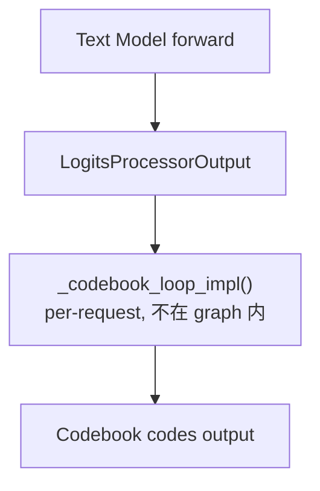
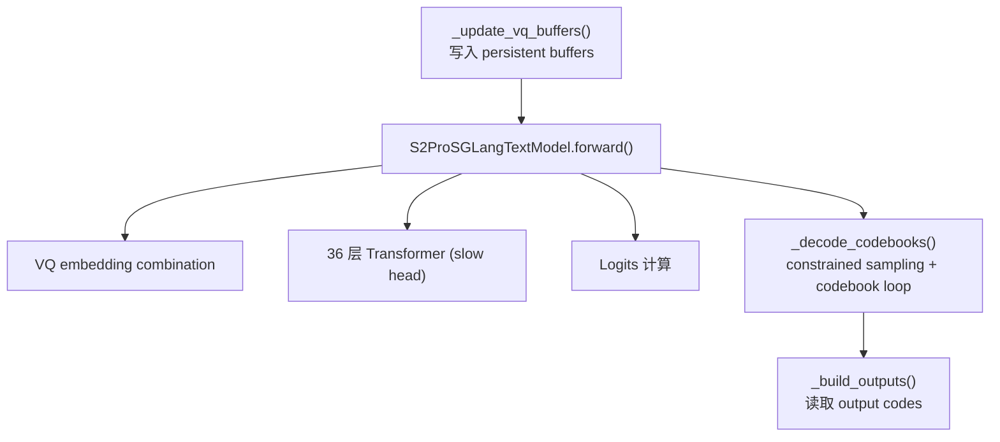
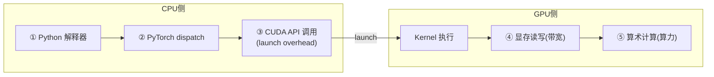
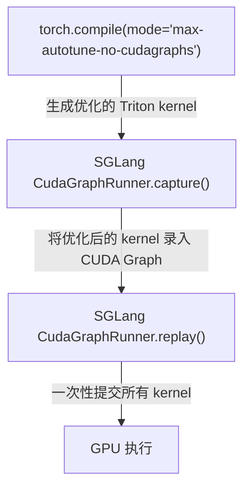
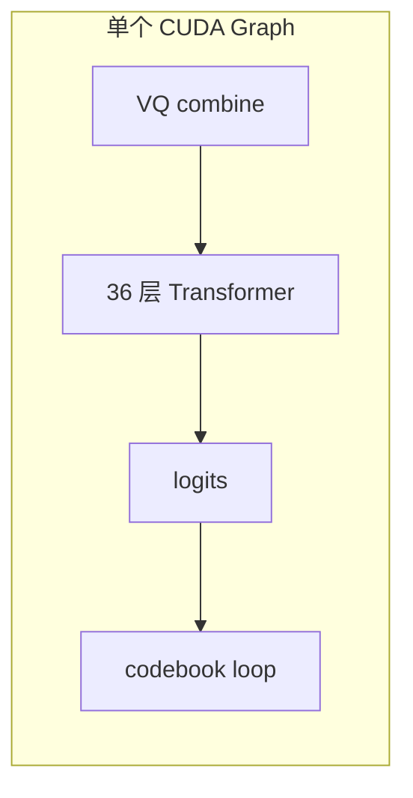
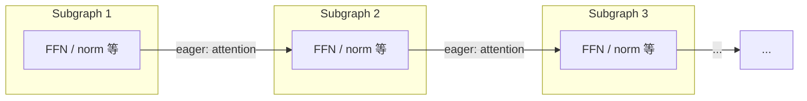

# 再探 CUDA Graph：TTS 模型中的双 CUDA Graph 优化

去年 8 月，我浅浅写过一篇从虚拟地址保护角度来理解 CUDA Graph 的文章，[基于 torch-memory-savor 浅析 CUDA Graph](./readme.md)（本系列第一篇）：覆盖了 CUDA Graph 基本概念、推理常用/训练少用的原因、torch-memory-saver 如何通过 `cuMemMap` 保护虚拟地址稳定性。无奈当时我对 CUDA Graph 的理解尚且浅薄，最近在 SGLang-Omni 框架中为 Fish Audio 的 S2-Pro TTS 模型添加 CUDA Graph 支持（[PR #153](https://github.com/sgl-project/sglang-omni/pull/153)），才发现 CUDA Graph 的博大精深。我们将 S2 Pro 模型通过双 CUDA Graph 同时执行，TPS 从 55.6 提高到了 88。在 [153](https://github.com/sgl-project/sglang-omni/pull/153) 相关的讨论中，我们更进一步结合 `torch.compile` 测试了同时开启 `torch.compile` 和 CUDA Graph 的性能：


| Configuration | Startup time | Steady-state throughput |
|---------------|--------------|-------------------------|
| No compile (CUDA graph only) | ~33s | 88 tok/s |
| Partial compile (fast head only) | ~54s | 121 tok/s |
| Full-model compile | ~137s | 126 tok/s |

> 注：此处的 TPS 衡量的是 TTS 模型 LLM backbone（语言模型骨干网络）产生 speech codec tokens 的速度，不包含 vocoder 阶段。这个模型的具体架构会在后文详细阐述。

效果令人感到极度舒适。有感于此，本文将会结合 153 PR 来分享我个人对 CUDA Graph 的更多理解。关于 `torch.compile` 的讨论，我们会留作后文分析：

1. deferred graph capture 的初始化顺序约束
2. persistent buffer 的指针稳定性设计
3. torch.compile 四种 mode 与 CUDA Graph 的共存策略
4. inductor CUDAGraph Trees 与 SGLang CudaGraphRunner 的冲突机制

acknowledgement：

Jingwen Gu, Yitong Guan, Ratish P, Shidong Li, Yue Leng, Shuai Shi, Junrong Lin, Shenggui Li, 还有我本人


## CUDA Graph 核心机制

在[浅析 CUDA Graph](./readme.md)一文中，已经讨论了 CUDA Graph 的基本概念。简单来说，CUDA Graph 将一段 GPU kernel 序列录制为静态 DAG，之后只需一次 CPU launch 即可重放整个计算流，以此消除逐个 kernel launch 的 CPU 开销。在此基础上，我们更进一步理解 CUDA Graph 的一些核心机制。

### 构造过程

1. **Capture**：捕获或者是录制 CUDA Graph。调用 `cudaStreamBeginCapture()` 后，CUDA runtime 进入录制模式——后续所有提交到该 stream 的操作（kernel launch、memcpy、memset 等）都不会真正执行，而是被记录为 DAG 中的节点。每个节点保存的信息包括：要调用哪个 kernel、grid/block 维度、以及所有参数的值（对 tensor 而言就是其 GPU 虚拟地址）。节点之间的边由 stream 上的提交顺序和跨 stream 的 event 同步自动推断。录制结束时，调用 `cudaStreamEndCapture()` 返回一个 `cudaGraph_t` 作为纯粹的拓扑关系的描述，不能直接执行。

2. **Instantiate**：实例化 CUDA Graph。得到 `cudaGraph_t` 后，进一步调用 `cudaGraphInstantiate()` 将其编译为 `cudaGraphExec_t`。capture 类似于录制脚本，instantiate 则是编译脚本为可执行二进制——前者是声明式的描述，后者是命令式的执行计划：
   - 依赖分析与调度：遍历 DAG 拓扑，确定哪些 kernel 之间有真正的数据依赖、哪些可以并发执行，生成一份最优的执行计划。
   - 参数绑定与固化：将 capture 阶段录制的所有 kernel 参数，比如 tensor 的 GPU 指针等等，烘焙（bake）进可执行对象中。从中我们也能看出，之后每次利用 CUDA Graph replay 时 tensor 的地址必须保持不变，因为虚拟地址已经被焊死在 `cudaGraphExec_t` 里了。
   - 合法性校验：检查图中是否存在不支持的操作（如 host-device sync），不合法则 instantiate 返回失败。


3. **Replay**：CUDA Graph 重放。调用 `cudaGraphLaunch(exec, stream)` 将整个 `cudaGraphExec_t` 一次性提交到指定 stream 上。CPU 只发出一次 launch 指令，GPU 端的调度器按 instantiate 阶段生成的执行计划依次（或并发地）执行所有 kernel，消除了逐个 kernel launch 的 CPU 开销。由于 replay 不经过 Python/PyTorch 的 dispatcher，也没有 CPU 端的逐 operation 调度，CPU overhead 几乎降为零。

对于推理这种高度重复的固定计算流（每个 decode step 执行相同的 kernel 序列），capture 一次、instantiate 一次、replay 无数次，节省下大量 CPU launch 开销，这就是 CUDA Graph 的核心价值。

### 约束条件

启动阶段执行的操作能够进一步推导出 CUDA Graph 的约束条件，也即在什么情况下 CUDA Graph 会被破坏：

| 约束 | 含义 | 为什么 |
|---|---|---|
| **指针稳定性** | replay 时必须保证 GPU 虚拟地址不变 | capture 时录制的是地址，地址变了 kernel 就读写错误内存 |
| **不能有动态内存分配** | capture 期间所有 tensor 必须预分配 | 动态 `torch.zeros(...)` 会触发 allocator，地址不可预测 |
| **不能有 host-device sync** | 不能调用 `.item()`、`torch.multinomial` 等 | sync 会中断 stream capture，导致 capture 失败 |
| **静态控制流** | 循环次数、分支条件在 capture 时固化 | graph 是静态 DAG，不支持运行时条件分支 |
| **graph 录制后不会自动更新** | 改了代码路径必须重新 capture | 录制完的 kernel 序列被固化，不会因为 Python 代码变化而改变 |

总的来说，CUDA Graph 是一个较为脆弱的静态图操作，需要仔细保护。

上述约束进一步得到一个直接推论：一份 graph 只能服务一种 batch size。具体来说，考虑到 capture 阶段录制 kernel 参数（grid 维度、tensor shape/地址）会被固化进 `cudaGraphExec_t`，而 batch size 改变，则这些参数会全部失效。SGLang 的 decode 阶段每个请求每步只产出一个 token，`bs=4` 意味着 input tensor 第一维为 4——对应的 kernel grid size、中间 tensor shape、内存布局都是按 4 来的，和 `bs=8` 时的布局完全不同。换言之，一份 graph 只能服务一种 batch size，SGLang 会为一组离散的 decode batch size（如 `bs ∈ {1, 2, 4, 8, ...}`）各 capture 一份 graph。当实际请求数恰好命中某个预录的 bs 时，走 graph replay；否则 fallback 到 eager mode——即 PyTorch 默认的逐 op 执行方式，每个 kernel 由 CPU 逐个 launch，没有 graph 的一次性提交优化，但胜在对任意动态 shape 都能正确执行。

### PyTorch 封装与 Memory Pool

PyTorch 将 CUDA runtime 的 graph API 进一步封装为 Python 友好的接口：

| PyTorch API | CUDA Runtime API |
|---|---|
| `torch.cuda.CUDAGraph()` | `cudaGraph_t` + `cudaGraphExec_t` |
| `graph.capture_begin()` | `cudaStreamBeginCapture()` |
| `graph.capture_end()` | `cudaStreamEndCapture()` |
| `graph.replay()` | `cudaGraphLaunch()` |

### CUDA Graph 显存开销与共享机制

讲到这里，不得不提到[兰青老师](https://www.linkedin.com/in/lanking/)曾给我分享过的一种定义——CUDA Graph 就是一种 cache。既然是 cache，一定是空间换时间的。每个 graph 在 capture 阶段执行的所有中间计算都会产生中间 tensor（attention score、FFN 中间激活、残差加法的输出等）。这些中间 tensor 的地址会被写入 `cudaGraphExec_t`，replay 时 kernel 直接读写这些固定地址。因此，capture 期间 memory pool 分配出的这块显存区域会被 CUDA Graph 整体锁定，不会还给 PyTorch 的通用 allocator。

此外，注意到 CUDA Graph 所持有的显存并非所有中间 tensor 大小的总和。我们可以将 CUDA Graph 的 memory pool 视作一块封闭的独立显存区域：graph 内部的 tensor 只能使用 pool 内的显存，外部 tensor 不能占用 pool 里的空间，内外隔离。但在这个围起来的区域内部，PyTorch 的 caching allocator 仍然正常工作：先产生的中间 tensor 如果后续不再被引用，其地址可以被后面的 tensor 复用。因此，单个 graph 持有的显存约等于 capture 期间的显存峰值（high-water mark），而非所有曾经出现过的 tensor 的简单加总。举个例子，一个 32 层 Transformer 的 forward，每层的中间激活在下一层开始后就可以被复用，high-water mark 可能只相当于几层的中间 tensor，而远非 32 层的总和。

尽管如此，如果有 12 个不同 batch size 的 graph 且各自独立持有一份 high-water mark 的显存，总占用仍然是 12 倍——这在大模型推理中依然不可接受。这里进一步引出不同 Graph 之间的显存共享机制。前文提及的内外隔离，是指 graph pool 与非 graph 的普通 PyTorch 代码之间的隔离，但多个 graph 之间并不需要隔离。PyTorch 通过 `torch.cuda.graph(pool=...)` 允许多个 graph 共享同一个 pool，它们的中间 tensor 都从同一块显存区域中分配。这之所以安全，是因为 decode 阶段每个 step 只会选择一个 batch size 对应的 graph 来 replay，不同 graph 的中间 tensor 不会同时存活，可以轮流复用。这样，不管有多少个 graph，显存开销只相当于最大那个 graph 的一份 high-water mark。这些概念会在后续 SGLang CudaGraphRunner 源码中具体展开。

## S2-Pro 模型架构与双 CUDA Graph 的动机

上文建立了 CUDA Graph 的核心机制：构造过程、五条约束、"一 bs 一 graph"推论、以及显存共享。接下来我们用这套工具来分析一个具体模型——S2-Pro。这不是一个普通的 LLM，而是一个 **Dual-AR（双自回归）TTS 模型**。理解它的架构特点，是理解"为什么需要双 CUDA Graph"的前提。

### 整体架构：为什么叫 Slow Head / Fast Head

S2-Pro 的每个 decode step 分两阶段：

1. **Slow head**（text model）：一个 36 层 Qwen3 transformer，输入上一步的 token，输出下一个 semantic token 的 logits。**叫 slow 是因为单次推理慢**——36 层大 transformer，`hidden_size=2560`，每层 4 个大 GEMM，单次 forward 耗时 ms 级。
2. **Fast head**（audio decoder）：一个小型 transformer，接收 slow head 的 hidden states，自回归地生成 9 个 codebook token。**叫 fast 是因为单次推理快**——层数少、维度小，单次只需 μs 级。但它要连续跑 9 次（对应 9 个 codebook）。

**命名的关键**：slow/fast 描述的是**单次推理的延迟**，不是总耗时。Slow head 单次慢但只跑一次；fast head 单次快但自回归地跑 9 次。

### Slow Head 细节

S2-Pro 的 slow head 在 [`sglang_model.py`](https://github.com/sgl-project/sglang-omni/blob/cd9aaf3/sglang_omni/models/fishaudio_s2_pro/sglang_model.py) 中实现为 `S2ProSGLangTextModel`，核心参数：

- **36 层** `S2ProDecoderLayer`，`hidden_size=2560`，`intermediate_size=9728`
- `num_heads=32`，`num_kv_heads=8`（GQA），`head_dim=128`
- 使用 SGLang 的 `RadixAttention`（带 paged KV cache），注意力后端为 FlashAttention 3

**计算特征**：每层包含 4 个大 GEMM——`qkv_proj`、`o_proj`、`gate_up_proj`、`down_proj`。以 bs=8 为例，主要的 GEMM shape 是 `mm(8×2560, 2560×6144)` 和 `mm(8×9728, 9728×2560)` 等。这些大矩阵乘法在 cuBLAS 中已经高度优化，单个 kernel 耗时在 ms 级，**kernel launch overhead 相对占比较小**。

### Fast Head 细节

Fast head 是一个独立的小型 transformer——[`FishQwen3AudioDecoder`](https://github.com/sgl-project/sglang-omni/blob/cd9aaf3/sglang_omni/models/fishaudio_s2_pro/fish_speech/models/text2semantic/modeling.py#L919)，核心组件：

- `project_in`：线性投影，将 text model 的 `hidden_size`（2560）映射到 fast decoder 自己的维度
- 若干层 `TransformerBlock`（层数远小于 slow head）
- `RMSNorm` + `output` 线性头（输出 `vocab_size=4096` 的 codebook logits）
- `codebook_embeddings`：`nn.Embedding(vocab_size × num_codebooks, text_dim)`——共享的 codebook embedding 表
- **Static KV cache**：每层独立预分配 `KVCache(max_batch_size, num_codebooks+1, n_local_heads, head_dim)`，与 SGLang 的 paged KV cache 完全独立

**9 步 codebook loop 的计算特征**：每步只有一次小 GEMM（`[bs, 1, fast_dim]` 级别），计算量极小（μs 级），但需要完成 embedding lookup → linear projection → `forward_kvcached` → argmax → embedding lookup 的完整序列。**瓶颈完全在 kernel launch overhead**——每步虽然快，但 9 步循环产生了大量的小 kernel launch。

这里思考一个小问题：为什么 fast head 的 KV cache 要用 static 预分配而不用 SGLang 的 paged KV cache？简单来说，codebook loop 的序列长度是固定的（`num_codebooks + 1`，即 10 或 11 步），不存在动态增长的需求。Static KV cache 不仅实现更简单，而且天然满足上文"指针稳定性"约束——分配后地址不再变化。

### 两种 KV Cache 的共存

在同一个 CUDA Graph 中，两种完全不同的 KV cache 管理策略必须和平共处：

| 维度 | SGLang Paged KV Cache（slow head） | Static KV Cache（fast head） |
|---|---|---|
| 管理方式 | `token_to_kv_pool_allocator` 动态分配 | `setup_caches()` 一次性预分配 |
| 序列长度 | 动态增长 | 固定（`num_codebooks + 1`） |
| 内存回收 | 通过 `release_kv_cache()` 归还 pool | `reset_caches()` 用 `zero_()` 清空 |
| CUDA Graph 安全性 | 通过 SGLang 的 `req_to_token_pool` 间接保证 | **天然安全**——地址分配后不变 |

两者共存不冲突，因为 graph replay 时看到的 GPU 虚拟地址都没有变化——paged cache 通过 SGLang 框架的预分配 buffer + 间接寻址保证，static cache 则更简单地通过一次性分配保证。

### 为什么 CUDA Graph 对这个模型有帮助

结合上文的概念框架，S2-Pro 的 decode 阶段天然适合 CUDA Graph：

- **高度重复的固定 kernel 序列**：每个 step 都执行相同的 36 层 transformer + 9 步 codebook loop，控制流完全静态——正是五条约束中"静态控制流"要求的理想场景
- Decode 阶段的 batch size 在一段时间内相对稳定
- TTS 推理是 latency-sensitive 的（需要实时生成语音），消除 CPU 侧的 launch overhead 对端到端延迟有直接帮助

确认了"CUDA Graph 适用于 S2-Pro"之后，下一个问题是：graph 应该覆盖哪些部分？

### 核心问题：为什么需要双 CUDA Graph

**这是整篇文章的驱动问题。**

PR #153 之前，SGLang 的 CUDA Graph 只覆盖 slow head（标准 LLM transformer forward）。Fast head（codebook loop）作为 per-request 后处理运行在 graph 之外。结合上面对两个 head 计算特征的分析：

- **Slow head 的 CUDA Graph 收益有限**：slow head 的核心是 `mm(8×2560, 2560×6144)` 这样的大 GEMM，单 kernel 耗时 ms 级。消除 launch overhead 的相对收益小——大 kernel 的执行时间远大于 launch 开销。
- **Fast head 没有 CUDA Graph 才是真正的瓶颈**：codebook loop 每步是 μs 级的小算子，9 步循环产生大量 kernel launch。Launch overhead 占执行时间的主要比例——**这正是 CUDA Graph 最擅长解决的问题**。
- **两个 head 之间还有 CPU 调度开销**：slow head 的 graph replay 结束后，CPU 需要取回结果、逐 request 调用 codebook loop、再写回——这段 CPU 往返也是开销。

因此，**核心洞察：把 slow head 和 fast head 统一到一个 `forward()` 中，让一个 CUDA Graph 同时捕获两者**。TPS 从 55.6 跃升到 88，增益主要来自 fast head 的 launch overhead 消除。

但"统一到一个 graph"引入了巨大的工程复杂性——这正是后续章节存在的原因：

- 两种 KV cache 必须在同一个 graph 中共存（上文已分析）
- 所有动态输入（上一步的 codebook values）必须通过 persistent buffer 传入
- 初始化顺序必须保证 graph 捕获到完整路径（deferred capture）
- Codebook loop 的循环和采样必须满足 CUDA Graph 的静态约束

### PR #153 前后的架构对比

**之前（分离的处理流程）**：



**之后（统一的 forward）**：



`_decode_codebooks()` 从外部的 per-request 后处理，变成了 `forward()` 内部的一个步骤。CUDA Graph 可以将 transformer + sampling + codebook loop 一次性录制，消除整个 decode step 的所有 kernel launch overhead。

## Deferred Graph Capture：为什么初始化顺序如此重要

上一章确立了"把 slow head 和 fast head 统一到一个 graph"的核心决策，并列出了它引入的四项工程复杂性。从这一章开始，我们逐项展开这些工程挑战。第一个是 deferred graph capture——它直接对应五条约束中的最后一条：**graph 录制后不会自动更新**。

### `factory.py` 的初始化时序

[`create_s2pro_sglang_engine()`](https://github.com/sgl-project/sglang-omni/blob/cd9aaf3/sglang_omni/models/fishaudio_s2_pro/factory.py) 中的初始化时序非常精心，每一步都不能乱：

```python
# Step 1: 暂时禁用 CUDA Graph
want_cuda_graph = not server_args.disable_cuda_graph
server_args.disable_cuda_graph = True

# Step 2: 初始化 ModelWorker（此时不 capture graph）
model_worker = ModelWorker(config=ModelWorkerConfig(), server_args=server_args, gpu_id=gpu_id)

# Step 3: BF16 精度修正
_truncate_rope_to_bf16(model_worker.model_runner.model)

# Step 4: 预分配 fast head 的 static KV cache
audio_decoder.setup_caches(max_batch_size=max_bs, dtype=torch.bfloat16)

# Step 5: 分配 persistent buffers + 挂载 audio decoder
text_model.setup_vq_decode(audio_decoder, ...)

# Step 6: 此时 capture graph——包含完整的 forward + _decode_codebooks
if want_cuda_graph:
    model_worker.model_runner.init_device_graphs()
```

有一个问题非常值得分享：**为什么不能在 Step 2 直接 capture？**

`ModelWorker.__init__()` 内部会调用 `init_cuda_graphs()`。如果在这一步就 capture，此时 `text_model._vq_ready = False`——因为 `setup_vq_decode()` 还没调用。于是 `forward()` 中的 `if self._vq_ready:` 分支不会执行，graph 中不包含 VQ embedding combination 和 `_decode_codebooks()`。

回顾第一章的第五条约束：**graph 是静态的，录制后不会自动更新**。后续即使调用了 `setup_vq_decode()` 让 `_vq_ready = True`，已经录好的 graph 并不会自动更新。Replay 时执行的仍然是录制时的 kernel 序列——一个不包含 codebook decode 的"残缺"forward。

因此必须 **先** attach audio decoder 和分配 buffers（Step 4-5），**再** capture graph（Step 6）。这就是 deferred graph capture 的核心。

### `setup_vq_decode()` 的 Buffer 分配

[`setup_vq_decode()`](https://github.com/sgl-project/sglang-omni/blob/cd9aaf3/sglang_omni/models/fishaudio_s2_pro/sglang_model.py#L196) 分配了所有 persistent buffer。这些 buffer 直接对应第一章的第二条约束：**不能有动态内存分配**。

**Input buffers**（由 ModelRunner 在 forward 前写入）：
- `_vq_codes`：`torch.zeros(max_bs, num_codebooks, dtype=torch.long)`——上一步生成的 codebook codes
- `_vq_mask`：`torch.zeros(max_bs, dtype=torch.bool)`——标记哪些 batch 位置需要 VQ embedding combination

**Output buffers**（由 `_decode_codebooks()` 写入，ModelRunner 在 forward 后读取）：
- `_output_codes`：`torch.zeros(max_bs, num_codebooks+1, dtype=torch.long)`——当前步生成的所有 codes
- `_output_semantic_ids`：`torch.zeros(max_bs, dtype=torch.long)`——当前步的 semantic token id

**Auxiliary tensors**：
- `_semantic_bias`：`torch.full((vocab_size,), -inf, dtype=torch.bfloat16)`——实现 constrained decoding
- `_vq_codebook_embeddings`：直接引用 `audio_decoder.codebook_embeddings`（共享权重，不额外分配）

所有 buffer 在 `setup_vq_decode()` 时一次性 `torch.zeros(...)` 分配，之后只通过就地操作修改值——这正是第一章"指针稳定性"约束的体现。

## Persistent Buffer 与 CUDA Graph 安全性

上一章解决了"什么时候分配 buffer"和"分配哪些 buffer"的问题。但 buffer 分配只是故事的一半——运行时每个 decode step 都需要往这些 buffer 里写入新的动态数据（上一步的 codebook values、semantic mask 等），然后让 graph replay 读取。这就引出下一个问题：为什么就地操作（`copy_()`、`fill_()`、`zero_()`）就能保证 CUDA Graph 安全？答案仍然要回到第一章的"指针稳定性"约束。

### 就地操作清单

| 操作 | 使用场景 | 为什么满足指针稳定性约束 |
|---|---|---|
| `tensor.copy_(source)` | `_update_vq_buffers()` 写入 VQ codes | 修改值，不改地址 |
| `tensor[:bs] = value` | `_decode_codebooks()` 写入 output codes | index assignment 是就地操作 |
| `tensor.fill_(scalar)` | audio decoder 的 `input_pos.fill_(codebook_idx)` | 就地填充 |
| `tensor.zero_()` | `reset_caches()` 清空 KV cache | 就地清零 |

### Buffer 读写协议

[`S2ProSGLangModelRunner`](https://github.com/sgl-project/sglang-omni/blob/cd9aaf3/sglang_omni/models/fishaudio_s2_pro/runtime/s2pro_sglang_ar.py) 实现了一个精心设计的协议：

| 步骤 | 函数 | 位置 |
|---|---|---|
| 1 | `_update_vq_buffers()` — 写入 `_vq_codes` / `_vq_mask` | **graph 外部**（forward 前） |
| 2 | `model_worker.forward()` — CUDA Graph replay | **graph 内部** |
| 3 | `_build_outputs()` — 读取 `_output_codes` | **graph 外部**（forward 后） |

**关键洞察**：buffer 的读写发生在 **CUDA Graph boundary 之外**（`_update_vq_buffers` 在 forward 前，`_build_outputs` 在 forward 后），但 buffer 本身被 graph 内部的 kernel 引用。这种 **"外部写值、graph 内部读地址"** 的模式是 CUDA Graph 与动态输入兼容的标准做法。

来看 `_update_vq_buffers()` 的具体实现：

```python
def _update_vq_buffers(self, model_worker_batch, scheduler_output):
    text_model = self.model_worker.model_runner.model
    input_ids = model_worker_batch.input_ids
    bs = input_ids.shape[0]

    # 计算 semantic mask
    is_semantic = (input_ids >= self._semantic_begin_id) & (input_ids <= self._semantic_end_id)
    text_model._vq_mask[:bs].copy_(is_semantic)

    # 写入每个 request 的 codebook values
    for i, sched_req in enumerate(scheduler_output.requests):
        data = sched_req.data
        if data._last_codebook_values is not None and is_semantic[i]:
            text_model._vq_codes[i].copy_(data._last_codebook_values)
```

`.copy_()` 修改了 `_vq_mask` 和 `_vq_codes` 的值，但这些 tensor 的 GPU 虚拟地址没有变化。Graph replay 时，`forward()` 中的 kernel 读取的仍然是同一个地址，只是值已经被更新为当前 step 的数据。

### `input_pos.fill_()` 模式

`forward_kvcached()` 中使用了一个精心设计的 CUDA Graph 兼容模式：

```python
def forward_kvcached(self, x, codebook_idx):
    self.input_pos.fill_(codebook_idx)
    freqs_cis = self.freqs_cis[self.input_pos]
    cache_seqlens = self.input_pos.expand(bsz).to(torch.int32)
    ...
```

`input_pos` 是 `register_buffer` 注册的 persistent tensor。`fill_()` 是就地操作。`codebook_idx` 在 codebook loop 展开后是 Python 常量，在 capture 时被固化为 graph 的一部分——对应五条约束中的"静态控制流"。

> 这比 `torch.tensor([codebook_idx])` 安全得多——后者会创建新 tensor，破坏地址稳定性。

### Greedy Decoding：host-device sync 约束的体现

PR #153 将 codebook 的采样策略从 `_sample_with_topk`（temperature + top_k + top_p + repetition_penalty）切换为 `torch.argmax(biased_logits, dim=-1)`。这不仅仅是简化——它直接对应五条约束中的"不能有 host-device sync"：

- `torch.argmax` 是确定性的、无状态的、不需要随机数生成器 → 完全可以被 CUDA Graph 录制
- top_k/top_p sampling 涉及 `torch.multinomial`，可能需要 random state 管理和动态 shape 操作 → graph-incompatible
- TTS 场景下 greedy decoding 的质量损失可以接受——这是一个有意的 trade-off

## SGLang CudaGraphRunner 源码走读

前两章从 S2-Pro 的视角展示了 CUDA Graph 约束如何落地为具体的代码设计。现在我们拉高一层视角，看 SGLang 框架如何管理这些 graph。

回顾第一章推导出的两个关键结论：**一份 graph 只能服务一种 batch size**（所以需要为多个 bs 各 capture 一份），以及**多个 graph 可以共享 memory pool**（否则显存占用是 N 倍 high-water mark）。`CudaGraphRunner` 正是这两个概念的源码级落地。

### 多 Batch Size 的 Graph 管理

SGLang 的 `CudaGraphRunner` 为每个 batch size 维护一个独立的 `cudaGraphExec_t`——这正是"一 bs 一 graph"推论的直接体现。默认的 capture_bs 列表包含 12 个 batch size（如 `[1, 2, 4, 8, 12, 16, 24, 32, 40, 48, 56, 64]`）。

**Capture 顺序**：从大到小——这来自第一章 memory pool 共享机制的推论。先 capture 大 bs，让 memory pool 看到最大的显存需求，后续小 bs 的 capture 可以复用已分配的内存：

```python
# cuda_graph_runner.py capture() 中的关键逻辑
capture_range = reversed(self.capture_bs)  # 从大 bs 到小 bs
for bs in capture_range:
    graph, output_buffers = self.capture_one_batch_size(bs, forward)
    self.graphs[bs] = graph
    self.output_buffers[bs] = output_buffers
```

每个 bs 在 capture 前先做一次 **warmup run**（eager forward），触发所有可能的内存分配（cuBLAS workspace、attention buffer 等），确保 capture 时不会有意外的 allocation——这对应五条约束中的"不能有动态内存分配"。

### Memory Pool 共享

第一章已经深入讨论了 CUDA Graph 的显存共享机制（high-water mark、内外隔离、`pool=...`）。在 `CudaGraphRunner` 中，这体现为所有 bs 的 graph 共享同一个 pool：

```python
with self.device_module.graph(cuda_graph=graph, pool=pool, stream=stream):
    out = run_once_fn()
```

对 S2-Pro 而言，12 个 bs 的 graph 共享 audio decoder 的 KV cache 中间结果内存——显存开销只相当于最大 bs graph 的一份 high-water mark，而非 12 份。

### Replay 中的 BS Padding

当 actual batch size < captured batch size 时，`CudaGraphRunner` 会找到大于等于 actual bs 的最小 captured bs：

```python
index = bisect.bisect_left(self.capture_bs, raw_bs)
bs = self.capture_bs[index]
```

Graph replay 执行完整的 `captured_bs` 个 kernel，多余的行产生无效计算。对于 S2-Pro，padding 意味着 `_decode_codebooks()` 也会对 padding 行执行完整的 9 步 codebook loop——但由于 codebook loop 是小矩阵运算，额外开销很小。

### S2-Pro 对 Capture 的额外需求

当 `text_model._vq_ready = True` 时，capture 的 forward 包含 VQ embedding combination、36 层 Transformer、logits 计算、以及 `_decode_codebooks()` 的 constrained sampling + 9 步 codebook loop。Graph 中包含了约 `36 × 4（transformer GEMM）+ 9 × N（codebook loop kernels）` 个 kernel node——比普通 LLM 的 graph 显著更大，但 replay 的 overhead 仍然是一次 `cudaGraphLaunch()`。

### 何时 Fallback 到 Eager Mode

并非所有情况都能走 CUDA Graph。对 S2-Pro 而言：

- **Prefill 阶段**：序列长度不固定 → 不走 graph
- **Decode 阶段 bs 超过最大 capture bs** → fallback
- **Chunked prefill** → 不走 graph
- **Extend 模式** → 走 eager

CUDA Graph 主要加速的是 **decode 阶段的稳态吞吐**——恰好是 S2-Pro 的性能瓶颈所在。

## CUDA Graph 与 torch.compile 的深层关系

回顾开篇的 benchmark 表格：CUDA Graph only 达到 88 tok/s，但 partial compile 还能在此基础上再提升 36% 到 121 tok/s。CUDA Graph 已经消除了所有 kernel launch overhead——那这 36% 的增量从何而来？这说明 **CUDA Graph 消除不了的开销另有其人**。要回答这个问题，需要建立一个更完整的 GPU 执行开销模型。

### GPU 执行流水线的五层开销



| 开销层 | CUDA Graph 的效果 | torch.compile 的效果 |
|---|---|---|
| ①Python overhead | **完全消除** | 大幅减少 |
| ②框架 dispatch | **完全消除** | 大幅减少 |
| ③launch overhead | **完全消除** | 部分减少（融合后 kernel 数量减少） |
| ④显存带宽 | 不影响 | **显著优化**（算子融合减少中间 tensor 读写） |
| ⑤算术计算 | 不影响 | 可能优化（也可能更差） |

**关键洞察**：两者在③上有重叠，但在④上只有 torch.compile 有效。这解释了为什么 CUDA Graph + torch.compile 仍然有 36% 的增量——codebook loop 的小算子链还有大量的中间 tensor 显存读写。

### 为什么 SGLang 使用 `max-autotune-no-cudagraphs`

上一章我们详细走读了 SGLang 的 `CudaGraphRunner`——它自己管理 graph 的 capture/replay、memory pool、multi-bs 调度。如果 inductor 也自己做 graph capture（`reduce-overhead` 或 `max-autotune` mode），就会产生 **"graph 里套 graph"** 的冲突。因此 SGLang 选择 `no-cudagraphs` 后缀：让 inductor 只负责 **kernel 优化**（算子融合 + Triton autotune），而 **graph 管理** 留给 SGLang 自己：



关于 CUDAGraph Trees 机制、`fullgraph=True` 约束、inductor Triton kernel 的 graph 录制兼容性等更深入的讨论，我们留作后续文章分析。

## torch.compile 在 S2-Pro 中的兴衰

上一章建立了五层开销模型和 `no-cudagraphs` 的分工原则。这一章用 PR #153 的实际迭代过程和 benchmark 数据来**验证**这个模型。

### 七个 Commit 的叙事线

| 序号 | Commit | 内容 | 意义 |
|---|---|---|---|
| 1 | `c153ae9` | unified slow/fast head | 核心实现：统一 forward + persistent buffers |
| 2 | `f621355` | lint | 代码规范 |
| 3 | `c962aa6` | torch.compile added in | **转折点**：加入 `enable_torch_compile = True` |
| 4 | `78aafc7` | setup_vq_decode before CUDA graph capture | **关键修复**：deferred graph capture |
| 5 | `dccf122` | tts eval refactoring | Benchmark 重构 |
| 6 | `cf9396d` | export server output | 输出接口调整 |
| 7 | `20be04a` | acknowledge torch.compile discussion | **最终决策**：移除 torch.compile |

Commit 3 加入了 `server_args.enable_torch_compile = True`，导致**整个 model forward** 被 inductor 接管——对 36 层 transformer × 12 个 bs 的每个 GEMM shape 做 18 候选 kernel 的 benchmark。启动时间从 33s 膨胀到了 137s。

### Benchmark 数据解读

| 配置 | Health Ready | Graph Capture | 吞吐（TTS） | 吞吐（Voice Clone） |
|---|---|---|---|---|
| CUDA Graph only | 33.3s | 3.3s | 88.1 tok/s | 87.7 tok/s |
| Partial compile（fast head only） | 54.4s | 16.4s | 120.6 tok/s | 118.7 tok/s |
| Full-model compile | 137.0s | 107.0s | 125.7 tok/s | 122.5 tok/s |

用上一章建立的五层开销模型逐条解读这些数据：

1. **Partial compile 的 36% 吞吐提升从何而来？** 回顾五层开销表：CUDA Graph 已消除开销①②③，但 codebook loop 的 9 步循环中，每步的小算子之间的中间 tensor 仍然需要经过显存读写——这正是开销④（显存带宽）。torch.compile 的 inductor 将这些小算子融合为更少的 Triton kernel，减少了 GPU-side 的显存 round-trip。**即使 launch overhead 已经为零，带宽优化仍有 36% 的收益空间**——这精确验证了五层模型中"CUDA Graph 不影响④，torch.compile 显著优化④"的预测。

2. **Full compile vs Partial compile 仅 4% 差异**：回顾第二章 slow head 的计算特征——大 GEMM 已被 cuBLAS 高度优化（开销⑤接近最优），torch.compile 在 transformer 上唯一的收益是融合 layernorm + residual 等小算子链，占比很小。

3. **103.7s 的额外启动时间**：`max-autotune-no-cudagraphs` mode 对每个 GEMM shape × 每个 bs 做 Triton autotune，总量 ≈ 12 bs × 36 layers × ~4 linear layers × 18 candidates ≈ 31,000+ benchmark runs。这是 autotune 的固有成本。

4. **Partial compile 仅 +21s**：只编译 fast head 的少量小算子，autotune 搜索空间远小于 full model。

### 为什么最终选择不 Compile

1. **抽象层级错配**：torch.compile 应该是框架级能力，不是单个模型的 hack
2. **交互复杂性**：torch.compile 的 guards/recompilation 与 CUDA Graph 交互需要极度小心
3. **粒度问题**：真正受益的只有 fast head 的 36% 增益，slow head 的 4% 不值得 103s 启动时间

> 这个决策不是"不要 torch.compile"，而是"**不在这里做**"——将优化推迟到框架层面（Issue #172）。

## Issue #172：Framework-Level torch.compile 蓝图

上一章的结论是"不在这里做 torch.compile，推迟到框架层面"。那框架层面怎么做？[Issue #172](https://github.com/sgl-project/sglang-omni/issues/172) 给出了三阶段系统性方案，正是对上述三层决策逻辑的逐一回应：

- **Phase 1（Partial Compile）**：模型通过 `get_compile_targets()` 声明可编译的 auxiliary modules（如 codebook decoder），框架侧用 `torch.compile(mode="max-autotune-no-cudagraphs", fullgraph=True)` 编译。预期 ~121 tok/s，启动 ~54s。
- **Phase 2（Global Compile）**：编译整个 `model.forward()`，前提是 SGLang 的 RadixAttention 等组件全部 compile-clean。预期 ~126 tok/s。
- **Phase 3（Mega Cache）**：缓存 inductor 编译产物，消除启动开销。预期 warm cache 下启动接近 baseline ~33s。

核心设计原则：模型文件中不出现 compile 调用、compile target 必须 tensor-in tensor-out、`fullgraph=True` 强制、eager-first 可读性、配置驱动。这些原则与 PR #153 中的教训一一对应。详细的三阶段实施分析留作后续文章。

## Piecewise CUDA Graph：SGLang 主仓库的另一条路径

回顾前文，我们在多个地方遇到了 monolithic CUDA Graph 的边界：第一章推导出"一 bs 一 graph"的限制——prefill 阶段 token 数量变化范围大，不可能穷举所有 size；CudaGraphRunner 一章指出 prefill 阶段只能 fallback 到 eager；Issue #172 的 Phase 2 中 RadixAttention 可能 graph break。这些局限自然引出一个问题：**有没有比 monolithic 更灵活的 CUDA Graph 方案？** SGLang 主仓库的 Piecewise CUDA Graph（PCG）正是对这个问题的回答。

### Monolithic Graph 的三个局限

回顾第一章的五条约束，monolithic graph 要求整个 `forward()` 都满足这些约束。但现实中：

1. **不可捕获的操作**：FlashAttention、MoE dispatch（DeepEP 等）等操作本身不能或不适合被 CUDA Graph 捕获——它们需要动态 shape 或有内部的 host-device sync（违反约束三）。Monolithic graph 无法绕过这些操作。
2. **Prefill 的动态 shape**：Prefill 阶段的 token 数量变化范围很大（从几个到几千），不可能为每个 token 数都预先 capture 一个 monolithic graph（违反约束四的精神——虽然控制流是静态的，但 shape 不固定）。
3. **显存压力**：Monolithic graph 为每个 batch size 各持有一份完整的中间 tensor，显存占用大。

S2-Pro 的 decode 之所以能用 monolithic graph，恰恰因为它满足了所有条件：固定 bs、RadixAttention 在 decode 阶段可捕获、codebook loop 控制流完全静态。但这些条件不是普遍成立的。

### 核心思路：在不可捕获操作的边界切分

**Piecewise CUDA Graph 不把整个 forward 作为一个 graph，而是在不可捕获操作的边界处切分**，将 forward 拆成若干个小 subgraph，每个 subgraph 独立 capture：

**Monolithic Graph（PR #153 方案）**：整个 forward 作为一个 graph



**Piecewise Graph（SGLang 主仓库方案）**：在不可捕获操作处切分



每个 subgraph 覆盖"两个不可捕获操作之间"的部分（如 FFN、layernorm、residual 等）。不可捕获操作（attention、MoE dispatch）仍然以 eager 模式执行。

### Split Points 机制

切分点通过 [`@register_split_op`](https://github.com/sgl-project/sglang/blob/main/python/sglang/srt/compilation/compilation_config.py) 装饰器声明：

```python
SPLIT_OPS = []

def register_split_op(op_name=None):
    def decorator(op_func):
        name = op_name or op_func.__name__
        SPLIT_OPS.append(f"sglang.{name}")
        return op_func
    return decorator
```

编译时，[`split_graph()`](https://github.com/sgl-project/sglang/blob/main/python/sglang/srt/compilation/backend.py) 遍历 FX graph 的所有节点，在 split op 处切开：

```python
def split_graph(graph, ops):
    subgraph_id = 0
    node_to_subgraph_id = {}
    for node in graph.graph.nodes:
        if node.op == "call_function" and str(node.target) in ops:
            subgraph_id += 1
            node_to_subgraph_id[node] = subgraph_id  # split op 单独一个 subgraph
            subgraph_id += 1
        else:
            node_to_subgraph_id[node] = subgraph_id
    # 用 torch.fx.passes.split_module 切分
    split_gm = split_module(graph, None, lambda node: node_to_subgraph_id[node], ...)
```

对于 MoE 模型，`PiecewiseCudaGraphRunner` 还会动态添加 MoE dispatch 作为切分点：

```python
if get_moe_a2a_backend().is_deepep():
    self.compile_config.add_split_op("sglang.moe_forward_piecewise_cuda_graph_impl")
```

### 每个 Subgraph 的三阶段执行

每个 subgraph 由 [`CUDAPiecewiseBackend`](https://github.com/sgl-project/sglang/blob/main/python/sglang/srt/compilation/cuda_piecewise_backend.py) 管理，经历三个阶段：

1. **Compilation**：`torch.compile` 编译 subgraph（用 `eager` 或 `inductor` 后端），处理动态 shape
2. **CUDA Graph Capture**：为预定义的 token 长度 capture 每个 subgraph
3. **Steady-State Replay**：运行时找最近的 captured size，pad 后 replay

```python
@dataclasses.dataclass
class ConcreteSizeEntry:
    runtime_shape: int
    need_to_compile: bool    # 该 size 是否需要 torch.compile
    use_cudagraph: bool      # 该 size 是否需要 CUDA Graph capture
    compiled: bool = False
    cudagraph: Optional[torch.cuda.CUDAGraph] = None
```

**Capture size schedule**（默认）：

```
4-32:      步长 4     ← 小 token 数（decode）需要精细粒度
48-256:    步长 16
288-512:   步长 32
640-1024:  步长 64
1280-4096: 步长 256   ← 大 token 数（prefill）对粒度不敏感
```

这里思考一个小问题：为什么 capture size 的步长不是固定的？因为小 token 数的 padding 浪费相对更大——如果 actual tokens = 5 但最近的 captured size = 32，padding 了 27 个无效 token（540% 浪费）。而 actual = 1000 时 padding 到 1024 只浪费 2.4%。

### 与 PR #153 Monolithic Graph 的对比

| 维度 | Monolithic Graph（PR #153） | Piecewise CUDA Graph |
|---|---|---|
| **捕获范围** | 整个 forward | 每层/每段独立 |
| **Attention 处理** | 被 graph 包含 | 在 split point 处 eager 执行 |
| **适用阶段** | 仅 decode（固定 bs） | **Decode + Prefill**（多种 token 数） |
| **不可捕获操作** | 必须绕过或替代 | 在切分点处自然支持 |
| **Memory Pool** | 每个 bs 一个 graph，共享 pool | **全局 shared pool**，所有 subgraph × 所有 size 共享 |
| **与 torch.compile** | 正交（先 compile 再 capture） | **内嵌**（每个 subgraph 先 compile 再 capture） |

**关键洞察**：Piecewise 方案内嵌了 torch.compile——每个 subgraph 先经过 inductor 优化，再 capture 为 CUDA Graph。这正是 Issue #172 中讨论的"inductor 管 kernel、SGLang 管 graph"分工模式的**框架级实现**。

### Global Shared Memory Pool

[`PiecewiseCudaGraphRunner`](https://github.com/sgl-project/sglang/blob/main/python/sglang/srt/model_executor/piecewise_cuda_graph_runner.py) 使用一个全局共享的 memory pool：

```python
global_graph_memory_pool = None  # 所有 runner 共享

# capture 时复用同一个 pool
capture_range = reversed(self.capture_num_tokens)  # 从大到小
for num_tokens in capture_range:
    self.capture_one_batch_size(num_tokens)
```

与 `CudaGraphRunner` 一样，从大 token 数到小 token 数 capture，让小 size 复用大 size 已分配的内存。但 piecewise 更进一步：**所有 subgraph × 所有 capture size 共享同一个 pool**——显存效率显著更高。

### 对 S2-Pro 的启示

Piecewise CUDA Graph 的思路对 SGLang-Omni 有什么意义？

- **当前 S2-Pro decode 不需要**：decode 阶段的 monolithic graph 已经足够——固定 bs、所有操作可捕获、TPS 已从 55.6 提升到 88
- **Prefill 阶段可能受益**：S2-Pro 的 prefill 目前走 eager。如果 prefill 成为瓶颈，piecewise graph 可以覆盖 attention 之外的部分
- **Issue #172 Phase 2 的关联**：Phase 2 要 compile 整个 `model.forward()`，但 RadixAttention 可能 graph break——piecewise 的"在不可捕获操作处切分"思路，正是一种解法
- **更广的意义**：SGLang-Omni 未来接入 MoE 或更复杂的多模态模型时，piecewise 方案可能成为必选项

目前 Piecewise CUDA Graph 在 SGLang 主仓库中**已默认启用**（[Issue #18130](https://github.com/sgl-project/sglang/issues/18130)），可通过 `--disable-piecewise-cuda-graph` 关闭。

## 设计复盘

从第一章的五条约束出发，我们推导出了"一 bs 一 graph"和显存共享机制；用这些概念分析了 S2-Pro 的双头架构和"为什么需要双 CUDA Graph"；深入了 deferred capture、persistent buffer、CudaGraphRunner 的工程实现；引入五层开销模型解释了 torch.compile 的 36% 增量；最后看到了 piecewise 方案对 monolithic 局限性的回应。现在我们把这条推导链收束为一张设计决策矩阵。

### 设计决策矩阵

| 决策 | 选择 | Trade-off | 对应的 CUDA Graph 约束 |
|---|---|---|---|
| 统一 vs 分离 graph | 统一 | 大 graph vs 两个小 graph + CPU 调度 | — |
| Greedy vs Sampling | Greedy（`torch.argmax`） | 丢失采样多样性 | 不能有 host-device sync |
| Persistent buffers | Pre-allocate + `copy_()` | 额外显存（~几 MB） | 指针稳定性 |
| Deferred capture | 先 init → setup_vq → capture | 增加初始化复杂度 | graph 录制后不更新 |
| torch.compile | Off（defer 到 framework） | 放弃 36% 吞吐提升 | — |
| Graph 管理权 | SGLang CudaGraphRunner | 放弃 inductor CUDAGraph Trees | — |

### 从 Eager 到终态

| 阶段 | 优化手段 | 消除的开销 | 吞吐 | 启动时间 |
|---|---|---|---|---|
| Baseline | 无 | — | — | — |
| **PR #153** | CUDA Graph only | ①②③ launch overhead | 88 tok/s | ~33s |
| Issue #172 Phase 1 | + Partial compile（fast head） | ④ 显存带宽（fast head） | ~121 tok/s | ~54s |
| Issue #172 Phase 2 | + Full compile | ④ 显存带宽（slow head） | ~126 tok/s | ~137s |
| **终态** Phase 3 | + Mega cache | compile 启动开销 | ~126 tok/s | ~33s |

每一层优化都是**正交且可叠加**的，这要归功于 `max-autotune-no-cudagraphs` 模式实现的"inductor 管 kernel、SGLang 管 graph"的清晰分工。

总的来说，S2-Pro 的 CUDA Graph 实战让我深刻体会到：**优化从来不是单一技术的事，而是多层抽象之间精心协调的结果**。五条约束是纲，所有工程设计是目——纲举目张。

## 参考

- [基于 torch-memory-savor 浅析 CUDA Graph](./readme.md)（本系列第一篇）
- [CUDA Graph vs torch.compile: S2-Pro TTS 模型实战分析](./readme-2.md)（本系列第二篇）
- [SGLang Code Walk Through](../../sglang/code-walk-through/readme.md)
- [深入浅出理解 verl 源码（初始化）](../../rlhf/verl/multi-turn/code-walk-through/readme.md)
- [SGLang-Omni PR #153](https://github.com/sgl-project/sglang-omni/pull/153)
- [SGLang-Omni Issue #172](https://github.com/sgl-project/sglang-omni/issues/172)
- [NVIDIA CUDA Programming Guide - CUDA Graphs](https://docs.nvidia.com/cuda/cuda-c-programming-guide/index.html#cuda-graphs)
- [PyTorch CUDA Graphs Documentation](https://pytorch.org/docs/stable/cuda.html#cuda-graphs)
- [SGLang Piecewise CUDA Graph Roadmap - Issue #11490](https://github.com/sgl-project/sglang/issues/11490)
- [Accelerating PyTorch with CUDA Graphs](https://pytorch.org/blog/accelerating-pytorch-with-cuda-graphs/)

<!-- /learn-write 自动检查报告
双轨检查：PASS
  - [x] 概念框架（五条约束 + 三阶段机制）在代码分析之前建立
  - [x] 模型架构在概念之后、代码之前
  - [x] slow/fast 命名由来在模型细节之前解释
  - [x] "为什么 CUDA Graph 有帮助"在"为什么需要双 CUDA Graph"之前
  - [x] "为什么需要双 CUDA Graph"在模型架构之后、基于计算特征推导
  - [x] 代码来自真实生产系统（SGLang-Omni PR #153，commit cd9aaf3；SGLang 主仓库 piecewise 实现）
  - [x] Piecewise CUDA Graph 作为拓展章节，与 monolithic graph 形成对比

叙事检查：PASS
  - [x] 开篇回顾前序文章，亮出 benchmark 数据
  - [x] 路线图为精炼编号列表（4 条）
  - [x] 致谢随意自然
  - [x] 每个工程设计选择显式回指五条约束
  - [x] 设问句引导读者思考

递进推导检查：PASS
  - [x] Section 2 从 Section 1 的约束工具推导模型分析
  - [x] Section 3 从 Section 2 的"统一引入工程复杂性"推导 deferred capture
  - [x] Section 4 从 Section 3 的"buffer 分配好了"推导"运行时如何安全读写"
  - [x] Section 5 从 Section 1.2 的"一 bs 一 graph"和 1.4 的 memory pool 推导 CudaGraphRunner
  - [x] Section 6 从开篇 benchmark 数据悬念（36% 增量从何而来）推导五层开销模型
  - [x] Section 7 用 benchmark 数据验证 Section 6 的五层模型
  - [x] Section 8 从 Section 7 的"不在这里做"推导"框架层面怎么做"
  - [x] Section 9 从前文多处 monolithic 局限性推导 piecewise 的动机
  - [x] Section 10 收束全文推导链

深度检查：[理解复现级 + 修改扩展级混合] → [实际深度匹配] PASS
  - CUDA Graph 概念框架：理解复现级
  - S2-Pro / SGLang-Omni 代码：修改扩展级
  - torch.compile：概要引出，详细分析留后续文章
  - Piecewise CUDA Graph：修改扩展级（SGLang 是自己开发的系统）
-->
