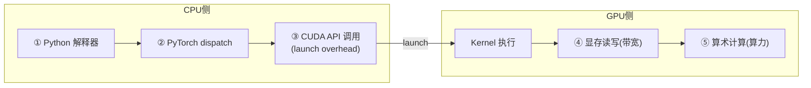
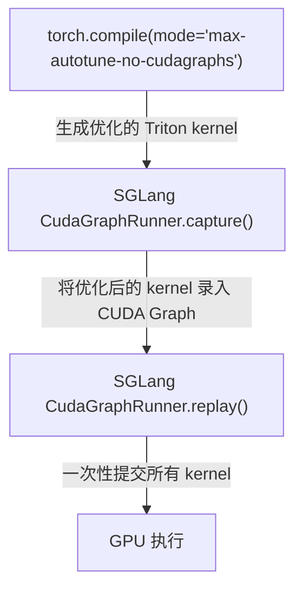
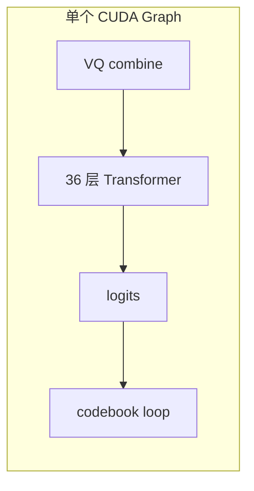
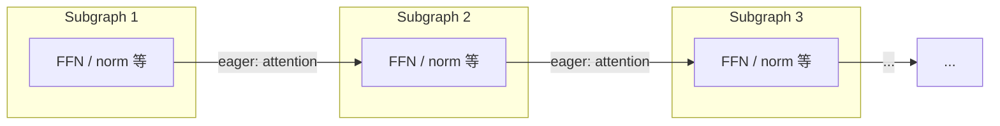

## SGLang CudaGraphRunner 源码走读

前两章从 S2-Pro 的视角展示了 CUDA Graph 约束如何落地为具体的代码设计。现在我们拉高一层视角，看 SGLang 框架如何管理这些 graph。

回顾第一章推导出的两个关键结论：**一份 graph 只能服务一种 batch size**（所以需要为多个 bs 各 capture 一份），以及**多个 graph 可以共享 memory pool**（否则显存占用是 N 倍 high-water mark）。`CudaGraphRunner` 正是这两个概念的源码级落地。

### 多 Batch Size 的 Graph 管理

SGLang 的 `CudaGraphRunner` 为每个 batch size 维护一个独立的 `cudaGraphExec_t`——这正是"一 bs 一 graph"推论的直接体现。默认的 capture_bs 列表包含 12 个 batch size（如 `[1, 2, 4, 8, 12, 16, 24, 32, 40, 48, 56, 64]`）。

**Capture 顺序**：从大到小——这来自第一章 memory pool 共享机制的推论。先 capture 大 bs，让 memory pool 看到最大的显存需求，后续小 bs 的 capture 可以复用已分配的内存：

```python
# cuda_graph_runner.py capture() 中的关键逻辑
capture_range = reversed(self.capture_bs)  # 从大 bs 到小 bs
for bs in capture_range:
    graph, output_buffers = self.capture_one_batch_size(bs, forward)
    self.graphs[bs] = graph
    self.output_buffers[bs] = output_buffers
```

每个 bs 在 capture 前先做一次 **warmup run**（eager forward），触发所有可能的内存分配（cuBLAS workspace、attention buffer 等），确保 capture 时不会有意外的 allocation——这对应五条约束中的"不能有动态内存分配"。

### Memory Pool 共享

第一章已经深入讨论了 CUDA Graph 的显存共享机制（high-water mark、内外隔离、`pool=...`）。在 `CudaGraphRunner` 中，这体现为所有 bs 的 graph 共享同一个 pool：

```python
with self.device_module.graph(cuda_graph=graph, pool=pool, stream=stream):
    out = run_once_fn()
```

对 S2-Pro 而言，12 个 bs 的 graph 共享 audio decoder 的 KV cache 中间结果内存——显存开销只相当于最大 bs graph 的一份 high-water mark，而非 12 份。

### Replay 中的 BS Padding

当 actual batch size < captured batch size 时，`CudaGraphRunner` 会找到大于等于 actual bs 的最小 captured bs：

```python
index = bisect.bisect_left(self.capture_bs, raw_bs)
bs = self.capture_bs[index]
```

Graph replay 执行完整的 `captured_bs` 个 kernel，多余的行产生无效计算。对于 S2-Pro，padding 意味着 `_decode_codebooks()` 也会对 padding 行执行完整的 9 步 codebook loop——但由于 codebook loop 是小矩阵运算，额外开销很小。

### S2-Pro 对 Capture 的额外需求

当 `text_model._vq_ready = True` 时，capture 的 forward 包含 VQ embedding combination、36 层 Transformer、logits 计算、以及 `_decode_codebooks()` 的 constrained sampling + 9 步 codebook loop。Graph 中包含了约 `36 × 4（transformer GEMM）+ 9 × N（codebook loop kernels）` 个 kernel node——比普通 LLM 的 graph 显著更大，但 replay 的 overhead 仍然是一次 `cudaGraphLaunch()`。

### 何时 Fallback 到 Eager Mode

并非所有情况都能走 CUDA Graph。对 S2-Pro 而言：

- **Prefill 阶段**：序列长度不固定 → 不走 graph
- **Decode 阶段 bs 超过最大 capture bs** → fallback
- **Chunked prefill** → 不走 graph
- **Extend 模式** → 走 eager

CUDA Graph 主要加速的是 **decode 阶段的稳态吞吐**——恰好是 S2-Pro 的性能瓶颈所在。

## CUDA Graph 与 torch.compile 的深层关系

回顾开篇的 benchmark 表格：CUDA Graph only 达到 88 tok/s，但 partial compile 还能在此基础上再提升 36% 到 121 tok/s。CUDA Graph 已经消除了所有 kernel launch overhead——那这 36% 的增量从何而来？这说明 **CUDA Graph 消除不了的开销另有其人**。要回答这个问题，需要建立一个更完整的 GPU 执行开销模型。

### GPU 执行流水线的五层开销



| 开销层 | CUDA Graph 的效果 | torch.compile 的效果 |
|---|---|---|
| ①Python overhead | **完全消除** | 大幅减少 |
| ②框架 dispatch | **完全消除** | 大幅减少 |
| ③launch overhead | **完全消除** | 部分减少（融合后 kernel 数量减少） |
| ④显存带宽 | 不影响 | **显著优化**（算子融合减少中间 tensor 读写） |
| ⑤算术计算 | 不影响 | 可能优化（也可能更差） |

**关键洞察**：两者在③上有重叠，但在④上只有 torch.compile 有效。这解释了为什么 CUDA Graph + torch.compile 仍然有 36% 的增量——codebook loop 的小算子链还有大量的中间 tensor 显存读写。

### 为什么 SGLang 使用 `max-autotune-no-cudagraphs`

上一章我们详细走读了 SGLang 的 `CudaGraphRunner`——它自己管理 graph 的 capture/replay、memory pool、multi-bs 调度。如果 inductor 也自己做 graph capture（`reduce-overhead` 或 `max-autotune` mode），就会产生 **"graph 里套 graph"** 的冲突。因此 SGLang 选择 `no-cudagraphs` 后缀：让 inductor 只负责 **kernel 优化**（算子融合 + Triton autotune），而 **graph 管理** 留给 SGLang 自己：



关于 CUDAGraph Trees 机制、`fullgraph=True` 约束、inductor Triton kernel 的 graph 录制兼容性等更深入的讨论，我们留作后续文章分析。

## torch.compile 在 S2-Pro 中的兴衰

上一章建立了五层开销模型和 `no-cudagraphs` 的分工原则。这一章用 PR #153 的实际迭代过程和 benchmark 数据来**验证**这个模型。

### 七个 Commit 的叙事线

| 序号 | Commit | 内容 | 意义 |
|---|---|---|---|
| 1 | `c153ae9` | unified slow/fast head | 核心实现：统一 forward + persistent buffers |
| 2 | `f621355` | lint | 代码规范 |
| 3 | `c962aa6` | torch.compile added in | **转折点**：加入 `enable_torch_compile = True` |
| 4 | `78aafc7` | setup_vq_decode before CUDA graph capture | **关键修复**：deferred graph capture |
| 5 | `dccf122` | tts eval refactoring | Benchmark 重构 |
| 6 | `cf9396d` | export server output | 输出接口调整 |
| 7 | `20be04a` | acknowledge torch.compile discussion | **最终决策**：移除 torch.compile |

Commit 3 加入了 `server_args.enable_torch_compile = True`，导致**整个 model forward** 被 inductor 接管——对 36 层 transformer × 12 个 bs 的每个 GEMM shape 做 18 候选 kernel 的 benchmark。启动时间从 33s 膨胀到了 137s。

### Benchmark 数据解读

| 配置 | Health Ready | Graph Capture | 吞吐（TTS） | 吞吐（Voice Clone） |
|---|---|---|---|---|
| CUDA Graph only | 33.3s | 3.3s | 88.1 tok/s | 87.7 tok/s |
| Partial compile（fast head only） | 54.4s | 16.4s | 120.6 tok/s | 118.7 tok/s |
| Full-model compile | 137.0s | 107.0s | 125.7 tok/s | 122.5 tok/s |

用上一章建立的五层开销模型逐条解读这些数据：

1. **Partial compile 的 36% 吞吐提升从何而来？** 回顾五层开销表：CUDA Graph 已消除开销①②③，但 codebook loop 的 9 步循环中，每步的小算子之间的中间 tensor 仍然需要经过显存读写——这正是开销④（显存带宽）。torch.compile 的 inductor 将这些小算子融合为更少的 Triton kernel，减少了 GPU-side 的显存 round-trip。**即使 launch overhead 已经为零，带宽优化仍有 36% 的收益空间**——这精确验证了五层模型中"CUDA Graph 不影响④，torch.compile 显著优化④"的预测。

2. **Full compile vs Partial compile 仅 4% 差异**：回顾第二章 slow head 的计算特征——大 GEMM 已被 cuBLAS 高度优化（开销⑤接近最优），torch.compile 在 transformer 上唯一的收益是融合 layernorm + residual 等小算子链，占比很小。

3. **103.7s 的额外启动时间**：`max-autotune-no-cudagraphs` mode 对每个 GEMM shape × 每个 bs 做 Triton autotune，总量 ≈ 12 bs × 36 layers × ~4 linear layers × 18 candidates ≈ 31,000+ benchmark runs。这是 autotune 的固有成本。

4. **Partial compile 仅 +21s**：只编译 fast head 的少量小算子，autotune 搜索空间远小于 full model。

### 为什么最终选择不 Compile

1. **抽象层级错配**：torch.compile 应该是框架级能力，不是单个模型的 hack
2. **交互复杂性**：torch.compile 的 guards/recompilation 与 CUDA Graph 交互需要极度小心
3. **粒度问题**：真正受益的只有 fast head 的 36% 增益，slow head 的 4% 不值得 103s 启动时间

> 这个决策不是"不要 torch.compile"，而是"**不在这里做**"——将优化推迟到框架层面（Issue #172）。

## Issue #172：Framework-Level torch.compile 蓝图

上一章的结论是"不在这里做 torch.compile，推迟到框架层面"。那框架层面怎么做？[Issue #172](https://github.com/sgl-project/sglang-omni/issues/172) 给出了三阶段系统性方案，正是对上述三层决策逻辑的逐一回应：

- **Phase 1（Partial Compile）**：模型通过 `get_compile_targets()` 声明可编译的 auxiliary modules（如 codebook decoder），框架侧用 `torch.compile(mode="max-autotune-no-cudagraphs", fullgraph=True)` 编译。预期 ~121 tok/s，启动 ~54s。
- **Phase 2（Global Compile）**：编译整个 `model.forward()`，前提是 SGLang 的 RadixAttention 等组件全部 compile-clean。预期 ~126 tok/s。
- **Phase 3（Mega Cache）**：缓存 inductor 编译产物，消除启动开销。预期 warm cache 下启动接近 baseline ~33s。

核心设计原则：模型文件中不出现 compile 调用、compile target 必须 tensor-in tensor-out、`fullgraph=True` 强制、eager-first 可读性、配置驱动。这些原则与 PR #153 中的教训一一对应。详细的三阶段实施分析留作后续文章。

## Piecewise CUDA Graph：SGLang 主仓库的另一条路径

回顾前文，我们在多个地方遇到了 monolithic CUDA Graph 的边界：第一章推导出"一 bs 一 graph"的限制——prefill 阶段 token 数量变化范围大，不可能穷举所有 size；CudaGraphRunner 一章指出 prefill 阶段只能 fallback 到 eager；Issue #172 的 Phase 2 中 RadixAttention 可能 graph break。这些局限自然引出一个问题：**有没有比 monolithic 更灵活的 CUDA Graph 方案？** SGLang 主仓库的 Piecewise CUDA Graph（PCG）正是对这个问题的回答。

### Monolithic Graph 的三个局限

回顾第一章的五条约束，monolithic graph 要求整个 `forward()` 都满足这些约束。但现实中：

1. **不可捕获的操作**：FlashAttention、MoE dispatch（DeepEP 等）等操作本身不能或不适合被 CUDA Graph 捕获——它们需要动态 shape 或有内部的 host-device sync（违反约束三）。Monolithic graph 无法绕过这些操作。
2. **Prefill 的动态 shape**：Prefill 阶段的 token 数量变化范围很大（从几个到几千），不可能为每个 token 数都预先 capture 一个 monolithic graph（违反约束四的精神——虽然控制流是静态的，但 shape 不固定）。
3. **显存压力**：Monolithic graph 为每个 batch size 各持有一份完整的中间 tensor，显存占用大。

S2-Pro 的 decode 之所以能用 monolithic graph，恰恰因为它满足了所有条件：固定 bs、RadixAttention 在 decode 阶段可捕获、codebook loop 控制流完全静态。但这些条件不是普遍成立的。

### 核心思路：在不可捕获操作的边界切分

**Piecewise CUDA Graph 不把整个 forward 作为一个 graph，而是在不可捕获操作的边界处切分**，将 forward 拆成若干个小 subgraph，每个 subgraph 独立 capture：

**Monolithic Graph（PR #153 方案）**：整个 forward 作为一个 graph



**Piecewise Graph（SGLang 主仓库方案）**：在不可捕获操作处切分



每个 subgraph 覆盖"两个不可捕获操作之间"的部分（如 FFN、layernorm、residual 等）。不可捕获操作（attention、MoE dispatch）仍然以 eager 模式执行。

### Split Points 机制

切分点通过 [`@register_split_op`](https://github.com/sgl-project/sglang/blob/main/python/sglang/srt/compilation/compilation_config.py) 装饰器声明：

```python
SPLIT_OPS = []

def register_split_op(op_name=None):
    def decorator(op_func):
        name = op_name or op_func.__name__
        SPLIT_OPS.append(f"sglang.{name}")
        return op_func
    return decorator
```

编译时，[`split_graph()`](https://github.com/sgl-project/sglang/blob/main/python/sglang/srt/compilation/backend.py) 遍历 FX graph 的所有节点，在 split op 处切开：

```python
def split_graph(graph, ops):
    subgraph_id = 0
    node_to_subgraph_id = {}
    for node in graph.graph.nodes:
        if node.op == "call_function" and str(node.target) in ops:
            subgraph_id += 1
            node_to_subgraph_id[node] = subgraph_id  # split op 单独一个 subgraph
            subgraph_id += 1
        else:
            node_to_subgraph_id[node] = subgraph_id
    # 用 torch.fx.passes.split_module 切分
    split_gm = split_module(graph, None, lambda node: node_to_subgraph_id[node], ...)
```

对于 MoE 模型，`PiecewiseCudaGraphRunner` 还会动态添加 MoE dispatch 作为切分点：

```python
if get_moe_a2a_backend().is_deepep():
    self.compile_config.add_split_op("sglang.moe_forward_piecewise_cuda_graph_impl")
```

### 每个 Subgraph 的三阶段执行

每个 subgraph 由 [`CUDAPiecewiseBackend`](https://github.com/sgl-project/sglang/blob/main/python/sglang/srt/compilation/cuda_piecewise_backend.py) 管理，经历三个阶段：

1. **Compilation**：`torch.compile` 编译 subgraph（用 `eager` 或 `inductor` 后端），处理动态 shape
2. **CUDA Graph Capture**：为预定义的 token 长度 capture 每个 subgraph
3. **Steady-State Replay**：运行时找最近的 captured size，pad 后 replay

```python
@dataclasses.dataclass
class ConcreteSizeEntry:
    runtime_shape: int
    need_to_compile: bool    # 该 size 是否需要 torch.compile
    use_cudagraph: bool      # 该 size 是否需要 CUDA Graph capture
    compiled: bool = False
    cudagraph: Optional[torch.cuda.CUDAGraph] = None
```

**Capture size schedule**（默认）：

```
4-32:      步长 4     ← 小 token 数（decode）需要精细粒度
48-256:    步长 16
288-512:   步长 32
640-1024:  步长 64
1280-4096: 步长 256   ← 大 token 数（prefill）对粒度不敏感
```

这里思考一个小问题：为什么 capture size 的步长不是固定的？因为小 token 数的 padding 浪费相对更大——如果 actual tokens = 5 但最近的 captured size = 32，padding 了 27 个无效 token（540% 浪费）。而 actual = 1000 时 padding 到 1024 只浪费 2.4%。

### 与 PR #153 Monolithic Graph 的对比

| 维度 | Monolithic Graph（PR #153） | Piecewise CUDA Graph |
|---|---|---|
| **捕获范围** | 整个 forward | 每层/每段独立 |
| **Attention 处理** | 被 graph 包含 | 在 split point 处 eager 执行 |
| **适用阶段** | 仅 decode（固定 bs） | **Decode + Prefill**（多种 token 数） |
| **不可捕获操作** | 必须绕过或替代 | 在切分点处自然支持 |
| **Memory Pool** | 每个 bs 一个 graph，共享 pool | **全局 shared pool**，所有 subgraph × 所有 size 共享 |
| **与 torch.compile** | 正交（先 compile 再 capture） | **内嵌**（每个 subgraph 先 compile 再 capture） |

**关键洞察**：Piecewise 方案内嵌了 torch.compile——每个 subgraph 先经过 inductor 优化，再 capture 为 CUDA Graph。这正是 Issue #172 中讨论的"inductor 管 kernel、SGLang 管 graph"分工模式的**框架级实现**。

### Global Shared Memory Pool

[`PiecewiseCudaGraphRunner`](https://github.com/sgl-project/sglang/blob/main/python/sglang/srt/model_executor/piecewise_cuda_graph_runner.py) 使用一个全局共享的 memory pool：

```python
global_graph_memory_pool = None  # 所有 runner 共享

# capture 时复用同一个 pool
capture_range = reversed(self.capture_num_tokens)  # 从大到小
for num_tokens in capture_range:
    self.capture_one_batch_size(num_tokens)
```

与 `CudaGraphRunner` 一样，从大 token 数到小 token 数 capture，让小 size 复用大 size 已分配的内存。但 piecewise 更进一步：**所有 subgraph × 所有 capture size 共享同一个 pool**——显存效率显著更高。

### 对 S2-Pro 的启示

Piecewise CUDA Graph 的思路对 SGLang-Omni 有什么意义？

- **当前 S2-Pro decode 不需要**：decode 阶段的 monolithic graph 已经足够——固定 bs、所有操作可捕获、TPS 已从 55.6 提升到 88
- **Prefill 阶段可能受益**：S2-Pro 的 prefill 目前走 eager。如果 prefill 成为瓶颈，piecewise graph 可以覆盖 attention 之外的部分
- **Issue #172 Phase 2 的关联**：Phase 2 要 compile 整个 `model.forward()`，但 RadixAttention 可能 graph break——piecewise 的"在不可捕获操作处切分"思路，正是一种解法
- **更广的意义**：SGLang-Omni 未来接入 MoE 或更复杂的多模态模型时，piecewise 方案可能成为必选项

目前 Piecewise CUDA Graph 在 SGLang 主仓库中**已默认启用**（[Issue #18130](https://github.com/sgl-project/sglang/issues/18130)），可通过 `--disable-piecewise-cuda-graph` 关闭。

## 设计复盘

从第一章的五条约束出发，我们推导出了"一 bs 一 graph"和显存共享机制；用这些概念分析了 S2-Pro 的双 AR 架构，以及"为什么要把两个 AR 过程统一到一个 CUDA Graph"；深入了 deferred capture、persistent buffer、CudaGraphRunner 的工程实现；引入五层开销模型解释了 torch.compile 的 36% 增量；最后看到了 piecewise 方案对 monolithic 局限性的回应。现在我们把这条推导链收束为一张设计决策矩阵。

### 设计决策矩阵

| 决策 | 选择 | Trade-off | 对应的 CUDA Graph 约束 |
|---|---|---|---|
| 统一 vs 分离 graph | 统一（一个 graph 覆盖双 AR） | 工程复杂度高，但消除两次 launch 间的 CPU 调度 | — |
| Greedy vs Sampling | Greedy（`torch.argmax`） | 丢失采样多样性 | 不能有 host-device sync |
| Persistent buffers | Pre-allocate + `copy_()` | 额外显存（~几 MB） | 指针稳定性 |
| Deferred capture | 先 init → setup_vq → capture | 增加初始化复杂度 | graph 录制后不更新 |
| torch.compile | Off（defer 到 framework） | 放弃 36% 吞吐提升 | — |
| Graph 管理权 | SGLang CudaGraphRunner | 放弃 inductor CUDAGraph Trees | — |

### 从 Eager 到终态

| 阶段 | 优化手段 | 消除的开销 | 吞吐 | 启动时间 |
|---|---|---|---|---|
| Baseline | 无 | — | — | — |
| **PR #153** | CUDA Graph only | ①②③ launch overhead | 88 tok/s | ~33s |
| Issue #172 Phase 1 | + Partial compile（fast head） | ④ 显存带宽（fast head） | ~121 tok/s | ~54s |
| Issue #172 Phase 2 | + Full compile | ④ 显存带宽（slow head） | ~126 tok/s | ~137s |
| **终态** Phase 3 | + Mega cache | compile 启动开销 | ~126 tok/s | ~33s |

每一层优化都是**正交且可叠加**的，这要归功于 `max-autotune-no-cudagraphs` 模式实现的"inductor 管 kernel、SGLang 管 graph"的清晰分工。

总的来说，S2-Pro 的 CUDA Graph 实战让我深刻体会到：**优化从来不是单一技术的事，而是多层抽象之间精心协调的结果**。五条约束是纲，所有工程设计是目——纲举目张。

## 参考

- [基于 torch-memory-savor 浅析 CUDA Graph](./readme.md)（本系列第一篇）
- [CUDA Graph vs torch.compile: S2-Pro TTS 模型实战分析](./readme-2.md)（本系列第二篇）
- [SGLang Code Walk Through](../../sglang/code-walk-through/readme.md)
- [深入浅出理解 verl 源码（初始化）](../../rlhf/verl/multi-turn/code-walk-through/readme.md)
- [SGLang-Omni PR #153](https://github.com/sgl-project/sglang-omni/pull/153)
- [SGLang-Omni Issue #172](https://github.com/sgl-project/sglang-omni/issues/172)
- [NVIDIA CUDA Programming Guide - CUDA Graphs](https://docs.nvidia.com/cuda/cuda-c-programming-guide/index.html#cuda-graphs)
- [PyTorch CUDA Graphs Documentation](https://pytorch.org/docs/stable/cuda.html#cuda-graphs)
- [SGLang Piecewise CUDA Graph Roadmap - Issue #11490](https://github.com/sgl-project/sglang/issues/11490)
- [Accelerating PyTorch with CUDA Graphs](https://pytorch.org/blog/accelerating-pytorch-with-cuda-graphs/)

<!-- /learn-write 自动检查报告
双轨检查：PASS
  - [x] 概念框架（五条约束 + 三阶段机制）在代码分析之前建立
  - [x] 模型架构在概念之后、代码之前
  - [x] slow/fast 命名由来在模型细节之前解释
  - [x] "为什么 CUDA Graph 有帮助"在"为什么要统一到一个 graph"之前
  - [x] "为什么统一到一个 graph"在模型架构之后、基于计算特征推导
  - [x] 代码来自真实生产系统（SGLang-Omni PR #153，commit cd9aaf3；SGLang 主仓库 piecewise 实现）
  - [x] Piecewise CUDA Graph 作为拓展章节，与 monolithic graph 形成对比

叙事检查：PASS
  - [x] 开篇回顾前序文章，亮出 benchmark 数据
  - [x] 路线图为精炼编号列表（4 条）
  - [x] 致谢随意自然
  - [x] 每个工程设计选择显式回指五条约束
  - [x] 设问句引导读者思考

递进推导检查：PASS
  - [x] Section 2 从 Section 1 的约束工具推导模型分析
  - [x] Section 3 从 Section 2 的"统一引入工程复杂性"推导 deferred capture
  - [x] Section 4 从 Section 3 的"buffer 分配好了"推导"运行时如何安全读写"
  - [x] Section 5 从 Section 1.2 的"一 bs 一 graph"和 1.4 的 memory pool 推导 CudaGraphRunner
  - [x] Section 6 从开篇 benchmark 数据悬念（36% 增量从何而来）推导五层开销模型
  - [x] Section 7 用 benchmark 数据验证 Section 6 的五层模型
  - [x] Section 8 从 Section 7 的"不在这里做"推导"框架层面怎么做"
  - [x] Section 9 从前文多处 monolithic 局限性推导 piecewise 的动机
  - [x] Section 10 收束全文推导链

深度检查：[理解复现级 + 修改扩展级混合] → [实际深度匹配] PASS
  - CUDA Graph 概念框架：理解复现级
  - S2-Pro / SGLang-Omni 代码：修改扩展级
  - torch.compile：概要引出，详细分析留后续文章
  - Piecewise CUDA Graph：修改扩展级（SGLang 是自己开发的系统）
-->
