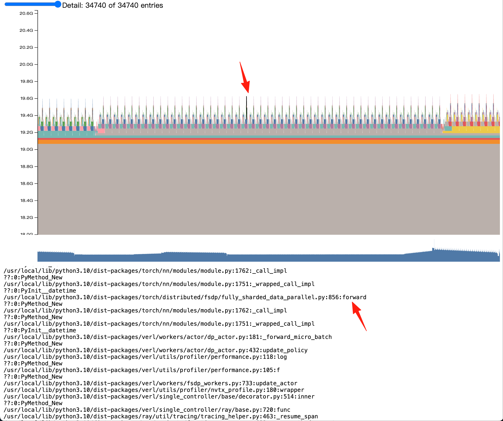
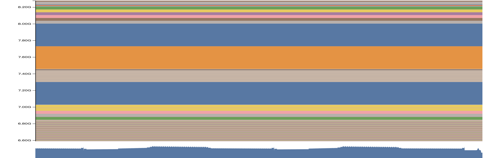
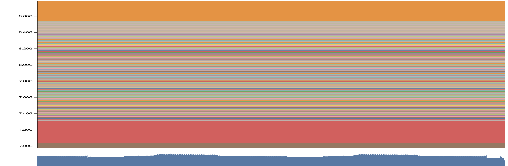
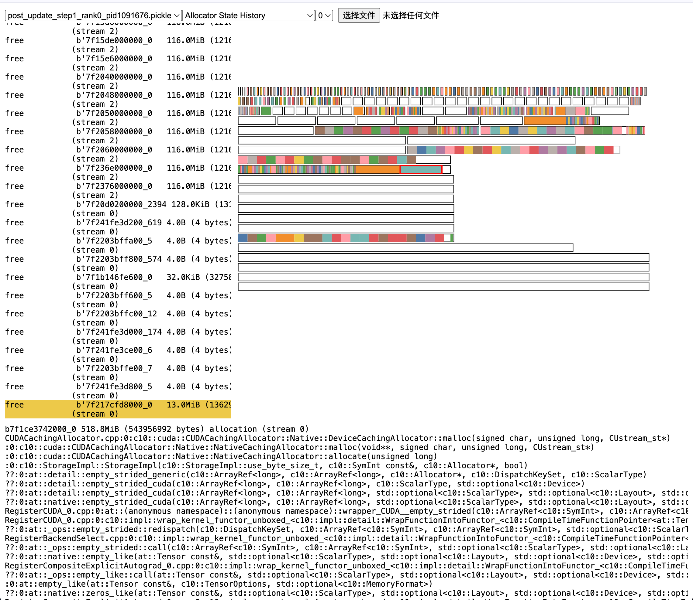
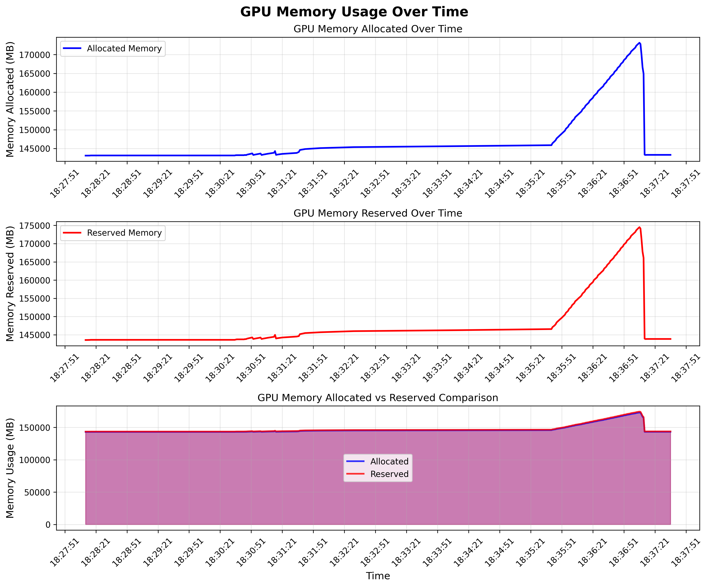
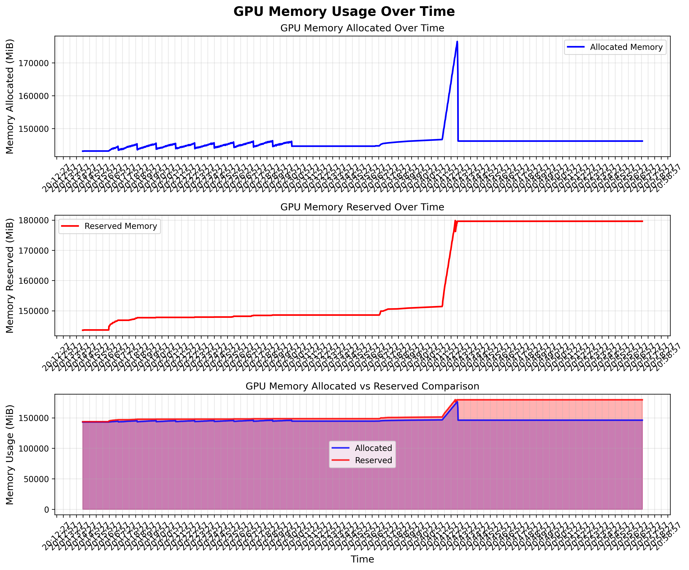

# 通过 Torch Memory Snapshot 分析 VLM RL 训练中的显存泄露问题

前一段时间我们在 RL 训练和 SGLang 本身的推理当中都遇到了一定的显存泄露问题。昨天终于想明白了具体泄露的原因，这篇文章分享我们基于 Torch Memory Snapshot 的排查过程，以及分享我们对显存泄露问题的解决方案。

特别致谢：Hongyu Lu (TikTok), Xinpeng Wei (Amazon), Rohan Bavishi (Amazon), Vint Lee (Amazon), Daisy Lin (Amazon), Deniz Birlikci (Amazon), Shahil Patel (Amazon), XJ Wang (Amazon), Huapeng Zhou (UW), Changyi Yang (CMU), Xinyuan Tong (USC), Yuhao Yang (HKU), Biao He (LinkedIn), Zhuoran Yin (CMU), Chenyang Zhao (LMSYS)
## 背景

很有意思的是，我们并不是为了支持分析显存泄露才现场学习的 Torch Memory Snapshot，而是大概一个月前，在解决 FSDP2 问题的时候就在逐步使用了。回到我们先前的文章，[FSDP 训练后端](../../rlhf/sys-design/readme-2.md#fsdp-in-verl)，我们提到过，直觉上从 FSDP1 切换到 FSDP2 并不麻烦，只需要修改四行配置：

```bash
actor_rollout_ref.ref.strategy=fsdp2
actor_rollout_ref.actor.strategy=fsdp2
critic.strategy=fsdp2
reward_model.strategy=fsdp2
```

然而很不幸，我们惊奇的发现，FSDP1 的脚本平移到 FSDP2 上后，稳定会 OOM。更神奇的是，我们把自己 OOM 的脚本交给 verl 团队和 Pytorch 负责 FSDP2 的工程师，他们发觉 8B 模型不会 OOM，但是 3B 模型稳定 OOM。折腾了很久，最后通过 `set_expandable_segments(True)` 解决了问题，相关 PR 见[3020](https://github.com/volcengine/verl/pull/3020)。

<details>
<summary>Expandable Segments 机制</summary>

`set_expandable_segments(True)` 通过开启 CUDA 的可扩展内存段功能，使得 PyTorch 能够更灵活地管理 GPU 内存。PyTorch 在 CUDA 后端上的内存分配主要由 CUDA caching allocator 管理。allocator 不会立即将释放的内存返回给操作系统，而是将其保存在一个内部的内存池中，以便后续的内存请求可以快速得到满足。这种机制通过减少与 CUDA API 的交互来提高性能。内存池实质上由 segment 和 block 两个概念来描述。

1. Segments (内存段)：内存段是 PyTorch 从 CUDA 驱动程序请求的大块连续内存。这些段是内存分配的最小单位，所有的 PyTorch 张量和数据都存储在这些段中。所有分配的 segment 总和就是 Reserved Memory。
2. Blocks (内存块)：每个内存段都包含许多小块内存（blocks）。当 PyTorch 需要分配内存时，它会在一个现有的段中寻找一个合适的空闲块。如果找不到，它会尝试从 CUDA 驱动程序中申请一个新的段。所有分配的 block 总和就是 Allocated Memory。

默认情况下，当 PyTorch 的 caching allocator 无法在现有内存段中找到足够大的空闲块时，它会向 CUDA 驱动程序请求一个新的内存段。这个新段的大小是根据当前的内存需求动态决定的。但是，这种动态扩展机制可能导致内存碎片化，先前分配的 segment 留下的 block 迟迟无法被利用，尤其是在 PyTorch 内存分配器频繁地释放和申请大块内存的情况下。

回到 FSDP 上，FSDP 默认采用 zero3 的策略，在 forward 和 backward 都需要 all gather，每个 GPU 节点会临时聚合其他节点的 parameter shard，这会创建临时的大量张量，导致对连续内存的需求激增。在传统的内存管理模式下，如果 caching allocator 无法找到一个足够大的连续内存块来容纳这些临时的大张量，就会直接 OOM。即使 GPU 仍有可用内存，但由于内存碎片化，没有足够的连续空间来容纳所需的新张量。

`torch.cuda.memory._set_allocator_settings("expandable_segments:True")` 将 PyTorch 的内存管理模式切换为一种更灵活的模式。开启该功能后，当 caching allocator 需要更大的连续内存时，它不再仅仅尝试从 CUDA 驱动程序中请求一个全新的段，而是尝试扩展已有的内存段。这种扩展机制允许 PyTorch 重新调整其内存布局，将分散的空闲内存块扩展或者合并为更大的连续块，从而满足那些对大块内存有需求的临时张量的分配。
</details>

总之，对 torch memory snapshot 的分析，其实是我们从 FSDP2 的 OOM 问题中学习到的，为我们去解决 RL 训练过程中的显存泄露埋下了伏笔。

## 如何观察显存占用

经过前文的铺垫，我们终于可以开始介绍如何使用 Torch Memory Snapshot 来分析显存泄露问题了。

### torch.cuda.memory_summary

在介绍 mem snapshot 之前，我们先来看看最简单的显存查询方法：

<details>
<summary>最简单的显存查询方法</summary>

```python
    @DynamicGradMode()
    def event_loop_overlap(self):
        """A scheduler loop that overlaps the CPU processing and GPU computation."""
        self.result_queue = deque()

        # 初始化内存日志文件
        if not hasattr(self, "_memory_log_file"):
            import datetime

            start_time = datetime.datetime.now().strftime("%Y%m%d_%H%M%S")
            self._memory_log_filename = f"{start_time}_memory_log.txt"
            self._memory_log_file = open(self._memory_log_filename, "w")
            self._memory_log_file.write(
                "timestamp,memory_summary,memory_allocated,memory_reserved\n"
            )
            self._memory_log_file.flush()

        while True:
            current_time = time.time()
            if (
                not hasattr(self, "_last_memory_log_time")
                or current_time - self._last_memory_log_time >= 1.0
            ):
                gc.collect()
                torch.cuda.empty_cache()

                # 获取内存信息
                memory_summary = torch.cuda.memory_summary(
                    device=self.gpu_id, abbreviated=True
                )
                memory_allocated = torch.cuda.memory_allocated()
                memory_reserved = torch.cuda.memory_reserved()

                # 转换为MB
                memory_allocated_mb = memory_allocated / (1024 * 1024)
                memory_reserved_mb = memory_reserved / (1024 * 1024)

                # 记录时间戳
                timestamp = time.strftime("%Y-%m-%d %H:%M:%S", time.localtime())

                # 写入日志文件
                self._memory_log_file.write(
                    f"{timestamp},\"{memory_summary.replace(',', ';')}\",{memory_allocated_mb:.2f},{memory_reserved_mb:.2f}\n"
                )
                self._memory_log_file.flush()

                # 更新时间记录
                self._last_memory_log_time = current_time

                # 同时打印到控制台（可选）
                print(f"[{timestamp}] Memory allocated: {memory_allocated_mb:.2f} MB")
                print(f"[{timestamp}] Memory reserved: {memory_reserved_mb:.2f} MB")
```

</details>

这是我们在排查 SGLang 显存泄露原因过程中，在这个 [commit](https://github.com/sgl-project/sglang/pull/9071/files#diff-c3b8cc39d10c245933a25aa9c2fd6397f6b31ed8d85c0ecbb926c1f42afdd178) 里面使用的一套回收 + 打印显存日志的代码。简单来说，这个代码的逻辑是：

1. 每 1s 通过 `torch.cuda.memory_summary, torch.cuda.memory_allocated, torch.cuda.memory_reserved` 打印显存占用情况
2. 每 1s 通过 `gc.collect, torch.cuda.empty_cache` 回收显存

我们先按下 `gc.collect, torch.cuda.empty_cache` 不表，看看 `torch.cuda.memory_summary, torch.cuda.memory_allocated, torch.cuda.memory_reserved` 的输出:

<details>
<summary>torch.cuda.memory_summary 的输出</summary>

```bash
|===========================================================================|
|                  PyTorch CUDA memory summary, device ID 0                 |
|---------------------------------------------------------------------------|
|            CUDA OOMs: 0            |        cudaMalloc retries: 0         |
|===========================================================================|
|        Metric         | Cur Usage  | Peak Usage | Tot Alloc  | Tot Freed  |
|---------------------------------------------------------------------------|
| Allocated memory      | 184648 KiB | 192833 KiB | 258378 KiB |  73729 KiB |
|       from large pool | 184576 KiB | 192768 KiB | 254208 KiB |  69632 KiB |
|       from small pool |     72 KiB |   1060 KiB |   4170 KiB |   4097 KiB |
|---------------------------------------------------------------------------|
| Active memory         | 184648 KiB | 192833 KiB | 258378 KiB |  73729 KiB |
|       from large pool | 184576 KiB | 192768 KiB | 254208 KiB |  69632 KiB |
|       from small pool |     72 KiB |   1060 KiB |   4170 KiB |   4097 KiB |
|---------------------------------------------------------------------------|
| Requested memory      | 184648 KiB | 192832 KiB | 258376 KiB |  73728 KiB |
|       from large pool | 184576 KiB | 192768 KiB | 254208 KiB |  69632 KiB |
|       from small pool |     72 KiB |   1060 KiB |   4168 KiB |   4096 KiB |
|---------------------------------------------------------------------------|
| GPU reserved memory   | 235520 KiB | 235520 KiB | 235520 KiB |      0 B   |
|       from large pool | 233472 KiB | 233472 KiB | 233472 KiB |      0 B   |
|       from small pool |   2048 KiB |   2048 KiB |   2048 KiB |      0 B   |
|---------------------------------------------------------------------------|
| Non-releasable memory |  30391 KiB |  38607 KiB | 132985 KiB | 102594 KiB |
|       from large pool |  28416 KiB |  36608 KiB | 126848 KiB |  98432 KiB |
|       from small pool |   1975 KiB |   2040 KiB |   6137 KiB |   4162 KiB |
|---------------------------------------------------------------------------|
| Allocations           |      21    |      23    |      42    |      21    |
|       from large pool |      12    |      14    |      26    |      14    |
|       from small pool |       9    |      10    |      16    |       7    |
|---------------------------------------------------------------------------|
| Active allocs         |      21    |      23    |      42    |      21    |
|       from large pool |      12    |      14    |      26    |      14    |
|       from small pool |       9    |      10    |      16    |       7    |
|---------------------------------------------------------------------------|
| GPU reserved segments |      10    |      10    |      10    |       0    |
|       from large pool |       9    |       9    |       9    |       0    |
|       from small pool |       1    |       1    |       1    |       0    |
|---------------------------------------------------------------------------|
| Non-releasable allocs |       6    |       6    |      13    |       7    |
|       from large pool |       4    |       5    |      11    |       7    |
|       from small pool |       2    |       2    |       2    |       0    |
|---------------------------------------------------------------------------|
| Oversize allocations  |       0    |       0    |       0    |       0    |
|---------------------------------------------------------------------------|
| Oversize GPU segments |       0    |       0    |       0    |       0    |
|===========================================================================|
```

</details>

看上去输出的内容非常多，但是仔细读读，其实内容非常简单，直接得到了对应显卡（rank）上的所有进程的显存占用情况。我会在这部分反复强调进程的概念，后续读者会逐渐体会到获得显存占用的方法其实高度受到进程的影响。

此外，我们来回顾下，对于 SGLang 而言，如果某个主进程直接 init 了一个 SGLang Engine，实际上会得到三个进程。初始化 Engine 的主进程会得到一个 Engine 实例和 Tokenizer Manger；第二个进程会初始化 SGLang Scheduler，这个进程才是实际上占据绝大多数现存的核心进程；最后一个进程会初始化 SGLang Detokenizer Manager。

注意，我们上方的代码虽然是直接在 SGLang scheduler 一层加入的显存监控，但是 `torch.cuda.memory_summary` 实际上监控的是整个 rank 上的显存占用情况。`torch.cuda.memory_summary` 是不区分进程的，而 `torch.cuda.memory._dump_snapshot()` 得到的只有当前进程的显存占用情况。

这听上去没什么意思，但是在 RL 场景下，情况会大为不同。以 verl 举例，verl 的 FSDP worker 所在进程初始化了 SGLang Engine，这样 FSDP worker 和 SGLang Scheduler 不在一个进程内。如果我们一直在 FSDP worker 上通过 `torch.cuda.memory._dump_snapshot()` 监控显存，那么我们只能监控到 FSDP worker 的显存占用情况，而无法监控到 SGLang Scheduler 的显存占用情况。正是这个原因，让我们在排查 RL 训练过程中的显存泄露问题时，根本没有对 SGLang Scheduler 的显存泄露进行监控，很长时间都没有进展。


### torch.cuda.memory._dump_snapshot

介绍完了 `torch.cuda.memory_summary`，我们再来看看 `torch.cuda.memory._dump_snapshot` 的输出。虽然听上去 `memory_summary` 的输出更加全局，毕竟是直接监控 rank 上所有的进程，但是大家也看到了，我们无法通过 `memory_summary` 得到细致的显存管理信息。比如 `memory_summary` 告诉我们 reserved memory 是 144GB，但是具体是哪些进程哪些 tensor 实际占用了多少，我们无法得知。`torch.cuda.memory._dump_snapshot` 正是为这一需求而设计的，我们可以直接得到当前进程在监视范围内的每一个 tensor 的创建、占用和销毁。让我们来看看具体用法：

<details>
<summary>torch.cuda.memory._dump_snapshot 的用法</summary>

```python
def enable_memory_visualize(
    trace_alloc_max_entries: int = 200_000,
    stack_depth: int = 32,
    context: str = "all",
    stacks: str = "all",
    devices=None,
    record_context: bool = True,
):
    """
    Enables memory history recording for CUDA allocations. This function
    should be called before any large-scale CUDA allocations. For DDP or
    multi-process setups, it must be called on each rank.

    Args:
        trace_alloc_max_entries (int): Maximum number of allocation entries
            to record.
        stack_depth (int): The depth of the call stack to capture for each
            allocation. (Supported by some PyTorch versions).
        context (str): The type of memory events to record.
            'alloc': records only allocation events.
            'state': records memory state changes.
            'all': records both.
        stacks (str): The type of call stacks to record.
            'python': records Python stacks.
            'cpp': records C++ stacks (available in some versions).
            'all': records both.
        devices (Union[int, list[int], None]): The device for which to enable
            memory history. `None` enables it for the current default device.
        record_context (bool): Whether to record context information for
            allocations. Required by older PyTorch versions.
    """
    # Memory history recording is CUDA-specific functionality
    if not is_cuda_available:
        logger.warning("[memory_visualize] Memory history recording is only available on CUDA devices")
        return

    f = get_torch_device().memory._record_memory_history
    params = set(inspect.signature(f).parameters.keys())

    def _one_call(dev_kw=None):
        kwargs = {}
        if "context" in params:
            kwargs["context"] = context
        if "stacks" in params:
            kwargs["stacks"] = stacks
        if "max_entries" in params:
            kwargs["max_entries"] = trace_alloc_max_entries
        elif "trace_alloc_max_entries" in params:
            kwargs["trace_alloc_max_entries"] = trace_alloc_max_entries
        if "stack_depth" in params:
            kwargs["stack_depth"] = stack_depth
        if dev_kw is not None:
            if "device" in params:
                kwargs["device"] = dev_kw
            elif "devices" in params:
                kwargs["devices"] = dev_kw if isinstance(dev_kw, list) else [dev_kw]
        if "record_context" in params:
            kwargs["record_context"] = record_context

        try:
            f(**kwargs)
            return "native", kwargs
        except TypeError:
            try:
                if "trace_alloc_max_entries" in params and "record_context" in params:
                    f(enabled=True, trace_alloc_max_entries=trace_alloc_max_entries, record_context=True)
                    return "legacy", {
                        "enabled": True,
                        "trace_alloc_max_entries": trace_alloc_max_entries,
                        "record_context": True,
                    }
                else:
                    f(enabled=True)
                    return "legacy-min", {"enabled": True}
            except Exception:
                raise

    if devices is None or isinstance(devices, str | int | torch.device):
        mode, used = _one_call(devices if devices is not None else None)
    else:
        mode, used = "multi-device", {}
        for d in list(devices):
            _mode, _used = _one_call(d)
            used[f"dev{d}"] = _used

    device = get_torch_device()
    if device.is_available():
        device.reset_peak_memory_stats()
        device.synchronize()

    rank = int(os.environ.get("RANK", "0") or 0)
    logger.info(f"[memory_visualize][rank {rank}] recording enabled ({mode}); args={used}")


class MemorySnapshotSampler:
    """
    A utility class that dumps GPU memory snapshots.
    This is useful for monitoring memory usage over a long-running process.

    The dumped files can be visualized with https://docs.pytorch.org/memory_viz

    Args:
        out_dir (str): The directory where the snapshots will be saved.
        tag (str): A tag for the snapshot filenames.
    """

    def __init__(self, out_dir: str = "./mem_snapshots", tag: str = "periodic"):
        self.out_dir = out_dir
        self.tag = tag

    def dump_memory_snapshot(self, out_dir: str = "./mem_snapshots", tag: str = "snapshot", sub_dir: str = None):
        """
        Generates a memory snapshot and saves it as a pickle file in a specified directory.
        The files are organized by timestamp in subdirectories, with all ranks' files
        placed in the same timestamp subdirectory.

        Args:
            out_dir (str): The directory where the snapshot file will be saved.
                The directory is created if it does not exist.
            tag (str): A string tag to prepend to the filename for easier identification.
            sub_dir (str): A subdirectory to place the snapshot file in.
        """
        if sub_dir is None:
            timestamp = datetime.now().strftime("%Y%m%d-%H%M")
            out_path = Path(out_dir) / timestamp
        else:
            out_path = Path(out_dir) / sub_dir
        out_path.mkdir(parents=True, exist_ok=True)

        # get the GPU rank on the current process
        rank = os.environ.get("RANK", "0")
        pid = os.getpid()
        # todo(chenyang): check wether we need to sync all ranks before dump
        fname = f"{tag}_rank{rank}_pid{pid}.pickle"
        path = out_path / fname

        device = get_torch_device()
        if not device.is_available():
            logger.warning("[memory_visualize] is only available on CUDA devices.")
            return
        try:
            device.synchronize()
            # Memory snapshot is CUDA-specific functionality
            device.memory._dump_snapshot(str(path))
            logger.info(f"[memory_visualize] dumped: {path}")
        except Exception as e:
            logger.info(f"[memory_visualize][warn] dump failed: {e}")
```

</details>

以上函数节选自我们给 verl 交的 PR [3099](https://github.com/volcengine/verl/pull/3099)，看着类非常复杂，其实干的事情很简单。我们将 `torch.cuda.memory._dump_snapshot` 比作一个录像机，通过 `enable_memory_visualize` 函数来开启录像，而每次 `MemorySnapshotSampler.dump_memory_snapshot` 则相当于将录像机已经拍到的内容保存到本地。显然，我们监控 memory 的时间越长，保存下来的 memory step 就越多，文件大小越大。为此，我们会在 `enable_memory_visualize` 中设置 `trace_alloc_max_entries, stack_depth` 来限制保存的 memory trace 的条数和深度。每次调用 `MemorySnapshotSampler.dump_memory_snapshot` 时，会保存当前监控范围内的所有 tensor 的创建、占用和销毁。此外，如果开启 `enable_memory_visualize` 的时间太晚了，有些 tensor 已经在这之前就创建了，那么这些 tensor 的创建、占用和销毁信息就无法被监控。

这样看来，`torch.cuda.memory._dump_snapshot` 的用法也是非常清晰的，就是监控当前 rank 的当前进程在监控范围内的所有 tensor 的创建、占用和销毁。我们最终会得到若干多个 pickle 文件，接着上传到 torch 官方的 [memory viz](https://pytorch.org/memory_viz) 网站上，就可以看到非常直观的 memory 使用情况。


如此以来，我们得到一些非常具体的 memory 使用情况，这里举出两个我最常用的可视化结果：

1. Active Memory Timeline


这张图有非常非常多细节，首先是我们观察整体的 memory 最高点，大致发现最高点在 25GB 左右。此外，我们能明显观察到在我们的整个 record 阶段有非常多的阶段，这里我继续放大一小部分，来看看具体的这个 spike：




我们观察这个 spike，同时在下方的 stack 内查看这块显存的分配时机，分配过程，和具体大小。这里我们可以观察到，我图中箭头指出的 spike 实际上来自于 verl FSDP 的 forward 过程。更具体的 stack 由于保密问题，不便透露。

一个非常有意思的事情是，我们发觉，相似或者作用相同的显存块，在不同的阶段去拍摄的 memory snapshot 会表现的相当一致，比如相同的颜色、相对位置和大小。举例来说，我们在 verl 每个 training step 结束的地方记录一次 memory snapshot，在 [`examples/grpo_trainer/run_qwen2_5_vl-7b-sglang.sh`](https://github.com/volcengine/verl/blob/main/examples/grpo_trainer/run_qwen2_5_vl-7b-sglang.sh) 中，我们观察 step 2 3 4 结束时的 memory stack，得到如下三张图：





我们注意观察 step 2 的时候，在 7.2GB 7.6GB 和 7.8GB 三个位置，都有连续的大的内存块，均为 512MB 大小（查看 stack，实际上是 optimizer state）。接着，到了 step 3 的时候，7.2GB 位置的 512MB 显存块还在一模一样的位置，但是在 step 2 的 7.6GB 的内存块已经移动到了 8.6GB；到了 step 4，这块 512MB 的显存块已经移动到了 9.6GB 以上了。按照我们的经验，这两个显存块不偏移，中间的这些非常零碎的显存块就是泄露的内容。我们具体看 stack：

<details>
<summary>显存碎片的的 stack</summary>

```bash
/usr/local/lib/python3.10/dist-packages/transformers/models/qwen2_vl/image_processing_qwen2_vl_fast.py:278:_preprocess
??:0:PyMethod_New
/usr/local/lib/python3.10/dist-packages/transformers/models/qwen2_vl/image_processing_qwen2_vl_fast.py:173:_preprocess_image_like_inputs
??:0:PyMethod_New
/usr/local/lib/python3.10/dist-packages/transformers/image_processing_utils_fast.py:659:preprocess
??:0:PyMethod_New
/usr/local/lib/python3.10/dist-packages/transformers/models/qwen2_vl/image_processing_qwen2_vl_fast.py:151:preprocess
??:0:PyMethod_New
/usr/local/lib/python3.10/dist-packages/transformers/image_processing_utils_fast.py:623:call
??:0:PyInit__datetime
/usr/local/lib/python3.10/dist-packages/transformers/models/qwen2_5_vl/processing_qwen2_5_vl.py:150:call
??:0:PyMethod_New
/usr/local/lib/python3.10/dist-packages/sglang/srt/multimodal/processors/base_processor.py:218:process_mm_data
??:0:PyMethod_New
/usr/local/lib/python3.10/dist-packages/sglang/srt/multimodal/processors/base_processor.py:540:_process_and_collect_mm_items
??:0:PyMethod_New
/usr/local/lib/python3.10/dist-packages/sglang/srt/multimodal/processors/base_processor.py:597:process_and_combine_mm_data
/usr/local/lib/python3.10/dist-packages/sglang/srt/multimodal/processors/qwen_vl.py:251:process_mm_data_async
/usr/local/lib/python3.10/dist-packages/sglang/srt/managers/tokenizer_manager.py:535:_tokenize_one_request
/usr/local/lib/python3.10/dist-packages/sglang/srt/managers/tokenizer_manager.py:832:_handle_batch_request
??:0:_PyUnicode_IsWhitespace
??:0:PyIter_Send
/usr/local/lib/python3.10/dist-packages/sglang/srt/managers/tokenizer_manager.py:486:generate_request

```

</details>

很明显，我们发现了这些碎片的来源，就是 qwen vl 的 fast tokenizer 在泄露。

通过我们已有的叙述，想必大家也有了一些使用 torch.cuda.memory._dump_snapshot 的经验，我们也根据以上已有的信息，升级了 [sglang 版本](https://github.com/volcengine/verl/pull/3183)，避免了在 image processor 上的显存泄露。

2. Allocator State History

我们继续看第二种可视化方法，Allocator State History 和 Active Memory Timeline 略同不同，我们能够更具体看到在每个记录的事件结束后，当前进程的显存情况。如下图：



其中，五颜六色的柱子是实际分配的显存，挪动到其上可以看到具体的分配时机和行数，比如：

<details>
<summary>我先前提到的 optimizer state</summary>

```bash
b7f1ce3742000_0 518.8MiB (543956992 bytes) allocation (stream 0)
CUDACachingAllocator.cpp:0:c10::cuda::CUDACachingAllocator::Native::DeviceCachingAllocator::malloc(signed char, unsigned long, CUstream_st*)
python_torch_functions_0.cpp:0:torch::autograd::THPVariable_zeros_like(_object*, _object*, _object*)
/usr/local/lib/python3.10/dist-packages/torch/optim/adam.py:180:_init_group
/usr/local/lib/python3.10/dist-packages/torch/_dynamo/eval_frame.py:838:_fn
/usr/local/lib/python3.10/dist-packages/torch/optim/adam.py:236:step
/usr/local/lib/python3.10/dist-packages/torch/optim/optimizer.py:79:_use_grad
/usr/local/lib/python3.10/dist-packages/torch/optim/optimizer.py:485:wrapper
??:0:PyMethod_New
/usr/local/lib/python3.10/dist-packages/torch/optim/lr_scheduler.py:124:wrapper
/usr/local/lib/python3.10/dist-packages/verl/workers/actor/dp_actor.py:301:_optimizer_step
/usr/local/lib/python3.10/dist-packages/verl/workers/actor/dp_actor.py:496:update_policy
/usr/local/lib/python3.10/dist-packages/verl/utils/profiler/performance.py:118:log
??:0:PyMethod_New
/usr/local/lib/python3.10/dist-packages/verl/utils/profiler/performance.py:105:f
??:0:PyMethod_New
/usr/local/lib/python3.10/dist-packages/verl/workers/fsdp_workers.py:733:update_actor
/usr/local/lib/python3.10/dist-packages/verl/utils/profiler/nvtx_profile.py:180:wrapper
/usr/local/lib/python3.10/dist-packages/verl/single_controller/base/decorator.py:514:inner
??:0:PyMethod_New
/usr/local/lib/python3.10/dist-packages/verl/single_controller/ray/base.py:720:func
/usr/local/lib/python3.10/dist-packages/ray/util/tracing/tracing_helper.py:463:_resume_span
/usr/local/lib/python3.10/dist-packages/ray/_private/function_manager.py:689:actor_method_executor
_raylet.cpp:0:__pyx_pw_3ray_7_raylet_12execute_task_3function_executor(_object*, _object*, _object*)
```

</details>

白色的块是 segment，也即我们最开始提到的已经 reservered 但是没有 allocated 的显存。segment 越多越碎，则显存碎片化越严重，更容易 OOM。

## 究竟显存泄露在哪儿

**首先，我们 bump 了 SGLang 版本后，无论是 VLM 还是 LLM，SGLang 均不存在泄露问题，请大家放心使用 SGLang-verl，可以参考[我们的指南](https://github.com/zhaochenyang20/Awesome-ML-SYS-Tutorial/blob/main/rlhf/verl/multi-turn/release_log/latest_sglang.md)来快速启用。**

其次，我还是来分享下具体泄露的原因：

其实还是在 Rollout 过程中，image processor 有一定的碎片化，或者泄露，加之我在公司里的训练场景非常复杂，所以叠加 FSDP 的碎片化，偶尔会出现 OOM 问题。这里，回到我一开始给出的代码片段：

<details>
<summary>在 SGLang Scheduler 上的每秒回收显存代码</summary>

```python
    @DynamicGradMode()
    def event_loop_overlap(self):
        """A scheduler loop that overlaps the CPU processing and GPU computation."""
        self.result_queue = deque()
        while True:
            current_time = time.time()
            if (
                not hasattr(self, "_last_memory_log_time")
                or current_time - self._last_memory_log_time >= 1.0
            ):
                gc.collect()
                torch.cuda.empty_cache()
```

</details>

这里，每一秒钟调用一次 `gc.collect, torch.cuda.empty_cache` 来回收显存是我手动加的。我们来看看不加的情况，具体的实验记录在 [PR 9071](https://github.com/sgl-project/sglang/pull/9071) 中。

当我启用了每 1s 回收一次显存后，通过高强度指令的方法：

```bash
python -m sglang.bench_serving \
    --backend sglang-oai-chat \
    --dataset-name random-image \
    --num-prompts 500 \
    --random-image-num-images 3 \
    --random-image-resolution 720p \
    --random-input-len 512 \
    --random-output-len 512
```

我们得到一个如下的显存占用随着时间的变化曲线：



我们观察到，由于同一时间发送了 500 条请求，所以整个 rank 上的显存陡然增加了 30GB。这是合理的，因为 SGLang 的 mem static 参数并不会控制 VLM 的 image processor 的显存占用，VLM 设置的 mem usage 就是要低于 LLM；同时，image processor 肯定要把 image 处理为 tensor，自然是要占据不少显存的。真正值得关注的是，在所有请求处理结束后，无论是 reserved 还是 allocated 的显存，都回到了 145GB 左右。

> 为什么是 145GB 呢，因为我用了 B200 lol，这辈子第一次摸到 B 卡，可惜安装也稍微麻烦些，现在还没试过能不能做 RL 😂

总之，可以观察到，我每 1s 回收一次显存的话，确实是不存在泄露的。但是，我把回收显存的部分去掉后，情况立刻不同了：



很不幸，我们 allocated 的显存完成了回收，但是 reserved 的显存一直在增长。这就是我提到的，segment 越分越多，越来越细，虽然 block 没有增长，但是 ROllout 阶段显存已经高度碎片化了，在我们公司复杂的 mutli-turn 业务中，一个 rollout request 里面，会有多张图片，最后这些碎片让 SGLang 无法再分配大片连续显存，从而在 rollout 阶段 OOM。

说到此，听上去问题很严重，但是我和做推理引擎的同行交流过，image processor 不由推理引擎掌控，存在这样的碎片或者泄露倒也是正常，而我们在 Scheduler 上定期回收显存的做法，是 reasonable 而且常见的。可惜的是，我在上方提出的方案是每 1s 回收一次，这无疑对性能有很大损失。如果你的 RL 训练也遇到了类似的 VLM 显存泄露问题，我认为有几种解决办法：

1. 加入定期的显存回收机制，比如每 10s 或者每 10 个 requests 回收一次；
2. 直接降低 rollout engine 的 mem static，比如从我们一般设置的 0.85 降低到 0.65；

1 的原因已经在我上方的图示说明清楚了，而 2 的原因值得一提一方面，SGLang 本身不管理 image processor 的显存，所以 SGLang 推荐的 mem static 参数对 VLM 就是比起 LLM 低。LLM 我们一般设置的 mem static 是 0.85，VLM 推荐可能就是 0.8 了；另一方面，很多时候如果我们 rollout 的时候，使用类似 verl 这种 SPMD 策略，每个 rollout worker 的 requests/worker 是能够算出来的（具体来说，是 `train batch size * grpo group size / num workers`），如果经过我们的计算，requests/worker 本身就不高，低于 20，那么设置更大的 mem static，有更大的 kv cache 空间，对推理性能的影响也不大。当然，对于 slime 这种更加解耦的设计，每个 rollout worker 上的 requests/worker 是不一定的，但是也大差不差，还是可以估算到平均每个 worker 处理的 requests 数量。

当然，在线上的 serving 场景不断地 `gc.collect` 对性能影响非常大，所以我个人觉得目前只能在 RL 场景下这么搞。具体线上 serving 怎么做，还得讨论。

最后，其实很早之前我就意识到了 rollout 可能存在碎片，我甚至也参考了 verl 团队所写的 `aggressive_empty_cache` 函数，给 SGLang 提了这个 [PR 3136](https://github.com/volcengine/verl/pull/3136)。

<details>
<summary>aggressive_empty_cache 的实现</summary>

```python
def aggressive_empty_cache(force_sync: bool = True, max_retries: int = 3) -> None:
    """
    More aggressive GPU memory cleanup function, tries to release PyTorch reserved
    but unallocated memory.

    Args:
        force_sync: Whether to force device synchronization
        max_retries: Maximum number of retries
    """
    device = get_torch_device()
    if not device.is_available():
        return

    for attempt in range(max_retries):
        # Record memory status before cleanup
        before_reserved = device.memory_reserved()
        before_allocated = device.memory_allocated()

        # Run garbage collection
        gc.collect()

        # Clear PyTorch cache
        device.empty_cache()

        # Force synchronization (optional)
        if force_sync:
            device.synchronize()

        # Record memory status after cleanup
        after_reserved = device.memory_reserved()
        after_allocated = device.memory_allocated()

        # Calculate freed memory
        reserved_freed = before_reserved - after_reserved
        allocated_freed = before_allocated - after_allocated

        logger.info(
            f"Memory cleanup attempt {attempt + 1}: Freed {reserved_freed / 1024**3:.2f} GB reserved, "
            f"{allocated_freed / 1024**3:.2f} GB allocated"
        )

        # Stop retrying if little memory was freed
        if reserved_freed < 1024**3:  # less than 1GB
            break
```

</details>

这个函数其实和直接调用 `gc.collect, torch.cuda.empty_cache` 区别不大，不过他们在回收的同时做了一次同步，可以回收的更彻底些。这个函数是对的，但我的调用时间错了。注意到，我在 PR 3136 中的调用时机是：

```python
  async def wake_up(self):
        aggressive_empty_cache(force_sync=True)

    @GPUMemoryLogger(role="FSDPSGLangShardingManager exit", logger=logger)
    async def sleep(self):
        aggressive_empty_cache(force_sync=True)
```

我们都是在 FSDP 中，调用了 SGLang 的 `wake_up` 和 `sleep` 函数的时候才回收显存，这是有问题的。SGLang 不会和 FSDP 同进程，而且 wake up 和 sleep 的时候已经更换了新的 garbage allocator，自然回收不到 rollout 时候的显存碎片。想明白这点后，我们把思路改成在 rollout 结束的时候回收显存，问题一下就解决了。

