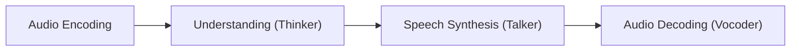
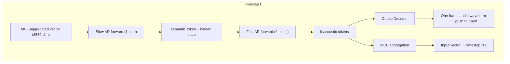
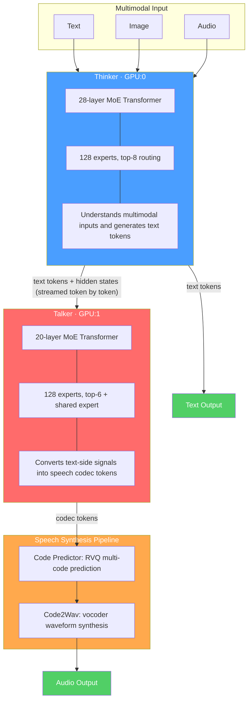
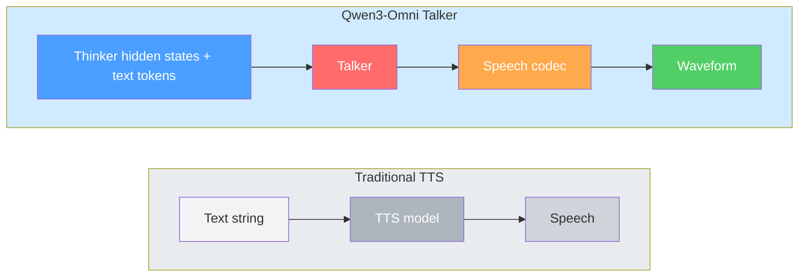
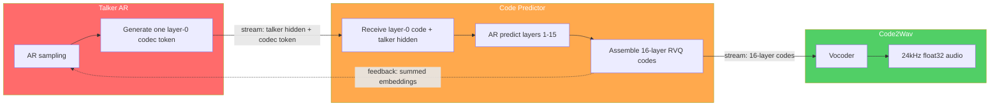

# Codec、RVQ、Dual AR、Thinker-Talker——A Deep Dive into Omni Model Inference for Qwen3-Omni and S2 Pro

I've been pushing forward the [SGLang-Omni refactoring](https://github.com/sgl-project/sglang-omni/issues/188) recently. Unfortunately, before I took over the project, the codebase had excessively complex abstraction layers — a request had to pass through 8-10 layers from HTTP API to `torch.forward`, with Stage → Worker → Executor → Engine having highly overlapping responsibilities. Refactoring was urgent, and I was excited about tackling such a large-scale system design. But before cutting layers, some prerequisite questions needed clear answers: what kinds of models do we actually need to support; where do their architectural differences lie; which computation patterns can be unified, and which must remain differentiated?

If you design abstractions without understanding the model architectures, you either end up with overly complex abstractions that bring massive maintenance costs, or overly coarse ones that lack flexibility. So through this note, I analyze the architectures and inference computation flows of the two representative model families we primarily support — Fish Audio S2 Pro and Qwen3-Omni.

This article follows this roadmap:

1. Establish a general conceptual framework for omni models — Codec, RVQ, the four-stage pipeline, and the design degrees of freedom in Speech Synthesis
2. Deep dive into Fish Audio S2 Pro's Dual AR inference flow, focusing on its requirements for framework abstraction
3. Deep dive into Qwen3-Omni's Thinker-Talker inference flow, analyzing its fundamental differences from S2 Pro
4. Derive the boundaries of framework abstraction from the comparison — what should be unified, what must remain differentiated

I previously wrote an article, [Revisiting CUDA Graph: Core Mechanisms, Multi-Graph Reuse, and Unified Coverage Optimization for Dual AR Models](../../torch/cuda-graph/readme-2.md), which analyzed S2 Pro's architecture in detail from the perspective of CUDA Graph optimization. This article re-examines it from the perspective of how model architecture impacts framework abstraction.

Thanks to Jingwen Gu, Yitong Guan, Ratish P, Shenggui Li, Yuan Luo and other colleagues for discussions and support during SGLang-Omni development.

## Conceptual Framework for Omni Models

This is my first time working with Omni models. I hold deep respect for traditional speech research — things like phoneme segmentation and acoustic modeling — just as I respect those who pioneered NLP tokenization...

### Omni Pipeline

What an omni model needs to accomplish is essentially "understand speech input and generate a speech response." This process naturally decomposes into four stages:

1. Audio Encoding: Raw audio waveforms have tens of thousands of sample points per second — feeding them directly to a Transformer is impractical. The Audio Encoder compresses high-frequency waveforms into low-frequency discrete token sequences — these discrete tokens are the so-called codec tokens. What they are, why they must be discrete, and how multi-layer quantization is achieved through RVQ is the topic of the next section.

2. Understanding (Thinker): After obtaining codec tokens (or equivalent continuous representations), a sufficiently powerful model is needed to "understand" the input and generate a text response. This step is essentially an LLM or multimodal LLM doing prefill + decode — fundamentally no different from a standard chat model generating text, except that the input sequence contains audio tokens.

3. Speech Synthesis (Talker): After the Thinker generates a text response, it still needs to convert text back to speech. This is the stage with the highest design degrees of freedom in the entire pipeline — generate codec tokens autoregressively token by token? Use Diffusion for iterative denoising? Generate all codebook layers at once or complete them layer by layer? Different models make vastly different choices here, and this is precisely the core source of architectural divergence among different Omni models.

4. Audio Decoding (Vocoder): Finally, convert the codec tokens generated by the Talker back into audio waveforms. The Vocoder is typically a lightweight ConvNet (such as Vocos, HiFi-GAN, EVA-GAN), with computation far less than the previous three steps — not a system bottleneck.

Among the four stages, Encoding and Decoding are relatively stable across different models — differences mainly manifest in codec selection, not in computation patterns. What truly drives architectural divergence is the middle two steps: the coupling between Thinker and Talker, and the Talker's own generation strategy.

### Codec Audio Encoding

The raw sampling rate of speech is typically 16kHz-48kHz, meaning 1 second of audio contains 16,000-48,000 sample points. If a Transformer were to process raw waveforms directly, the sequence length would inflate to completely unacceptable levels — a 10-second conversation at 48kHz approaches 500,000 scalar steps, far exceeding most LLMs' context windows. Therefore, we must compress first. The first thing an Audio Codec does is use an encoder to compress high-frequency continuous waveforms into low-frequency continuous frame vector sequences. Taking EnCodec-class models as an example, a common setting is approximately 12.5 frames/second, meaning the original tens of thousands of sample points per second first become a dozen or so frames of continuous representation per second; each frame corresponds to a continuous vector, e.g., 128-dimensional. Up to this point, although the information has been aggressively compressed in the time dimension, it is still continuous-valued and cannot directly feed into the standard LLM pipeline of "finite vocabulary + cross-entropy + autoregressive sampling."

Next comes quantization of the continuous vectors — turning continuous frame vectors into discrete codec tokens. The common approach here is Vector Quantization (VQ): for each VQ layer, a finite-size codebook is learned, where each entry can be understood as a representative vector in the continuous space. For a given frame, the encoder's output continuous vector is not directly passed to the LLM; instead, a nearest-neighbor lookup is performed in the current VQ layer's codebook to find the closest entry, and the integer index of that entry in the codebook becomes the final codec token id for this frame. The originally continuous, nearly infinitely fine vector space is compressed into a finite-size lookup table. The model interface changes from continuous values to discrete ids, naturally connecting to the standard language model pipeline of finite vocabulary + cross-entropy + autoregressive sampling.

Of course, with only single-layer VQ, it can be understood as the simplest case: each frame performs a nearest-neighbor lookup in one codebook, selects the closest entry, and uses that entry's integer index as the frame's codec token id. In this sense, a codebook and an LLM's vocabulary are isomorphic — both are "entries in a finite set + integer ids for lookup." But single-layer VQ quickly encounters a classic trade-off: a codebook too large causes training difficulties and embedding table explosion; a codebook too small causes excessive quantization error, with reconstructed audio showing obvious distortion. Therefore, practical systems more commonly use RVQ (Residual Vector Quantization). Its key is not merely having many layers of codebooks, but that each layer quantizes the residual from the previous layer: Layer 0 first quantizes the current frame's original continuous vector to get the first codec token id; then the part that Layer 0 failed to represent well becomes the residual, passed to Layer 1 for quantization; the residual after Layer 1 goes to Layer 2, and so on. In other words, each layer has its own codebook, but subsequent layers quantize not the same original vector, but the residual that previous layers have not yet captured well.

This way, if there are N layers of RVQ, then a single frame at the same timestep corresponds to N codec token ids. This is also the most confusing aspect between audio codec and text tokenizer. In text, it's typically "one subword, one token," while in RVQ, the more accurate description is "multiple discrete tokens at a single time position" — the frame is decomposed into multi-layer progressively approximating quantization results. Taking 24kHz sampling and 12.5 frames/second as an example, the compression ratio in the time dimension is approximately 1920:1. A 5-second utterance goes from 120,000 sample points to about 63 timesteps; with single-layer VQ, that's about 63 discrete tokens, while with N-layer RVQ, each of these 63 timesteps corresponds to N codec token ids. In implementation, these ids can be flattened into a longer discrete sequence, split into multiple token streams, or predicted in stages by different sub-networks, but the interface essence never changes: what is actually passed to downstream Transformers or other generation modules are these discrete id sequences and their embeddings, not the original continuous frame vectors themselves, and certainly not the entire codebook matrix.

Clearly, for multi-layer RVQ, the information value carried by different layers is asymmetric. Typically, earlier layers, especially Layer 0, lean more toward "what was said" — core semantics and basic prosody; later layers gradually shift toward finer acoustic details like timbre, breathiness, resonance positioning, and emotional vibrato. Therefore, losing earlier layers often means losing content, while losing later layers mostly just degrades audio quality. This inter-layer asymmetry directly inspired the approach of "using a large model to generate the more critical earlier layers, then using a smaller module to complete subsequent layers" — Fish Audio S2 Pro's Dual AR is exactly this idea in practice.

### Understanding (Thinker)

Audio Encoding transforms cold audio into warm tokens. The next step is to use a model to understand the meaning of these tokens and generate a text response — essentially an LLM or multimodal LLM doing prefill + decode, fundamentally no different from a standard chat model generating text responses.

For pure TTS models (like S2 Pro), the Thinker receives text tokens (target text) and audio tokens (codec encoding of reference audio), interleaved into a unified token sequence, then autoregressively generates like a standard LLM. For multimodal omni models (like Qwen3-Omni), the Thinker may also receive image/video tokens beyond text and audio tokens — but the computation pattern is unchanged: prefill processes the complete input sequence, decode outputs text response token by token.

From the inference framework perspective, the Understanding stage is the most homogeneous part across different omni models. Whether the underlying model is Qwen3-4B (S2 Pro's Slow AR) or 30B-A3B MoE (Qwen3-Omni's Thinker), the decode stage is standard autoregressive LLM inference — continuous batching, paged KV cache, RadixAttention, CUDA Graph, and other existing SGLang optimizations can be directly reused. What truly causes architectural divergence is not Understanding itself, but what comes after: how the Thinker's text and hidden states are passed to the Talker, and what method the Talker uses to convert text back to speech.

### Speech Synthesis

As discussed above, Speech Synthesis has very high design degrees of freedom — specifically decomposable into several orthogonal dimensions:

| Design Dimension | Option A | Option B |
|------------------|----------|----------|
| Generation Method | Autoregressive: generate codec tokens one by one | Non-Autoregressive: Diffusion / Flow Matching, iterative generation |
| Codebook Generation Strategy | Layer-wise AR: generate Layer 0 first, then autoregressively generate Layer 1-N | Parallel generation: all codebook layers output simultaneously |
| Information Flow with Thinker | Hidden States + Text Tokens: Talker receives both | Hidden States only: Talker decodes directly from hidden states |
| Thinker-Talker Timing | Serial nesting: Talker nested within each Thinker decode step | Asynchronous pipeline: both run independent decode loops |

Let's look at a concrete example — the information flow between Thinker and Talker in detail. The need for Hidden States is easy to understand: having only text tokens would lose much of the high-dimensional information carried by speech. But let's think about the reverse question: **Given that the Talker already needs hidden states as its input information flow, why does it also need text tokens?**

I can only offer a pessimistic understanding: because the Talker model is not powerful enough. Hidden states are the Thinker's internal representations after understanding the input, containing rich semantic, prosodic, and emotional information. But hidden states are high-dimensional continuous vectors that simultaneously encode "what to say" and "how to say it," with no dimension explicitly corresponding to a specific word. If the Talker relies solely on hidden states to generate speech, it needs to simultaneously decode both linguistic content and acoustic details from these continuous representations, placing higher demands on the Talker's modeling capacity, and lacking explicit semantic anchors, making it prone to content drift — the generated speech being inconsistent with the Thinker's generated text. Intuitively, if we noticed the text on Doubao's screen was inconsistent with the generated speech, it would be very confusing for users. Therefore, text tokens provide an explicit semantic anchor, a stronger supervision signal: discrete, interpretable, deterministic — "好的" (hǎo de, "okay") is "好的" and won't be pronounced as "okay" — no ambiguity. With text tokens, the Talker knows exactly what words to say and only needs to extract "how to say them" (intonation, rhythm, emotion) from hidden states.

Specifically, Qwen3-Omni's Talker receives two things: one is the text tokens output by Thinker decode (response content), and the other is the hidden states produced by the Thinker's intermediate layers when processing audio/visual inputs (acoustic features). Note that the Talker does not receive hidden states from the Thinker's processing of text inputs — for textual information, discrete tokens themselves are already a complete representation, passing hidden states would be redundant; while prosody, timbre, and other acoustic attributes only exist in audio/visual hidden states and cannot be encoded by text tokens. This decoupling also brings a practical benefit: external modules (RAG, function calling, safety filter) can intervene on the Thinker's text output, then send the processed text to the Talker, without disrupting the acoustic information flow. Of course, for Thinker-Talker architectures like Qwen3-Omni, there is an additional trade-off: the Talker must wait for the Thinker's decode to complete (at least partially) before it can start generating speech, directly impacting the TTFV (Time to First Voice) of inference. Qwen3-Omni's approach is an asynchronous pipeline — Thinker and Talker each run independent decode loops, connected through hidden state relay, allowing both to proceed in parallel as much as possible.

It should be noted that the "text token + hidden states" information flow described above is a characteristic of the Thinker-Talker architecture, not universal to all omni models. S2 Pro, as a pure TTS model, takes a completely different path — the Slow AR doesn't generate text tokens but directly autoregressively generates semantic codec tokens (Layer 0), and the Fast AR receives the Slow AR's hidden state and semantic token to complete the remaining codebook layers. The entire information transfer is completed within the codec token space, with no text tokens involved.

### Audio Decoding

The final step of the pipeline is converting codec tokens back into audio waveforms audible to human ears. This step is completed by the vocoder, typically a lightweight causal ConvNet — S2 Pro uses an EVA-GAN-based Codec Decoder, and Qwen3-Omni uses Code2Wav (200M parameters). The causal property here is interesting: a causal ConvNet only needs to see the current frame and historical frames to synthesize waveforms, without waiting for subsequent frames. This means that once Speech Synthesis generates one complete frame of codebook tokens, the vocoder can immediately synthesize and push to the client, enabling frame-by-frame streaming playback. In contrast, Qwen2.5-Omni used a block-wise DiT for waveform synthesis, requiring the Talker to accumulate sufficient block context before starting. After switching to a causal ConvNet, first-packet latency is reduced at the architectural level.

From the inference framework perspective, vocoder scheduling is very simple: it's not a Transformer, has no KV cache, doesn't need continuous batching, and its computation is far less than the LLMs. More interestingly, LLM decode is memory-bandwidth bound (heavy KV cache reads/writes), while ConvNet is compute bound (dense convolution computation) — the two have different bottleneck resources and can be scheduled in parallel on the same GPU via CUDA MPS without interference. Like Audio Encoding, Audio Decoding is relatively stable across different models — differences mainly lie in vocoder selection (EVA-GAN vs Code2Wav vs Vocos vs HiFi-GAN), not computation patterns. It's not the key focus for framework abstraction.

## Dual-AR Model Inference: Fish Audio S2 Pro

Having discussed the main structure of the Omni Pipeline, let's deep-dive into two specific Omni models: one is the typical Dual-AR TTS model Fish Audio S2 Pro, and the other is the Thinker-Talker architecture Qwen3-Omni.

[S2 Pro](https://huggingface.co/fishaudio/s2-pro) is Fish Audio's approximately 5B parameter speech generation model (TTS) — given reference audio + target text, it generates speech matching the reference voice. It has been merged to the main branch in SGLang-Omni with CUDA Graph + streaming support ([PR #153](https://github.com/sgl-project/sglang-omni/pull/153)). S2 Pro is a pure TTS model — it doesn't do multimodal understanding, only "given text and reference voice, synthesize speech."

### Four Components

The entire inference system consists of four components:

1. Slow AR: A decoder-only Transformer based on Qwen3-4B, approximately 4B parameters, 36 layers. During prefill, the input is the embedding obtained from standard embedding lookup of the reference audio's codec tokens and the target text's text tokens. After processing, it generates the first semantic token; thereafter, at each decode step, the input is the vector aggregated by MCF from the previous timestep's 10 codec tokens (see MCF component below), generating the next semantic token. The Slow AR maintains a continuously growing KV cache, exactly like a standard LLM generating text.

2. Fast AR: An independent 4-layer Transformer, approximately 400M parameters, with independent weights and embedding table. Given the semantic token and hidden state output by the Slow AR at a given frame, it autoregressively generates along the codebook depth direction, completing the remaining 9 acoustic tokens in a fixed 9 steps. All KV cache is discarded after each timestep, not retained across frames.

3. Codec Decoder: An EVA-GAN-based ConvNet, not a Transformer. It receives one frame's complete 10 tokens and decodes them into actual audio PCM waveforms. Pure signal processing, completely decoupled from LLM scheduling.

4. MCF (Multi-Codebook Fusion): Not an independent model, just a vector aggregation operation. It takes a frame's 10 tokens, looks them up through their respective embedding tables, and sums them element-wise to get a vector as the Slow AR's next-step input.

### Complete Decode Flow for One Frame

Suppose we are at timestep t, and the previous step has already produced an input vector through MCF aggregation. We enter the next decode flow.

1. Slow AR generates semantic token: The Slow AR takes the input vector and does one standard LLM forward pass. The KV cache already stores all history from the prompt beginning to the previous frame — this step is completely identical to a standard LLM decoding the next text token. The output yields a logits vector (4096-dimensional, corresponding to the semantic codebook size); and a hidden state vector (2560-dimensional, the output of the last Transformer layer). The logits vector is then sampled to obtain this frame's semantic token id. The Slow AR's work at this timestep is done, with KV cache retained and appended.

2. Fast AR completes acoustic tokens: The Fast AR receives the Slow AR's hidden state and the freshly sampled semantic token, then constructs an input sequence `[hidden projection, semantic token embedding]`. Position 0 is `hidden projection` — the Slow AR's hidden state passed through a linear projection layer mapping to the Fast AR's input dimension. This position doesn't correspond to any codebook token; it's the channel for injecting the Slow AR's global context into the Fast AR. Position 1 is `semantic token embedding` — the semantic token looked up through the Fast AR's own embedding table. This is the seed input, telling the Fast AR the current frame's semantic content. Then, the Fast AR begins autoregression for a fixed 9 steps: the first forward's prefix is positions 0 and 1, producing the 2nd codec token and building KV cache; continuing until the 9th forward predicts the 10th codec token. The total sequence length is 11 positions (1 conditioning prefix + 1 semantic token + 9 generated tokens), fixed length, not growing with audio duration. All codebooks share a single embedding table, with codebook identity implicitly distinguished through RoPE positional encoding. After the current timestep, the Fast AR's KV cache is directly discarded. The next timestep creates a clean session.

3. Codec Decoder synthesizes waveform: Once 10 codebook tokens are assembled, the Codec Decoder looks up each integer in its own quantization codebook (note: this is not the same thing as the Fast AR's embedding table), obtaining 10 quantized vectors, summing them layer by layer following the standard RVQ procedure to reconstruct a frame of continuous features, then decoding into PCM waveform through a causal ConvNet. This frame is approximately 48 milliseconds of audio, which can be immediately pushed to the client for streaming playback. The Codec Decoder is causal — it doesn't need to see subsequent frames. In production, LLM decoding is memory-bandwidth bound, ConvNet is compute bound, and the two can be scheduled in parallel on the same GPU via MPS.

4. MCF aggregation: The final step compresses this frame's 10 tokens into a single vector to pass back to the Slow AR as the next step's input. Specifically: the 10 codebook tokens are each looked up through an independent embedding table, yielding 10 vectors (all with dimension equal to the Slow AR's hidden dim); plus the 11th vector obtained by looking up the semantic token through the Slow AR's native token embedding layer — these 11 vectors are summed element-wise to produce the next step's input.

The aggregated vector is fed to the Slow AR, entering timestep t+1, and the loop continues until an end-of-audio token is encountered. Each timestep: Slow AR forwards 1 time, Fast AR forwards 9 times, Codec Decoder runs 1 time. The Slow AR's KV cache continuously grows; the Fast AR's KV cache is rebuilt each frame. This highly asymmetric design — 4B parameters along the time axis, a 4-layer network along codebook depth — is key to Dual AR achieving low-latency real-time generation.

### S2 Pro Mapped to the Omni Pipeline

With the inference flow covered, let's now map S2 Pro back to the four-stage pipeline. One key distinction must be clarified first: **S2 Pro does not follow the "Thinker generates text → Talker synthesizes codec" separation path.**

For multimodal understanding models like Qwen3-Omni, the pipeline division of labor is clear: Audio Encoding encodes input speech into codec tokens, the Thinker understands the input and generates text tokens as a response, the Talker converts text tokens into output speech codec tokens, and finally the Vocoder synthesizes waveforms. The input-side codec tokens (encoding what the user said) and output-side codec tokens (encoding what the model will say) are two completely different sequences, bridged by text tokens.

S2 Pro is different. Its input is reference audio (providing voice) and target text (providing content), and its output is target speech. The Dual AR receives an input sequence concatenated from two parts: tokens from codec-encoding the reference audio ("what voice to use") and text tokens from the target text ("what content to say"). The Slow AR directly autoregressively generates the target speech's semantic tokens on this input sequence, and the Fast AR completes acoustic tokens frame by frame — no intermediate text generation step. This layered generation approach shares similarities with RVQ's multi-layer residual quantization, but they operate at different stages: RVQ encodes the input-side reference audio, while the Slow AR and Fast AR generate the output-side target speech. Nevertheless, they share the same codebook structure — as analyzed in the Codec Audio Encoding section, the RVQ residual quantization mechanism makes the 0th codebook naturally carry the most semantic information, with subsequent codebooks progressively refining acoustic details. Dual AR leverages precisely this structural property for division of labor.

Mapped to the four-stage pipeline: Audio Encoding encodes the reference audio; Understanding + Speech Synthesis are merged in the Slow AR + Fast AR (both completed serially within the same timestep); Audio Decoding is handled by the Codec Decoder. This merging is feasible because pure TTS tasks have far simpler "understanding" requirements than multimodal conversation — no need to extract semantics from speech and generate text responses, just extract voice characteristics from reference audio and apply them to the target text's synthesis process.

### Design Considerations for Dual AR

Let's analyze why S2 Pro adopts the Dual AR architecture rather than having a single AR model decode all tokens. Suppose we fix S2 Pro to output 10 codec tokens per timestep; otherwise, each frame's audio information would be very limited. If a single LLM were to string all tokens into one sequence for autoregressive generation, this LLM's context window would need to accommodate all 10 × number-of-frames codec tokens. On one hand, the vast majority of codec tokens are acoustic details that contribute little to modeling semantic coherence along the time axis (having both semantic tokens and acoustic tokens in the same sequence), yet they consume large amounts of KV cache and attention computation.

Dual AR splits the generation task between two models: the Slow AR decodes along the time axis, generating only the 0th semantic token per frame — its context window contains entirely semantic tokens' MCF aggregated vectors, making long-range dependency modeling efficient and focused; the Fast AR independently completes the remaining 9 acoustic tokens within each frame, with a fixed sequence length of 11, never accumulating across frames, discarded after use. As analyzed in the Codec Audio Encoding section, the information value of codebooks is naturally asymmetric — "losing earlier codebooks often means losing content, losing later ones mostly just degrades audio quality." Dual AR leverages this property to allocate model capacity: the larger-parameter Slow AR with stronger context modeling focuses on the most critical semantic tokens, while the smaller but faster Fast AR handles acoustic detail completion.

Now let's map S2 Pro's choices back to the design degrees of freedom matrix from the Speech Synthesis section:

- Generation method: AR. Both Slow AR and Fast AR autoregressively generate codec tokens, with no Diffusion or Flow Matching iterative denoising involved. AR's advantage is native streaming support — each generated frame can be immediately passed to the vocoder for waveform synthesis, without waiting for global denoising convergence.
- Codebook strategy: Layer-wise AR (0th first, then 1st-9th). Not all codebooks output simultaneously; within a timestep, there are logically two phases: Slow AR first determines semantics (the 0th), then Fast AR completes acoustics (1st-9th). This is exactly the divide-and-conquer strategy leveraging inter-codebook information asymmetry.
- Information flow: Hidden States (internal transfer). S2 Pro is a pure TTS model without an independent Thinker generating text tokens, so there's no need for the "text tokens as semantic anchor" discussed earlier. What the Slow AR passes to the Fast AR is its own last layer's hidden state and the freshly sampled semantic token — both transferred directly as tensors within the same forward pass, without any cross-stage buffer or communication.
- Timing: Serial nesting. The Fast AR is not an independently running decode loop but is nested within each of the Slow AR's decode steps — the Slow AR outputs one semantic token, the Fast AR immediately follows with a fixed 9 steps, MCF aggregation completes, and only then does the next timestep begin. The entire inference has only one outer loop, with the Fast AR as a sub-process within the loop body. This contrasts sharply with Qwen3-Omni's asynchronous pipeline (two independent decode loops progressing in parallel).

### From the Serving Perspective

After understanding the inference flow, it becomes clear that for a serving framework, Dual AR's core has only one thing requiring special handling: the Slow AR's input embedding is not a simple token lookup but an MCF-aggregated vector. Beyond that, it's a standard LLM decode loop — the Slow AR is based on Qwen3-4B, naturally inheriting continuous batching, paged KV cache, RadixAttention, and other existing SGLang capabilities. This is the fundamental reason S2 Pro is friendly to inference frameworks.

The Fast AR can be viewed as a fixed post-processing step after each decode step — it doesn't need continuous batching, paged KV cache, or RadixAttention, because the sequence length is always 11. Note that even paged KV cache is unnecessary. Paged KV cache solves core problems of: multiple requests with different lengths, dynamically growing KV cache, and page-granularity memory sharing. The Fast AR's KV cache has fixed length (11), is rebuilt each frame (discarded after use), and has no cross-request sharing — the complexity of paged management has zero benefit here.

Of course, there are plenty of engineering details for production deployment. For instance, can the Fast AR's 9-step loop be packaged with CUDA Graph? Can MCF's 11 embedding lookups be fused with the Slow AR's forward? These questions are discussed in detail in [Revisiting CUDA Graph](https://github.com/zhaochenyang20/Awesome-ML-SYS-Tutorial/blob/main/torch/cuda-graph/readme-2.md).

## Thinker-Talker Model Inference: Qwen3-Omni

S2 Pro's Dual AR is serially nested within the same decode loop — the two models execute sequentially within each timestep, sharing one outer loop. Qwen3-Omni takes a completely different path — the two models each run independent decode loops, collaborating through an asynchronous pipeline.

Before diving into the component list and step-by-step inference flow, it is helpful to first look at Qwen3-Omni from a higher level. The key point is not just that it is "multimodal," but that it splits reasoning and speech generation into separate subsystems, and that this split directly shapes the serving architecture.

### Thinker-Talker Architecture

Qwen3-Omni's core design is to separate "understanding and reasoning" from "speech generation" into two different models:

### Why Split Thinker and Talker

There are several reasons this split is attractive:

1. Capability decoupling: reasoning and speaking are fundamentally different tasks. Understanding the input and deciding what to say requires strong language and multimodal reasoning ability; turning that content into natural speech requires acoustic modeling. One model can in principle do both, but separating them makes each subproblem cleaner.
2. Streaming output: once the models are separated, the Thinker can emit one text token and the Talker can immediately start consuming it, which greatly reduces first-audio latency.
3. Reuse of pretrained text models: the Thinker can stay close to an already strong text/multimodal LLM, while the Talker can remain comparatively lightweight and specialized.
4. Deployment flexibility: the Thinker and Talker can live on different GPUs and scale independently.

```mermaid
gantt
    title Streaming: Thinker and Talker in parallel
    dateFormat X
    axisFormat %s

    section Thinker
    token 1      :crit, t1, 0, 1
    token 2      :crit, t2, 1, 2
    token 3      :crit, t3, 2, 3
    token 4      :crit, t4, 3, 4
    token 5      :crit, t5, 4, 5

    section Talker
    speech 1     :active, s1, 0, 2
    speech 2     :active, s2, 1, 3
    speech 3     :active, s3, 2, 4
    speech 4     :active, s4, 3, 5
```

If a single model had to alternate between generating text-side content and speech-side codec tokens in one unified loop, latency would be much harder to control.

### Talker Is Not Traditional TTS

It is also important not to misunderstand the Talker as a regular standalone TTS model.

Traditional TTS takes a complete text string as input and produces speech as output. Qwen3-Omni's Talker is much more tightly coupled to the Thinker: besides text-side signals, it also receives the Thinker's hidden states. In other words, the Talker is not just reading text aloud; it is conditioning on the Thinker's internal semantic representation.

This is why the Talker has to live inside the same end-to-end pipeline, rather than being replaced by an external TTS system with only text input.

### Speech Generation Pipeline: Talker AR -> Code Predictor -> Code2Wav

Speech generation is not completed by the Talker alone. It is itself a small pipeline, and there is even a feedback loop between the Talker and the Code Predictor:

The feedback loop matters. After the Talker generates a codec token, it cannot always simply continue to the next step. The Code Predictor completes the remaining RVQ layers and feeds a summarized embedding back to the Talker, which then uses it as additional context for the next decoding step.

### Token-Level Alignment Between Thinker and Talker

At a high level, the Talker stays aligned with the Thinker token by token through a mechanism like `trailing_text_hidden`:

As each new Thinker token arrives, its corresponding representation is projected and appended to this text-side buffer. The Talker consumes that buffer incrementally while continuing its own codec-token generation. When the Thinker is finished, a special EOS embedding signals that no more text-side conditioning will arrive.

### Model Overview

[Qwen3-Omni](https://github.com/QwenLM/Qwen3-Omni) is an end-to-end multimodal model from the Qwen team, accepting text, audio, image, and video inputs, generating text + speech outputs. Unlike S2 Pro (pure TTS), it does both speech synthesis and multimodal understanding. Parameter scale: Thinker 30B-A3B (MoE) + Talker 3B-A0.3B (MoE) + MTP Module 80M + Code2Wav 200M + AuT Encoder 650M + Vision Encoder 540M. Already supported in SGLang Omni.

### Five Components

1. Audio/Vision Encoder: Input-side encoders. AuT (Audio Transformer) with 650M parameters, Vision Encoder based on SigLIP2 with approximately 540M parameters. Unlike S2 Pro's input side — where reference audio is codec-encoded via RVQ into discrete tokens fed to the Slow AR — Qwen3-Omni's AuT encoder outputs continuous audio hidden states without codebook quantization. These continuous vectors are projected to the Thinker's embedding dimension via adapters, then concatenated with text token embeddings into a unified vector sequence as the Thinker's input — consistent with how multimodal LLMs like LLaVA process image tokens. On the output side, Qwen3-Omni uses the same RVQ codec multi-codebook structure: the Talker generates the 0th codec token, the MTP Module completes the remaining codebook codec tokens, and Code2Wav receives the complete set of discrete codec tokens to synthesize waveforms. In short, Qwen3-Omni's input side uses continuous representations (no RVQ), while its output side uses discrete codec tokens (RVQ multi-codebook structure).

2. Thinker: 30B-A3B MoE Transformer (48 layers, hidden_size 2048), receives all modal inputs, autoregressively generates text tokens as responses, activated parameters 3B.

3. Talker: 3B-A0.3B MoE Transformer (20 layers, hidden_size 1024), the main backbone for speech generation. Autoregressively generates the 0th discrete codec token, has its own independent KV cache, activated parameters 0.3B.

4. MTP Module (Multi-Token Prediction): Approximately 80M parameter lightweight dense Transformer (5 layers). After the Talker generates the 0th codec token at each step, MTP completes the remaining fixed number of codec tokens. Functionally equivalent to S2 Pro's Fast AR, but with fewer parameters.

5. Code2Wav: Approximately 200M parameter causal ConvNet, replacing the block-wise DiT in Qwen2.5-Omni. Receives one frame's complete set of discrete codec tokens and decodes them into audio waveforms. Role equivalent to S2 Pro's Codec Decoder.

### Complete Inference Flow

1. Encoder Preprocessing

Audio input is resampled to 16kHz, converted to a 128-channel mel-spectrogram (25ms window, 10ms hop), and fed into the AuT encoder. Internally, AuT first uses Conv2D for 8x downsampling, then passes through 32 layers of self-attention, finally outputting 12.5 Hz continuous audio hidden states (each frame corresponding to 80ms of audio). Image and video inputs are fed into the Vision Encoder, outputting visual hidden states. These continuous hidden states are projected to the Thinker's embedding dimension via their respective adapters, then concatenated with text token embeddings into a unified embedding as the Thinker's input.

2. Thinker generates text response

The Thinker receives the multimodal embedding of all preceding tokens, first performs prefill, then enters the decode stage, autoregressively generating the text response token by token. This step is identical to standard multimodal LLM inference: continuous batching, paged KV cache, all standard LLM serving optimizations apply directly.

For each text token the Thinker generates, it simultaneously outputs its intermediate layer's hidden state for transfer to the Talker. However, not all positions' hidden states are transferred — although the Thinker's input is a unified vector sequence, each position's modal identity is determined at construction time (which positions come from AuT's audio hidden states, which from the Vision Encoder's visual hidden states, which are text token embeddings). The Talker only receives hidden states from audio/visual positions (carrying prosody, timbre, and other acoustic features), not text positions' hidden states — as analyzed in the conceptual framework, for textual information, discrete tokens themselves are already a complete representation, and the Thinker's output text tokens serve directly as semantic anchors for the Talker.

Note that the Thinker and Talker prefills are interleaved: after the Thinker completes the current chunk's prefill, its output is immediately sent for the Talker's current chunk prefill, while the Thinker simultaneously begins processing the next chunk. This asynchronous chunked prefill pipeline design significantly reduces TTFV (Time-to-First-Voice) — the latency from user request to hearing the first audio frame.

3. Talker decode generates discrete codec tokens

After Talker prefill completes, it begins running its own decode loop. The Talker has its inherited `lm_head` removed (no text logits output) and uses an independent `codec_embedding` (vocab_size=3072) specifically for codec token embedding. Information from the Thinker enters the Talker through two independent `ResizeMLP` modules (Linear → SiLU → Linear):

- `text_projection`: Receives the Thinker's layer 0 word embedding (i.e., the Thinker's input-layer token embedding, not deep hidden states), projecting from Thinker hidden dim (2048) to Talker hidden dim (1024)
- `hidden_projection`: Receives hidden states from the Thinker's layer 24 (out of 48 total), taking only audio/visual positions (selected by modal identity as described above), projecting to Talker hidden dim

During prefill, the Talker's input is processed by modality: text positions use `text_projection(thinker_word_embedding)`, multimodal positions use `hidden_projection(thinker_hidden_state)`.

During decode, each step's input vector = the previous step's generated codec tokens looked up via `codec_embedding` and summed element-wise (similar to S2 Pro's MCF aggregation) + the current timestep's corresponding `text_projection(thinker_word_embedding)`. Text information and codec information are fused via element-wise addition, not concatenation.

At each step, the Talker autoregressively generates the current frame's 0th discrete codec token (12.5 Hz, i.e., one token every 80ms). The Talker maintains its own independent, continuously growing paged KV cache.

4. MTP Module completes codec tokens

After the Talker generates a 0th codec token, the MTP Module is immediately invoked to complete the current frame's remaining codec tokens in a fixed number of steps. The MTP Module works very similarly to S2 Pro's Fast AR: each frame's input consists only of the current frame's Talker hidden state and the 0th codec token's embedding (2 positions total), then it autoregressively generates the remaining discrete codec tokens. Since the input prefix doesn't grow across frames — each frame starts fresh from a fixed-length `[hidden_state, layer0_embedding]`, and different frames' `hidden_state` are almost entirely different — during the current step's MTP decode process, the KV cache can speed up subsequent codec token decoding, but the KV cache absolutely does not need to be retained across frames, discarded after each timestep.

5. Code2Wav synthesizes waveform

Once all codec tokens for a frame are assembled, Code2Wav (causal ConvNet, 200M parameters) decodes them into audio waveforms. Being causal, streaming output can begin from the very first frame, without waiting for subsequent frames. This is a significant improvement over Qwen2.5-Omni: previously, block-wise DiT was used for waveform synthesis, requiring the Talker to accumulate sufficient block context before synthesis could begin; after switching to a causal ConvNet, first-packet latency is reduced at the architectural level.

### Serving Perspective Analysis

For SGLang-Omni, the core challenges in supporting Qwen3-Omni are "dual-LLM asynchronous scheduling" and "multiple fundamentally different KV cache requirements."

1. Talker's Paged KV cache: The Talker is a complete independent LLM. Along the time axis, each timestep only generates 1 discrete codec token — each timestep actually involves multiple codec tokens for speech synthesis, but only the first is generated by the Talker — when generating frame 100, all historical codec tokens decoded by the Talker from frame 1 onward are completely preserved in context. Therefore, the Talker needs full KV cache management: dynamically growing KV cache, varying lengths across concurrent requests, naturally lending itself to paged KV cache.

2. Talker does not use RadixCache: The Thinker is a standard LLM with discrete token ID inputs, so RadixAttention / prefix cache applies directly — different requests sharing the same system prompt prefix can reuse KV cache. But the Talker's situation is more complex: its prefill input is not discrete token IDs but continuous embedding vectors projected through `text_projection` and `hidden_projection`. Standard RadixAttention matches prefixes by token ID sequences, which doesn't directly apply to the Talker. If prefix cache were needed for the Talker — e.g., multiple requests using the same voice style system prompt — a different matching key would be needed (such as speaker ID / voice style configuration) rather than token ID sequences; this requires additional engineering implementation.

3. Asynchronous scheduling between Thinker-Talker: First, note the data dependency: the Thinker's layer 0 word embedding and specified intermediate layer's audio/visual hidden states need to be transferred to the Talker in real-time. This can be implemented through a shared buffer — the Thinker registers hooks during forward to write the corresponding embedding and hidden state to the buffer, and the Talker's input embedding construction logic reads from the buffer.

## Omni Inference Framework Abstraction Design

Returning to this note's core question:

> When we need to serve S2 Pro (Dual AR) and Qwen3-Omni (Thinker + Talker) — two architecturally distinct omni models — within a single inference framework, which computation patterns can be unified as the framework's general capabilities, and which must remain as model-specific implementations in their respective layers?

| Dimension | Fish Audio S2 Pro | Qwen3-Omni |
|-----------|-------------------|------------|
| Model Purpose | Pure TTS | Multimodal understanding + speech synthesis |
| Understanding Stage | Slow AR (Qwen3-4B, 4B dense) | Thinker (30B-A3B MoE) |
| Understanding Stage Essence | Standard LLM decode | Multimodal LLM prefill + decode |
| Synthesis Backbone | Fast AR nested in Slow AR (400M) | Independent Talker (3B-A0.3B MoE) |
| Codebook Completion | Fast AR autoregressive 9 steps | MTP Module (80M) fixed steps |
| Synthesis Stage KV Cache | Static pre-allocated (fixed length 11) | Talker's own Paged KV Cache |
| Two-Model Collaboration | Serial nesting (same decode loop) | Asynchronous pipeline (two independent decode loops) |
| Main Model → Synthesis Module Info Flow | Hidden state + semantic token (internal forward transfer) | Text tokens + audio/visual hidden states (cross-stage transfer) |
| Vocoder | EVA-GAN (ConvNet) | Code2Wav (causal ConvNet) |

### What Can Be Unified

1. LLM backbone serving: Both models' "understanding" stages are LLMs (or multimodal LLMs). S2 Pro's Slow AR and Qwen3-Omni's Thinker during decode are both standard autoregressive LLMs, sharing SGLang's core serving capabilities — continuous batching, paged KV cache, RadixAttention, CUDA Graph. Qwen3-Omni's Talker during decode is also standard AR, likewise reusing the same serving infrastructure.
2. Pipeline staging: Both need multi-stage chaining (encode → understand → synthesize → decode), requiring a unified stage orchestration concept. The current code already has highly symmetric pipeline directory structures for S2 Pro and Qwen3-Omni (`stages.py`, `engine_io.py`, `state_io.py`, `next_stage.py`).
3. Codebook completion + Vocoder as post-processing: Fast AR / MTP Module and Codec Decoder / Code2Wav are identical at the abstraction level — both are per-step callbacks, needing neither continuous batching nor paged KV cache, and can be unified as "fixed post-processing executed after each decode step completes."
4. Tensor relay: Both need to transfer tensors between stages (hidden states, codec tokens). Although S2 Pro's transfer is within the forward (direct tensor passing) and Qwen3-Omni's is cross-stage (requiring shared buffer / NCCL / NixL), the interface can be unified.

### What Must Remain Differentiated

1. Talker's execution mode is fundamentally different: S2 Pro's Fast AR is nested within the Slow AR's forward, rebuilds KV cache each frame, and has fixed sequence length — it is essentially a post-processing step, not an independent serving entity. Qwen3-Omni's Talker is a complete LLM, needing independent KV cache management, batch scheduling, and even an independent system prompt — it is an independent serving entity. It's impossible to unify both under the same ModelRunner abstraction.
2. KV Cache management divergence: S2 Pro needs to manage two sets of KV cache (paged + static) within the same forward, but the Fast AR's static cache management is extremely simple (fixed length, rebuilt each frame). Qwen3-Omni needs to manage two independent LLMs: the Thinker supports radix cache + paged KV cache, while the Talker currently only considers paged KV cache, and the MTP additionally needs pre-allocated static KV Cache — higher complexity.
