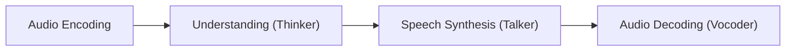
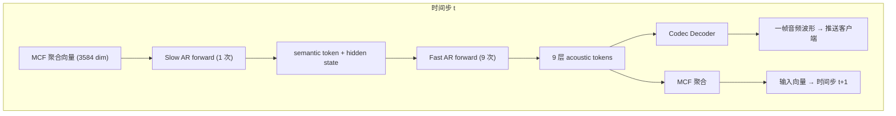

# 从模型架构到框架抽象：深入理解 Omni 模型的推理计算

最近在推动 [SGLang-Omni 的重构](https://github.com/sgl-project/sglang-omni/issues/188)。很遗憾，在我接手项目之前，代码的抽象层级过度复杂——一个请求从 HTTP API 到 `torch.forward` 要穿过 8-10 层，其中 Stage → Worker → Executor → Engine 四层的职责高度重叠。重构迫在眉睫，我对这样大规模的 system desgin 也充满期待。但在动刀砍层之前，有一些前置问题必须先思考清晰：我们到底要支持什么样的模型；它们的架构差异在哪里；哪些计算模式可以统一，哪些必须保持差异化？

如果不理解模型架构就去设计抽象，要么抽象太复杂，带来了巨大的维护成本，要么抽象太粗糙，灵活性不足。所以我通过这篇笔记分析目前主要支持的两类代表模型——Fish Audio S2 Pro 和 Qwen3-Omni——的架构和推理计算流程。

本文将按以下路线展开：

1. 建立 omni 模型的通用概念框架——Codec、RVQ、四阶段 pipeline 以及 Speech Synthesis 的设计自由度
2. 深入 Fish Audio S2 Pro 的 Dual AR 推理流程，聚焦于其对框架抽象的需求
3. 深入 Qwen3-Omni 的 Thinker-Talker 推理流程，分析其与 S2 Pro 的本质差异
4. 从两者的对比中推导出框架抽象的边界——哪些该统一，哪些必须差异化

实际上，我之前有过一篇文章，[再探 CUDA Graph：核心机制、多图复用以及 Dual AR 模型的统一覆盖优化](../../torch/cuda-graph/readme-2.md)，从 CUDA Graph 优化的视角详细分析了 S2 Pro 的架构。本文从模型架构对框架抽象的影响这一视角重新进行审视。

感谢 Jingwen Gu, Yitong Guan, Ratish P, Shenggui Li, Yuan Luo 等等大哥在 SGLang-Omni 开发过程中的讨论和支持。

## Omni 模型的概念框架

我也是第一次接触 Omni 模型，对于传统语音研究许多的分词等等保持敬畏，如同我敬畏那些研究 NLP 分词的前辈一样...

### Omni Pipeline

一个 omni 模型要完成的事情，几乎就是"听懂语音输入，生成语音回复"，这个过程天然可以拆分成四个阶段：

1. Audio Encoding：原始音频波形每秒有数万个采样点，直接交给 Transformer 处理不现实。Audio Encoder 负责把高频波形压缩为低频的离散 token 序列——这些离散 token 就是所谓的 codec token。它是什么、为什么必须是离散的、怎样通过 RVQ 实现多层量化，是下一节的主题。

2. Understanding（Thinker）：拿到 codec token（或等价的连续表示）后，需要一个足够强大的模型来"理解"输入并生成文本回复。这一步本质上就是一个 LLM 或多模态 LLM 在做 prefill + decode——和标准 chat 模型生成文本没有本质区别，只是输入序列中混入了 audio token。

3. Speech Synthesis（Talker）：Thinker 生成了文本回复之后，还需要把文本转回语音。这是整个 pipeline 中设计自由度最大的环节——用 AR 逐 token 生成 codec token？用 Diffusion 做迭代 denoising？一次生成所有 codebook 层还是分层补全？不同模型在这里的选择截然不同，这正是各类 Omni 模型架构分歧的核心来源。

4. Audio Decoding（Vocoder）：最后，把 Talker 生成的 codec token 还原为音频波形。Vocoder 通常是一个轻量级 ConvNet（如 Vocos、HiFi-GAN、EVA-GAN），计算量远小于前三步，不是系统瓶颈。

四个阶段中，Encoding 和 Decoding 在不同模型之间相对稳定——差异主要体现在 codec 的选型，而非计算模式本身。真正导致架构分歧的是中间两步：Thinker 和 Talker 的耦合方式，以及 Talker 自身的生成策略。                                    

### Codec Audio Encoding

语音的原始采样率通常在 16kHz-48kHz，意味着 1 秒音频就有 16000-48000 个采样点；如果直接让 Transformer 处理原始波形，序列长度会膨胀到完全不可接受的程度，一段 10 秒对话在 48kHz 下接近 50 万个标量步，远超大多数 LLM 的上下文窗口。因此我们必须先做压缩，而 Audio Codec 做的第一件事，就是用 encoder 把高频的连续波形压成低频的连续帧向量序列。以 EnCodec 一类模型为例，常见设置大约是 12.5 帧/秒，也就是说原本每秒几万个采样点，会先变成每秒十几帧的连续表示；每一帧对应一个连续向量，例如 128 维。到这一步为止，信息虽然已经在时间维上被强力压缩，但它仍然是连续值，还不能直接走“有限词表 + 交叉熵 + 自回归采样”这条标准 LLM 管线。

接下来进行连续向量的量化，也就是把连续帧向量变成离散的 codec token。这里常用的做法是向量量化（Vector Quantization, VQ）：对于每一层 VQ，先学习一张规模有限的 codebook，里面的每个条目都可以理解成连续空间中的一个代表向量。对于某一帧，encoder 输出的连续向量并不会直接交给 LLM，而是先在当前层 VQ 的 codebook 里做一次最近邻查找，挑出与它最接近的那个条目，再用这个条目在码本中的整数索引，作为这一帧最终的 codec token id。原本连续、几乎无穷细的向量空间，压缩在了一张有限大小的查找表，模型接口从连续值变成了离散 id，可以自然接上有限词表 + 交叉熵 + 自回归采样这套标准语言模型管线。

当然，若只用单层 VQ，可以把它理解成最简单的情形：每一帧都在一张 codebook 里做最近邻查找，选出最接近的条目，并用该条目的整数索引作为这一帧的 codec token id。在这个意义上，codebook 和 LLM 的 vocabulary 是同构的，都是“有限集合里的条目 + 查表用的整数 id”。但单层 VQ 很快就会遇到经典 trade-off：codebook 太大，训练困难、embedding table 爆炸；codebook 太小，量化误差过高，还原出来的音频会明显失真。于是实际系统更常用 RVQ（Residual Vector Quantization，残差向量量化）。它的关键不单单是有很多层 codebook，而是每一层量化去量化上一层的残差：第 0 层先对当前帧的原始连续向量做量化，得到第一个 codec token id；然后把第 0 层没表达好的部分当作残差，交给第 1 层去量化；第 1 层之后剩下的残差再交给第 2 层，依此类推。换句话说，每一层都有自己的 codebook，但后续层量化的不是同一个原始向量，而是前面几层尚未表达好的残差。

这样一来，如果有 N 层 RVQ，那么同一时间步上的一帧，会对应 N 个 codec token id，这也是 audio codec 和 text tokenizer 最容易让人混淆的地方。文本里通常是“一个 subword 一个 token”，而在 RVQ 里，更准确的说法是“一个时间位置上有多个离散 token”，这一帧被拆成了多层逐步逼近的量化结果。以 24kHz 采样、12.5 帧/秒为例，时间维上大约是 1920:1 的压缩比，一句 5 秒的话会从 120000 个采样点先变成约 63 个时间步；如果是单层 VQ，那么就是约 63 个离散 token，而如果是 N 层 RVQ，那么这 63 个时间步中的每一步都会再对应 N 个 codec token id。实现上，这些 id 可以被展平成更长的离散序列、拆成多条 token 流，或者由不同子网络分阶段预测，但接口本质始终没变：真正交给下游 Transformer 或其他生成模块的，是这些离散的 id 序列及其 embedding，而不是原始连续帧向量本身，更不是整张 codebook 矩阵。

显然，对于多层 RVQ，不同层承载的信息价值并不对称。通常靠前层，尤其 Layer 0，更偏向”说了什么”这种核心语义和基本韵律；靠后的层则逐渐转向音色、气息、共鸣位置以及情感颤动等更细的声学细节。于是，丢失前层往往等于丢失内容，丢失后层更多只是音质下降。这种层间不对称性，直接催生了”用大模型先生成更关键的前几层，再用较小模块补全后续层”的思路，Fish Audio S2 Pro 的 Dual AR 正是这一点的具体体现。

### Understanding（Thinker）

Audio Encoding 将冰冷的音频变成了温暖的 token，下一步我们通过一个模型来理解这些 token 的含义并生成文本回复——本质上就是一个 LLM 或多模态 LLM 在做 prefill + decode，和标准 chat 模型生成文本回复没有本质区别。

对于纯 TTS 模型（如 S2 Pro），Thinker 接收的输入是 text token（目标文本）和 audio token（参考音频的 codec 编码），两者交织成一个统一的 token 序列，然后像标准 LLM 一样自回归生成。对于多模态 omni 模型（如 Qwen3-Omni），Thinker 除了文本和音频 token，还可能接收 image/video token——但计算模式不变，仍然是 prefill 处理完整输入序列，decode 逐 token 输出文本回复。

从推理框架的视角看，Understanding 阶段是不同 omni 模型之间最同质的部分。无论底层是 Qwen3-4B（S2 Pro 的 Slow AR）还是 30B-A3B MoE（Qwen3-Omni 的 Thinker），decode 阶段都是标准的自回归 LLM 推理——continuous batching、paged KV cache、RadixAttention、CUDA Graph 这些 SGLang 已有的优化可以直接复用。真正导致架构分歧的不在 Understanding 本身，而在于 Understanding 之后：Thinker 生成的文本和 hidden states 如何传递给 Talker、Talker 用什么方式把文本转回语音。

### Speech Synthesis

如前文所说，Speech Synthesis 的设计自由度非常高——具体来说可以拆成几个正交的维度：

| 设计维度 | 选项 A | 选项 B |
|----------|--------|--------|
| 生成方式 | Autoregressive：逐 token 生成 codec | Non-Autoregressive：Diffusion / Flow Matching，迭代生成 |
| Codebook 生成策略 | 逐层 AR：先生成 Layer 0，再自回归生成 Layer 1-N | 并行生成：所有 codebook 层同时输出 |
| 与 Thinker 的信息流 | Hidden States + Text Tokens：Talker 同时接收两者 | 仅 Hidden States：Talker 从 hidden states 直接解码 |
| Thinker-Talker 时序 | 串行嵌套：Talker 嵌套在 Thinker 的每个 decode step 中 | 异步流水线：两者各自运行独立的 decode loop |

举个具体的例子，我们来详细看看 Thinker 和 Talker 之间的信息流。需要 Hidden States 是好理解的，毕竟只拿着 text token 会丢失许多语音承载的高维信息，但是我们反过来思考如下问题：**既然 Talker 已经需要 hidden states 作为输入信息流，为什么还需要 text token？**

我只能给出一个悲观的理解，因为 Talker 模型能力不够强大。Hidden states 是 Thinker 理解输入后的内部表示，包含了丰富的语义、韵律和情感信息。但 hidden states 是高维连续向量，同时编码了"说什么"和"怎么说"，没有哪个维度显式对应某个具体的词。如果 Talker 只依赖 hidden states 来生成语音，它需要从这些连续表示中同时解码出语言内容和声学细节，这对 Talker 的建模能力提出了更高要求，且缺乏显式的语义锚点，容易出现内容偏移——生成的语音和 Thinker 生成的文字不一致。直观上，如果我们发现豆包屏幕上生成的文字和生成的语音不一致，会是个让用户非常费解的事情。因此，Text token 提供了一种显式的语义锚点，一个更强的监督信号：它是离散的、可解释的、确定性的——"好的"就是"好的"，不会读出来就成了“okay”，不存在模糊空间。Talker 拿到 text token，就知道自己该说什么词，只需要再从 hidden states 中提取"怎么说"（语气、节奏、情感）。

具体来说，Qwen3-Omni 的 Talker 接收两样东西：一是 Thinker decode 输出的 text token（回复内容），二是 Thinker 中间层在处理 audio/visual 输入时产生的 hidden states（声学特征）。注意 Talker 不接收 Thinker 处理 text 输入时产生的 hidden states——对于文本信息，discrete token 本身已经是完备的表示，再传 hidden states 是冗余的；而 prosody、timbre 这类声学属性只存在于 audio/visual 的 hidden states 中，text token 无法编码它们。这个解耦还带来一个实际好处：外部模块（RAG、function calling、safety filter）可以在 Thinker 的 text 输出上做干预，再把处理后的 text 送给 Talker，而不会破坏声学信息流。当然，对于 Qwen3-Omni 这类 Thinker-Talker 架构，存在一个额外的 trade-off：Talker 必须等待 Thinker 的 decode 完成（至少部分完成）才能开始生成语音，这直接影响推理的 TTFV（Time to First Voice）。Qwen3-Omni 的处理方式是异步流水线——Thinker 和 Talker 各自运行独立的 decode loop，通过 hidden state relay 连接，尽可能地让两者并行推进。

需要注意，上述"text token + hidden states"的信息流是 Thinker-Talker 架构的特征，并非所有 omni 模型都如此。S2 Pro 作为纯 TTS 模型，走的是完全不同的路——Slow AR 不生成 text token，而是直接自回归生成 semantic codec token（Layer 0），Fast AR 接收 Slow AR 的 hidden state 和 semantic token 来补全剩余 codebook 层。整个信息传递都在 codec token 空间内完成，不涉及 text token。

### Audio Decoding

Pipeline 的最后一步是把 codec token 还原为人耳可听的音频波形。这一步由 vocoder 完成，通常是一个轻量级的 causal ConvNet——S2 Pro 用的是基于 EVA-GAN 的 Codec Decoder，Qwen3-Omni 用的是 Code2Wav（200M 参数）。这里 causal 是一个很有意思的属性：causal ConvNet 只需要看到当前帧和历史帧就能合成波形，不需要等待后续帧。这意味着 Speech Synthesis 每生成一帧完整的 codebook token，vocoder 就可以立即合成并推送给客户端，实现逐帧流式播放。与之相对的是，Qwen2.5-Omni 用的是 block-wise DiT 做波形合成，需要 Talker 积累足够的 block context 才能开始。换成 causal ConvNet 后，first-packet latency 从架构层面就被压低了。

从推理框架的视角看，vocoder 的调度非常简单：它不是 Transformer，没有 KV cache，不需要 continuous batching，计算量也远小于前面的 LLM。更有意思的是，LLM decode 是 memory-bandwidth bound（大量 KV cache 读写），而 ConvNet 是 compute bound（密集卷积计算），两者的瓶颈资源不同，可以通过 CUDA MPS 在同一块 GPU 上并行调度，互不干扰。和 Audio Encoding 一样，Audio Decoding 是不同模型之间相对稳定的部分——差异主要在 vocoder 的选型（EVA-GAN vs Code2Wav vs Vocos vs HiFi-GAN），而非计算模式。它不是框架抽象需要重点处理的环节。

## 以 Fish Audio S2 Pro 为代表的 Dual-AR 模型推理

讨论完了 Omni Pipeline 的主体结构后，我们来深入剖析两个具体的 Omni 模型：一个是典型的 Dual-AR TTS 模型 Fish Audio S2 Pro，另一个是 Thinker-Talker 架构的 Qwen3-Omni 模型。

[S2 Pro](https://huggingface.co/fishaudio/s2-pro) 是 Fish Audio 推出的约 5B 参数语音生成模型（TTS），给定参考语音 + 目标文本，生成符合参考音色的语音。在 SGLang-Omni 中已合并主分支，包含 CUDA Graph + streaming 支持（[PR #153](https://github.com/sgl-project/sglang-omni/pull/153)）。S2 Pro 是一个纯 TTS 模型——不做多模态理解，只做"给定文本和参考音色，合成语音"这一件事。

### S2 Pro 与 Omni Pipeline 的对照

在把 S2 Pro 的架构映射到前文的四阶段 pipeline 之前，有一个关键区别必须再次强调：**S2 Pro 不走"Thinker 生成 text → Talker 合成 codec"的分离路径，Understanding 和 Speech Synthesis 两个阶段被合并在同一个时间步内，由 Slow AR 和 Fast AR 两个子模型共同完成。**

对于 Qwen3-Omni 这类多模态理解模型，pipeline 的分工是清晰的：Audio Encoding 把输入语音编码为 codec token，Thinker 理解输入后生成 text token 作为回复，Talker 再把 text token 转化为输出语音的 codec token，最后 Vocoder 合成波形。输入侧的 codec token（编码用户说了什么）和输出侧的 codec token（编码模型要说什么）是两套完全不同的序列，中间有 text token 作为桥梁。

S2 Pro 不同。它的输入是参考音频（提供音色）和目标文本（提供内容），输出是目标语音。Dual AR 接收的输入序列由两部分拼接而成：参考音频经 codec 编码后的 token（"用什么声音说"）和目标文本的 text token（"说什么内容"）。接着，Slow AR 沿时间轴自回归，每一步生成一帧的 Layer 0 semantic codec token；然后 Fast AR 立刻接手，拿到 Slow AR 的 hidden state 和刚采样出的 Layer 0 token，沿 codebook 深度方向固定 9 步补全该帧的 Layer 1-9 acoustic codec token。

这种分层生成的思路和 RVQ 的多层残差量化有相似之处，但两者作用于不同阶段：RVQ 编码的是输入侧的参考音频，Slow AR 和 Fast AR 生成的是输出侧的目标语音，两者是完全不同的序列。尽管如此，它们共享同一套 codebook 结构——前文 Codec Audio Encoding 一节分析过，RVQ 的残差量化机制使得 Layer 0 的 codebook 自然承载最多的语义信息，后续层则逐步精化音色、气息等声学细节。Dual AR 正是利用了这一结构性质来分工：Slow AR（4B 参数）专注生成语义最关键的 Layer 0，Fast AR（400M 参数）负责补全声学细节层，两者在同一个时间步内串行完成，共同扮演了 Understanding + Speech Synthesis 的角色。

映射到四阶段 pipeline：Audio Encoding 编码参考音频；Understanding + Speech Synthesis 合并在 Slow AR + Fast AR 中；Audio Decoding 由 Codec Decoder 完成。这种合并之所以可行，是因为纯 TTS 任务的"理解"需求远比多模态对话简单——不需要从语音中提取语义并生成文本回复，只需要从参考音频中提取音色特征并应用到目标文本的合成过程中。

### Dual AR 架构设计

S2 Pro 的 codec 使用 10 层 RVQ，也就是说每个时间步会产出 10 个 codec token id。前文 Codec 一节提到过，这 N 个 token id 在交给下游生成模块时有三条路可以走：展平成更长的离散序列、拆成多条 token 流、或者由不同子网络分阶段预测。我们逐一排除。

**展平**：最朴素的做法——把 10 层 token 沿时间轴首尾相连，交给一个 LLM 直接自回归。一段 10 秒的音频（约 210 帧）展平后变成约 2100 个 token 位置，序列长度膨胀 10 倍，context window 压力陡增。更致命的是，展平后的序列混杂了两种截然不同的依赖关系：相邻时间步的 Layer 0 之间是语义延续（"下一个音节说什么"），同一时间步内 Layer 0 → Layer 9 之间是声学细化（"这个音节怎么发"）。一个 Transformer 用同一套 attention 权重同时建模这两种尺度迥异的依赖，既低效又不稳定。

**多流**：把 10 层拆成 10 条并行的 token 流，每条流各自自回归。这消除了序列膨胀，但引入了另一个问题：10 条流之间需要交叉注意力来保持帧内一致性（Layer 3 的音色细节必须和 Layer 0 的语义内容对齐），而跨流注意力的设计和训练代价并不低。更重要的是，Codec 一节分析过，RVQ 各层承载的信息价值天然不对称——Layer 0 偏语义，后续层逐渐转向声学细节——把它们当作对等的并行流处理，没有利用这种结构先验。

**分阶段预测**：Dual AR 选择的正是这条路，而且分法精确地利用了上述层间不对称性。前文提到"丢失前层往往等于丢失内容，丢失后层更多只是音质下降"——既然 Layer 0 承载的语义信息最为关键，那就用一个参数量大、上下文建模能力强的模型（Slow AR，4B）沿时间轴逐帧只管 Layer 0，保证"说什么"的质量；再用一个参数量小但足够快的模型（Fast AR，400M）沿 codebook 深度方向，在每一帧内固定 9 步补全 Layer 1-9 的声学细节。大模型负责时间轴上的长程语义连贯，小模型负责帧内的声学精细还原——序列长度回到可控范围，同时两种依赖关系被解耦到各自擅长的网络中。

现在我们把 S2 Pro 的选择逐项映射回前文 Speech Synthesis 一节的设计自由度矩阵：

- **生成方式 = AR**：Slow AR 和 Fast AR 都是自回归生成 codec token，不涉及 Diffusion 或 Flow Matching 的迭代 denoising。AR 的优势是天然支持流式——每生成一帧就可以立即交给 vocoder 合成波形，不需要等待全局 denoising 收敛。
- **Codebook 策略 = 逐层 AR（先 Layer 0 再 Layer 1-9）**：不是所有 codebook 层同时输出，而是严格分两阶段——Slow AR 先确定语义（Layer 0），Fast AR 再补全声学（Layer 1-9）。这正是利用了 RVQ 层间信息不对称性的分治策略。
- **信息流 = Hidden States（内部传递）**：S2 Pro 是纯 TTS 模型，没有独立的 Thinker 生成 text token，因此不存在前文讨论的"text token 作为语义锚点"的需求。Slow AR 向 Fast AR 传递的是自身最后一层的 hidden state 和刚采样出的 semantic token——两者都在同一次 forward 内部直接以 tensor 形式传递，不经过任何跨 stage 的 buffer 或通信。
- **时序 = 串行嵌套**：Fast AR 不是一个独立运行的 decode loop，而是嵌套在 Slow AR 的每个 decode step 内部——Slow AR 出一个 semantic token，Fast AR 立刻跟上固定 9 步，MCF 聚合后才进入下一个时间步。整个推理只有一个外层循环，Fast AR 是循环体内的子过程。这与 Qwen3-Omni 的异步流水线（两个独立 decode loop 并行推进）形成鲜明对比。

### 四个组件

整个推理系统由四个组件构成：

**Slow AR**：基于 Qwen3-4B 的 decoder-only Transformer，约 4B 参数，36 层。沿时间轴自回归，每一步生成一帧的第 0 层 semantic token。它维护一个不断增长的 KV cache，和普通 LLM 生成文字时完全一样。

**Fast AR**：一个独立的 4 层 Transformer，约 400M 参数，有独立的权重和 embedding table。给定 Slow AR 在某一帧输出的 semantic token 和 hidden state，它沿 codebook depth 方向自回归，固定 9 步补全这一帧剩余的 9 层 acoustic token。每个时间步用完就丢掉 KV cache，不跨帧保留。

**Codec Decoder**：基于 EVA-GAN 的 ConvNet，不是 Transformer。接收一帧完整的 10 层 token，解码成实际的音频 PCM 波形。纯信号处理，和 LLM 调度完全解耦。

**MCF（Multi-Codebook Fusion）**：不是一个独立模型，只是一步向量聚合运算。它把一帧的 10 层 token 通过各自的 embedding table 查表后逐元素相加，得到一个向量，作为 Slow AR 下一步的输入。

### 一帧的完整 decode 流程

假设我们在时间步 t，上一步已经通过 MCF 聚合好了一个输入向量，维度和 Slow AR 的 hidden dim 一致（3584）。

**第一阶段：Slow AR 生成 semantic token。** Slow AR 拿到输入向量，做一次标准的 LLM forward pass。KV cache 里已经存了从 prompt 开头到上一帧的所有历史，这一步和普通 LLM decode 下一个 text token 的过程完全相同。输出两个东西：logits 向量（4096 维，对应 semantic codebook 大小），采样得到这一帧的 semantic token——一个整数，比如 2371；以及 hidden state 向量（3584 维），即最后一层 Transformer 的输出。Slow AR 在这个时间步的工作到此结束，KV cache 保留并追加。

**第二阶段：Fast AR 补全 acoustic tokens。** 现在手上有 Slow AR 的 hidden state 和刚采样出的 semantic token。Fast AR 的输入序列按如下方式构造：

- **Position 0**：Slow AR 的 hidden state 经过一个线性投影层，从 3584 映射到 Fast AR 的维度。这个位置不对应任何 codebook token，是把 Slow AR 的全局上下文注入 Fast AR 的通道
- **Position 1**：semantic token 通过 Fast AR 自己的 embedding table 查表。这是 seed input，告诉 Fast AR 当前帧的语义内容

然后 Fast AR 开始自回归，固定 9 步：第 1 次 forward 看到 position 0 和 1，预测 codebook 第 1 层 token，建立 KV cache；第 2 次 forward 只输入第 1 层 token 的 embedding，读 KV cache，预测第 2 层 token；……依此类推到第 9 次 forward 预测第 9 层 token。整个序列最终长度是 11 个 position（1 个 conditioning prefix + 1 个 seed + 9 个生成的 token），这个长度是固定的，不随音频时长增长。所有 codebook 层共享同一张 embedding table，层的身份通过 RoPE 位置编码隐式区分。

Fast AR 完成后，KV cache 直接丢弃。下一个时间步会重新创建一个干净的 session。不同时间步之间的声学细节没有需要缓存的依赖——时间轴上的长程依赖已经由 Slow AR 的 KV cache 负责建模。

**第三阶段：Codec Decoder 合成波形。** 10 层 codebook token 凑齐后，Codec Decoder 对每个整数查自己的量化 codebook（注意这和 Fast AR 的 embedding table 不是同一个东西），得到 10 个量化向量，按 RVQ 标准做法逐层相加，还原成一帧连续特征，再通过 causal ConvNet 解码成 PCM 波形。这一帧约 48 毫秒的音频，可以立即推送给客户端做流式播放。Codec Decoder 是 causal 的，不需要看到后续帧。在生产环境里，LLM decoding 是 memory-bandwidth bound，ConvNet 是 compute bound，两者可以用 MPS 在同一块 GPU 上并行调度。

**第四阶段：MCF 聚合。** 最后一步，把这一帧的 10 个 token 压缩成一个向量喂回 Slow AR。做法是：10 个 codebook token 各自通过一个独立的 embedding table 查表，得到 10 个向量（维度均为 Slow AR 的 hidden dim）；再加上 Slow AR 原生的 token embedding 层对 semantic token 查出的第 11 个向量——这 11 个向量逐元素相加，得到下一步的输入。为什么 semantic token 被查了两张表？Slow AR 自带的 embedding 层继承自 Qwen3-4B 预训练权重，捕捉语言语义信息；新增的 codebook embedding 层捕捉声学编码信息。两个表参数独立，捕捉互补信息。

聚合后的向量喂给 Slow AR，进入时间步 t+1，循环继续直到遇到 end-of-audio token。

每个时间步，Slow AR forward 1 次，Fast AR forward 9 次，Codec Decoder 跑 1 次。Slow AR 的 KV cache 持续增长；Fast AR 的 KV cache 每帧重建。这种高度不对称的设计——4B 参数沿时间轴、4 层网络沿 codebook 深度——是 Dual AR 能做到低延迟实时生成的关键。

### 从 serving 的视角看

搞清楚推理流程之后会发现，对 serving framework 来说，Dual AR 的核心只有一件事需要特殊处理：**Slow AR 的输入 embedding 不是简单的 token lookup，而是 MCF 聚合后的向量**。除此之外，它就是一个标准的 LLM decode loop——Slow AR 基于 Qwen3-4B，天然继承 continuous batching、paged KV cache、RadixAttention 等 SGLang 已有能力。这是 S2 Pro 对框架"友好"的根本原因。

Fast AR 可以被视为每个 decode step 之后的一个固定后处理——它不需要 continuous batching，不需要 paged KV cache，不需要 RadixAttention，因为序列长度永远是 11。为什么不需要 paged KV cache？paged KV cache 解决的核心问题是：多请求不同长度、KV cache 动态增长、page 粒度共享显存。而 Fast AR 的 KV cache 长度固定（11）、每帧重建（用完即弃）、不存在跨请求共享——paged 管理的复杂性在这里没有任何收益。

当然，实际落地还有不少 engineering 细节。比如 Fast AR 的 9 步循环能不能用 CUDA Graph 打包？MCF 的 11 个 embedding 查表能不能和 Slow AR 的 forward fuse？这些问题在[再探 CUDA Graph](../../torch/cuda-graph/readme-2.md) 中有详细讨论。

## 把 Qwen3-Omni 的 Thinker-Talker 推理过程讲清楚

S2 Pro 的两个 AR 是串行嵌套在同一个 decode loop 里的。Qwen3-Omni 走了完全不同的路：两个模型各自运行独立的 decode loop，通过 hidden state 传递信息，形成异步流水线。

### 和 S2 Pro Dual-AR 的核心区别

S2 Pro 和 Qwen3-Omni 其实都是双 LLM 架构。但两者的协作方式完全不同：

S2 Pro 是**串行嵌套**——两个模型在同一个时间步内依次执行。Slow AR 出一个 semantic token，Fast AR 立刻跟上补全 9 层 acoustic token，MCF 聚合后才进入下一个时间步。Fast AR 的 KV cache 每帧重建，不跨时间步保留。整个推理只有一个外层 decode loop，Fast AR 嵌套在里面。

Qwen3-Omni 是**异步流水线**——两个模型各自运行独立的 decode loop，通过 hidden state 传递信息。Thinker 持续生成 text token，Talker 持续消费这些 token 并生成 codec token，两者的 decode 是并行推进的，通过 chunked prefill 实现交错调度。

这个区别直接决定了 serving framework 的调度设计。S2 Pro 的核心问题是"一个 decode loop 内怎么高效执行嵌套的 Fast AR"；Qwen3-Omni 的核心问题是"两个独立的 decode loop 怎么做流水线填充"。

### 模型全貌

[Qwen3-Omni](https://github.com/QwenLM/Qwen3-Omni) 是阿里通义推出的端到端多模态模型，参数规模为 Thinker 30B-A3B（MoE）+ Talker 3B-A0.3B（MoE）+ MTP Module 80M + Code2Wav 200M + AuT Encoder 650M + Vision Encoder 540M。它不是纯 TTS，而是一个全能的理解 + 生成模型——接受文本、音频、图像、视频输入，生成文本 + 语音输出。

在 SGLang-Omni 中，Thinker 已合并主分支，Talker 部分仍在开发中。

### 五个组件

**Thinker**：30B-A3B 的 MoE Transformer，是整个系统的"大脑"。它接收 text、audio、image、video 等所有模态的输入，自回归生成 text token 作为响应。和普通的 multimodal LLM chat 没有本质区别——输入是 multimodal token 序列，输出是 text token 序列。activated parameters 只有 3B，所以 decode 阶段的 memory bandwidth 消耗相对可控。

**Talker**：3B-A0.3B 的 MoE Transformer，是语音生成的主干。它自回归生成 codec 第 0 层 token（12.5 Hz，每个 token 对应 80ms 音频），有自己独立的 KV cache。前文概念框架中已经分析过，Talker 的输入包含 Thinker decode 输出的 text token（语义锚点）和 Thinker 中间层的 audio/visual hidden states（声学特征），不接收 text 的 hidden states。

**MTP Module（Multi-Token Prediction）**：80M 参数的 ultra-lightweight dense Transformer。Talker 每步生成第 0 层 codec token 后，MTP Module 固定步数地补全剩余 codebook 层。功能上等价于 S2 Pro 的 Fast AR，但参数更小（80M vs 400M）。

**Code2Wav**：200M 参数的 causal ConvNet，替代了 Qwen2.5-Omni 中的 block-wise DiT。接收一帧完整的多层 codec token，解码成音频波形。和 S2 Pro 的 Codec Decoder 角色相同。这是相对于 Qwen2.5-Omni 的一个重要改进：之前用 block-wise DiT 做波形合成，需要等 Talker 积累足够的 block context 才能开始合成；换成 causal ConvNet 后，每生成一帧就能立即合成，first-packet latency 从架构层面就被压低了。

**Audio/Vision Encoder**：输入侧的编码器。AuT（Audio Transformer）是 650M 参数的 encoder-decoder 模型，从 20M 小时监督音频上从零训练，token rate 12.5 Hz，用 block-wise window attention 支持 real-time prefill caching。Vision Encoder 基于 SigLIP2，约 540M 参数。它们的输出被投影后拼入 Thinker 的 token 序列，位置编码使用 TM-RoPE（Time-aligned Multimodal RoPE），把 temporal、height、width 三个维度的位置信息编码到不同的 rotary angle 组里。

### 完整推理流程

#### Encoder 预处理

音频输入被重采样到 16kHz，转换成 128 通道 mel-spectrogram（25ms 窗口、10ms hop），然后送入 AuT encoder。AuT 内部先用 Conv2D 做 8 倍下采样，再经过 32 层 self-attention，最终输出 12.5 Hz 的 audio token 序列（每帧对应 80ms 音频）。图像和视频输入送入 Vision Encoder，输出 visual token 序列。

这些 encoder 输出的 token 经过各自的 adapter 层投影到 Thinker 的 embedding 维度后，和 text token 拼接成一个统一的 multimodal token 序列。

#### Thinker 生成 text response

Thinker 拿到拼接好的 multimodal token 序列，先做 prefill（处理完整输入），然后进入 decode 阶段，逐 token 自回归生成 text response。这一步和普通的 multimodal LLM inference 完全相同：continuous batching、paged KV cache、所有标准的 LLM serving 优化都直接适用。

Thinker 每生成一个 text token，同时会暴露其中间层的 hidden state，传递给 Talker。

#### Talker 生成 codec token

这是和 S2 Pro 差异最大的地方。Talker 是一个独立的 LLM，它和 Thinker 之间是异步流水线关系。

**Talker 的输入构造**：Talker 的 token 序列由以下几部分拼接而成：

- Thinker 生成的 text token（作为离散 token 输入，通过 Talker 自己的 text embedding 层查表）
- 从 Thinker 中间层提取的 audio/visual hidden state（作为连续向量直接注入）
- Talker 自己之前生成的 codec token 的 embedding（和 S2 Pro 的 MCF 类似，多层 codebook embedding 聚合后作为下一步输入）

**异步 chunked prefill**：Thinker 和 Talker 的 prefill 是交错进行的。Thinker 完成当前 chunk 的 prefill 后，其输出立即被送去做 Talker 当前 chunk 的 prefill，与此同时 Thinker 开始处理下一个 chunk。这个流水线设计显著降低了 Time-to-First-Token。

**Talker 的 decode 过程**：进入 decode 阶段后，Talker 每一步自回归生成一个 codec 第 0 层 token（12.5 Hz，即每 80ms 生成一个 token）。这一步和普通 LLM decode 一样，只是 vocabulary 是 codec codebook 而不是 text vocabulary。

#### MTP Module 补全 codebook

Talker 每生成一个第 0 层 codec token，MTP Module 立即被调起，固定步数地补全当前帧的剩余 codebook 层。工作方式和 S2 Pro 的 Fast AR 非常类似：拿到 Talker 的 hidden state 和第 0 层 token 作为输入，自回归生成剩余层的 token。序列长度固定，KV cache 不跨帧保留。

#### Code2Wav 合成波形

一帧的全部 codebook token 凑齐后，Code2Wav（causal ConvNet，200M 参数）将其解码为音频波形。由于是 causal 的，从第一帧就可以开始流式输出，不需要等待后续帧。

### 端到端延迟分解

Qwen3-Omni 在冷启动（无 prefix cache）条件下，audio 场景的端到端 first-packet latency 为 234ms，分解如下：

| 阶段 | 延迟 |
|------|------|
| Encoder 预处理（AuT 推理） | 72ms |
| Thinker TTFT | 88ms |
| Talker TTFT | 57ms |
| MTP Module 处理一帧 | 14ms |
| Code2Wav 处理一帧 | 3ms |
| **总计** | **234ms** |

由于这些环节是串行依赖的（Encoder → Thinker → Talker → MTP → Code2Wav），总延迟是各项之和。MoE 架构在高并发下的优势在于：Thinker 和 Talker 的 prefill latency 和 TTFT 受并发影响较小（activated parameters 少，memory bandwidth 消耗低），而 MTP Module 和 Code2Wav 本身就是轻量模块，overhead 可控。

### 从 serving 的视角看

对 SGLang-Omni 来说，支持 Qwen3-Omni 需要处理的核心问题是双 LLM 的异步调度：

Thinker 和 Talker 各自需要独立的 KV cache 管理和 batch scheduling。Thinker 的 KV cache 包含 multimodal token（audio/visual encoder 的输出），长度可能很长（40 分钟音频 ≈ 30000 个 audio token）；Talker 的 KV cache 包含 text token + multimodal hidden state + codec token history。

两者之间的数据依赖是：Thinker 中间层的 hidden state 需要被实时传递给 Talker。这可以通过一个 shared buffer 实现——Thinker forward 时注册 hook 把指定层的 hidden state 写入 buffer，Talker 的 input embedding 构造逻辑从 buffer 读取。

Thinker 和 Talker 还可以有各自独立的 system prompt，分别控制回复内容风格和语音风格。这意味着两个模型的 prompt 处理和 prefix caching 逻辑是独立的。

MTP Module 和 Code2Wav 的调度相对简单，和 S2 Pro 的 Fast AR + Codec Decoder 处于同一个抽象层级：per-step callback + async waveform renderer。

## 架构对比与框架抽象推导

两个模型的推理流程都讲清楚了。现在回到这篇笔记的核心问题：

> **当我们要在一个推理框架中同时服务 S2 Pro（Dual AR）和 Qwen3-Omni（Thinker + Talker）这两类架构迥异的 omni 模型时，哪些计算模式可以统一抽象为框架层的通用能力，哪些必须作为模型特异的实现留给各自的底层？**

### 结构化对比

| 维度 | Fish Audio S2 Pro | Qwen3-Omni |
|------|-------------------|------------|
| **模型用途** | 纯 TTS | 多模态理解 + 语音合成 |
| **理解阶段** | Slow AR（Qwen3-4B，4B dense） | Thinker（30B-A3B MoE） |
| **理解阶段本质** | 标准 LLM decode | 多模态 LLM prefill + decode |
| **合成主干** | 嵌套在 Slow AR 内的 Fast AR（400M） | 独立运行的 Talker（3B-A0.3B MoE） |
| **Codebook 补全** | Fast AR 自回归 9 步 | MTP Module（80M）固定步数 |
| **合成阶段 KV Cache** | Static 预分配（长度固定 11） | Talker 自己的 Paged KV Cache |
| **两模型协作方式** | 串行嵌套（同一 decode loop） | 异步流水线（两个独立 decode loop） |
| **主模型→合成模块信息流** | Hidden state + semantic token（forward 内部传递） | Text tokens + audio/visual hidden states（跨 stage 传递） |
| **Vocoder** | EVA-GAN (ConvNet) | Code2Wav (causal ConvNet) |
| **CUDA Graph 适用性** | 全 pipeline 可覆盖 | 仅 Thinker decode 阶段 |
| **独立 system prompt** | 不适用（单模型） | 支持（分别控制回复内容和语音风格） |

### 可以统一的部分

1. **LLM backbone serving**：两者的"理解"阶段都是 LLM（或多模态 LLM）。S2 Pro 的 Slow AR 和 Qwen3-Omni 的 Thinker 在 decode 阶段都是标准的自回归 LLM，可以共享 SGLang 的核心 serving 能力——continuous batching、paged KV cache、RadixAttention、CUDA Graph。Qwen3-Omni 的 Talker 在 decode 阶段同样是标准 AR，也可以复用同一套 serving 基础设施
2. **Pipeline staging**：都需要多阶段串联（encode → understand → synthesize → decode），需要统一的 stage orchestration 概念。当前代码中 S2 Pro 和 Qwen3-Omni 的 pipeline 目录结构已经高度对称（`stages.py`, `engine_io.py`, `state_io.py`, `next_stage.py`）
3. **Codebook 补全 + Vocoder 作为后处理**：Fast AR / MTP Module 和 Codec Decoder / Code2Wav 在抽象层级上完全一致——都是 per-step callback，不需要 continuous batching，不需要 paged KV cache，可以统一为"每个 decode step 完成后执行的固定后处理"
4. **Tensor relay**：都需要在 stage 之间传递 tensor（hidden states、codec tokens）。虽然 S2 Pro 的传递是 forward 内部的（直接传 tensor），Qwen3-Omni 的传递是跨 stage 的（需要 shared buffer / NCCL / NixL），但接口可以统一

### 必须差异化的部分

1. **Talker 的执行模式根本不同**：S2 Pro 的 Fast AR 嵌套在 Slow AR 的 forward 内部，每帧重建 KV cache，序列长度固定——它本质上是一个后处理步骤，不是独立的 serving 实体。Qwen3-Omni 的 Talker 是一个完整的 LLM，需要独立的 KV cache 管理、batch scheduling、甚至独立的 system prompt——它是一个独立的 serving 实体。**不可能用同一个 ModelRunner 抽象来统一两者**
2. **KV Cache 管理的差异性**：S2 Pro 需要在同一个 forward 中管理两套 KV cache（paged + static），但 Fast AR 的 static cache 管理极其简单（固定长度，每帧重建）。Qwen3-Omni 需要管理两个独立 LLM 的 paged KV cache，复杂度更高
3. **CUDA Graph 适用范围**：S2 Pro 的全 pipeline（Slow AR + Fast AR + MCF）已经被[统一到一个 CUDA Graph 中捕获和重放](../../torch/cuda-graph/readme-2.md)。Qwen3-Omni 的 Thinker decode 可以用 CUDA Graph，但 Talker 作为独立 LLM 需要单独的 CUDA Graph 管理
4. **Batching 策略**：S2 Pro 的 Fast AR 不需要 continuous batching（固定 9 步，嵌套在主 loop 内）。Qwen3-Omni 的 Talker 需要完整的 continuous batching（独立 decode loop，多请求并发）

### 推导抽象边界

框架抽象应该在哪里画线：

**统一层（框架提供的通用能力）：**

- **Pipeline orchestration**：Stage 的串联、数据传递、状态管理——两个模型的 pipeline 目录结构已经高度对称，可以抽象为通用的 stage executor 框架
- **LLM serving**：SGLang 的核心 serving 能力（continuous batching, paged KV cache, RadixAttention, CUDA Graph）——这是两个模型共享的最大公约数
- **Tensor relay**：Stage 之间的 tensor 传递接口
- **Vocoder execution**：Codec Decoder / Code2Wav 的执行——轻量级、解耦的波形合成

**差异层（模型特异的实现）：**

- **ModelRunner 的 forward 实现**：S2 Pro 的 forward 包含嵌套的 Fast AR loop + MCF 聚合，Qwen3-Omni 的 Thinker forward 和 Talker forward 各自独立。这是差异最大的部分
- **Codebook 补全模块的调度**：Fast AR（嵌套在 forward 内）vs MTP Module（作为 Talker 的后处理 callback）
- **跨模型数据传递**：S2 Pro 的 hidden state 传递是 forward 内部的（tensor 直接传），Qwen3-Omni 的是跨 stage 的（需要 buffer 或通信）

### 对 SGLang-Omni 重构的启示

回到 [issue #188](https://github.com/sgl-project/sglang-omni/issues/188) 的核心矛盾：Stage → Worker → Executor → Engine 四层抽象中，哪些是多余的？

- **Worker 和 Executor 的确是多余的间接层**——它们的 `getattr` 动态委托只是在翻译接口，没有增加语义。两个模型的需求都不依赖这两层提供的任何独特能力
- **Stage 有存在的必要**：它负责 pipeline orchestration——管理多个阶段的串联、状态传递、流式输出控制。两个模型都需要多阶段串联，只是阶段内容不同
- **Engine 有存在的必要**：它负责单个阶段内的调度——continuous batching、KV cache 管理、CUDA Graph 等。S2 Pro 只需要一个 Engine（Slow AR），Qwen3-Omni 需要两个 Engine（Thinker + Talker）

**ModelRunner 应当成为核心抽象边界**：框架保证 Engine → ModelRunner 的接口稳定，ModelRunner 以下的实现（Dual AR 的嵌套 forward / Thinker 的多模态 forward / Talker 的 codec forward）由各模型自行决定。这样既消除了不必要的间接层，又保留了对不同模型架构的灵活性。

总的来说，这两个模型的架构差异告诉我们一件事：**不要试图在 Speech Synthesis 的层面做统一抽象。** AR 嵌套、独立 LLM、Diffusion——这些方式的差异太大，强行统一只会制造另一堆 `getattr` 间接层。统一应该发生在更高的层面（pipeline staging、LLM serving 基础设施）和更低的层面（ModelRunner 接口），中间层让各模型自己决定。

<!-- /learn-write 自动检查报告
双轨检查：[PASS] 概念框架在代码分析之前建立；章节顺序遵循 概念 → 模型 → 抽象推导
叙事检查：[PASS] 开篇从重构工作切入，非模板化；引用了 CUDA Graph 系列作为前序文章；路线图 4 条；包含致谢；有设问引导；无 meta-framing
深度检查：[修改扩展级] → [实际深度：修改扩展级] [PASS]
递进推导检查：[PASS] 过渡句具体引用前节结论；无 checklist 式罗列；约束映射融入行文；驱动问题在两个模型分析完成后提出；模型介绍先全貌再计算特征；无 ASCII 艺术字
交叉引用：已引用 CUDA Graph 系列第二篇
-->
